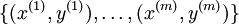
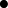

Backpropagation Algorithm
=========================

<!-- Jump to: [navigation](#column-one), [search](#searchInput) -->
Suppose we have a fixed training set  of *m* training examples. We can train our neural network using batch gradient descent. In detail, for a single training example (*x*,*y*), we define the cost function with respect to that single example to be:

This is a (one-half) squared-error cost function. Given a training set of *m* examples, we then define the overall cost function to be:

![
\begin{align}
J(W,b)
&= \left[ \frac{1}{m} \sum_{i=1}^m J(W,b;x^{(i)},y^{(i)}) \right]
                       + \frac{\lambda}{2} \sum_{l=1}^{n_l-1} \; \sum_{i=1}^{s_l} \; \sum_{j=1}^{s_{l+1}} \left( W^{(l)}_{ji} \right)^2
 \\
&= \left[ \frac{1}{m} \sum_{i=1}^m \left( \frac{1}{2} \left\| h_{W,b}(x^{(i)}) - y^{(i)} \right\|^2 \right) \right]
                       + \frac{\lambda}{2} \sum_{l=1}^{n_l-1} \; \sum_{i=1}^{s_l} \; \sum_{j=1}^{s_{l+1}} \left( W^{(l)}_{ji} \right)^2
\end{align}
](images/math/4/5/3/4539f5f00edca977011089b902670513.png)

The first term in the definition of *J*(*W*,*b*) is an average sum-of-squares error term. The second term is a regularization term (also called a **weight decay** term) that tends to decrease the magnitude of the weights, and helps prevent overfitting.

[Note: Usually weight decay is not applied to the bias terms , as reflected in our definition for *J*(*W*,*b*). Applying weight decay to the bias units usually makes only a small difference to the final network, however. If you've taken CS229 (Machine Learning) at Stanford or watched the course's videos on YouTube, you may also recognize this weight decay as essentially a variant of the Bayesian regularization method you saw there, where we placed a Gaussian prior on the parameters and did MAP (instead of maximum likelihood) estimation.]

The **weight decay parameter** λ controls the relative importance of the two terms. Note also the slightly overloaded notation: *J*(*W*,*b*;*x*,*y*) is the squared error cost with respect to a single example; *J*(*W*,*b*) is the overall cost function, which includes the weight decay term.

This cost function above is often used both for classification and for regression problems. For classification, we let *y* = 0 or 1 represent the two class labels (recall that the sigmoid activation function outputs values in [0,1]; if we were using a tanh activation function, we would instead use -1 and +1 to denote the labels). For regression problems, we first scale our outputs to ensure that they lie in the [0,1] range (or if we were using a tanh activation function, then the [ − 1,1] range).

Our goal is to minimize *J*(*W*,*b*) as a function of *W* and *b*. To train our neural network, we will initialize each parameter  and each  to a small random value near zero (say according to a *N**o**r**m**a**l*(0,ε2) distribution for some small ε, say 0.01), and then apply an optimization algorithm such as batch gradient descent. Since *J*(*W*,*b*) is a non-convex function,
gradient descent is susceptible to local optima; however, in practice gradient descent
usually works fairly well. Finally, note that it is important to initialize
the parameters randomly, rather than to all 0's. If all the parameters start off
at identical values, then all the hidden layer units will end up learning the same
function of the input (more formally,  will be the same for all values of *i*, so that  for any input *x*). The random initialization serves the purpose of **symmetry breaking**.

One iteration of gradient descent updates the parameters *W*,*b* as follows:

where α is the learning rate. The key step is computing the partial derivatives above. We will now describe the **backpropagation** algorithm, which gives an
efficient way to compute these partial derivatives.

We will first describe how backpropagation can be used to compute  and , the partial derivatives of the cost function *J*(*W*,*b*;*x*,*y*) defined with respect to a single example (*x*,*y*). Once we can compute these, we see that the derivative of the overall cost function *J*(*W*,*b*) can be computed as:

![
\begin{align}
\frac{\partial}{\partial W_{ij}^{(l)}} J(W,b) &=
\left[ \frac{1}{m} \sum_{i=1}^m \frac{\partial}{\partial W_{ij}^{(l)}} J(W,b; x^{(i)}, y^{(i)}) \right] + \lambda W_{ij}^{(l)} \\
\frac{\partial}{\partial b_{i}^{(l)}} J(W,b) &=
\frac{1}{m}\sum_{i=1}^m \frac{\partial}{\partial b_{i}^{(l)}} J(W,b; x^{(i)}, y^{(i)})
\end{align}
](images/math/9/3/3/93367cceb154c392aa7f3e0f5684a495.png)

The two lines above differ slightly because weight decay is applied to *W* but not *b*.

The intuition behind the backpropagation algorithm is as follows. Given a training example (*x*,*y*), we will first run a "forward pass" to compute all the activations throughout the network, including the output value of the hypothesis *h**W*,*b*(*x*). Then, for each node *i* in layer *l*, we would like to compute an "error term"  that measures how much that node was "responsible" for any errors in our output. For an output node, we can directly measure the difference between the network's activation and the true target value, and use that to define  (where layer *n**l* is the output layer). How about hidden units? For those, we will compute  based on a weighted average of the error terms of the nodes that uses  as an input. In detail, here is the backpropagation algorithm:

1. Perform a feedforward pass, computing the activations for layers *L*2, *L*3, and so on up to the output layer .
- For each output unit *i* in layer *n**l* (the output layer), set

- For 
For each node *i* in layer *l*, set

- Compute the desired partial derivatives, which are given as: 

Finally, we can also re-write the algorithm using matrix-vectorial notation. We will use "" to denote the element-wise product operator (denoted ".\*" in Matlab or Octave, and also called the Hadamard product), so that if , then . Similar to how we extended the definition of  to apply element-wise to vectors, we also do the same for  (so that ![\textstyle f'([z_1, z_2, z_3]) =
[f'(z_1),
f'(z_2),
f'(z_3)]](images/math/c/7/5/c7515c53b59e670ceee277e06c1229cb.png)).

The algorithm can then be written:

1. Perform a feedforward pass, computing the activations for layers , , up to the output layer , using the equations defining the forward propagation steps
- For the output layer (layer ), set 

- For 
Set

- Compute the desired partial derivatives: 

**Implementation note:** In steps 2 and 3 above, we need to compute  for each value of . Assuming  is the sigmoid activation function, we would already have  stored away from the forward pass through the network. Thus, using the expression that we worked out earlier for , 
we can compute this as .

Finally, we are ready to describe the full gradient descent algorithm. In the pseudo-code
below,  is a matrix (of the same dimension as ), and  is a vector (of the same dimension as ). Note that in this notation, 
"" is a matrix, and in particular it isn't " times ." We implement one iteration of batch gradient descent as follows:

1. Set ,  (matrix/vector of zeros) for all .
- For  to ,
	1. Use backpropagation to compute  and 
	.
	- Set . 
	- Set .- Update the parameters:
![\begin{align}
W^{(l)} &= W^{(l)} - \alpha \left[ \left(\frac{1}{m} \Delta W^{(l)} \right) + \lambda W^{(l)}\right] \\
b^{(l)} &= b^{(l)} - \alpha \left[\frac{1}{m} \Delta b^{(l)}\right]
\end{align}](images/math/0/f/7/0f7430e97ec4df1bfc56357d1485405f.png)

To train our neural network, we can now repeatedly take steps of gradient descent to reduce our cost function .

[Neural Networks](Neural_Networks.md "Neural Networks") | **Backpropagation Algorithm** | [Gradient checking and advanced optimization](Gradient_checking_and_advanced_optimization.md "Gradient checking and advanced optimization") | [Autoencoders and Sparsity](Autoencoders_and_Sparsity.md "Autoencoders and Sparsity") | [Visualizing a Trained Autoencoder](Visualizing_a_Trained_Autoencoder.md "Visualizing a Trained Autoencoder") | [Sparse Autoencoder Notation Summary](Sparse_Autoencoder_Notation_Summary.md "Sparse Autoencoder Notation Summary") | [Exercise:Sparse Autoencoder](Exercise_Sparse_Autoencoder.md "Exercise:Sparse Autoencoder")

---

> * Language: [中文](%E5%8F%8D%E5%90%91%E4%BC%A0%E5%AF%BC%E7%AE%97%E6%B3%95.md "反向传导算法")
> * This page was last modified on 7 April 2013, at 12:50.

