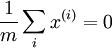
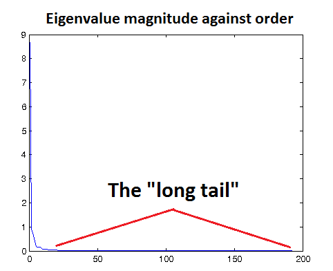

Data Preprocessing
==================

<!-- Jump to: [navigation](#column-one), [search](#searchInput) -->

|  |
| --- |
| Contents* [1 Overview](#Overview)
* [2 Data Normalization](#Data_Normalization)
	+ [2.1 Simple Rescaling](#Simple_Rescaling)
	+ [2.2 Per-example mean subtraction](#Per-example_mean_subtraction)
	+ [2.3 Feature Standardization](#Feature_Standardization)
* [3 PCA/ZCA Whitening](#PCA.2FZCA_Whitening)
	+ [3.1 Reconstruction Based Models](#Reconstruction_Based_Models)
	+ [3.2 ICA-based Models (with orthogonalization)](#ICA-based_Models_.28with_orthogonalization.29)
* [4 Large Images](#Large_Images)
* [5 Standard Pipelines](#Standard_Pipelines)
	+ [5.1 Natural Grey-scale Images](#Natural_Grey-scale_Images)
	+ [5.2 Color Images](#Color_Images)
	+ [5.3 Audio (MFCC/Spectrograms)](#Audio_.28MFCC.2FSpectrograms.29)
	+ [5.4 MNIST Handwritten Digits](#MNIST_Handwritten_Digits)
 |

  Overview
----------

Data preprocessing plays a very important in many deep learning algorithms. In practice, many methods work best after the data has been normalized and whitened. However, the exact parameters for data preprocessing are usually not immediately apparent unless one has much experience working with the algorithms. In this page, we hope to demystify some of the preprocessing methods and also provide tips (and a "standard pipeline") for preprocessing data.

Tip: When approaching a dataset, the first thing to do is to look at the data itself and observe its properties. While the techniques here apply generally, you might want to opt to do certain things differently given your dataset. For example, one standard preprocessing trick is to subtract the mean of each data point from itself (also known as remove DC, local mean subtraction, subtractive normalization). While this makes sense for data such as natural images, it is less obvious for data where stationarity does not hold.

  Data Normalization
--------------------

A standard first step to data preprocessing is data normalization. While there are a few possible approaches, this step is usually clear depending on the data. The common methods for feature normalization are:

* Simple Rescaling
* Per-example mean subtraction (a.k.a. remove DC)
* Feature Standardization (zero-mean and unit variance for each feature across the dataset)

###   Simple Rescaling

In simple rescaling, our goal is to rescale the data along each data dimension (possibly independently) so that the final data vectors lie in the range [0,1] or [ − 1,1] (depending on your dataset). This is useful for later processing as many *default* parameters (e.g., epsilon in PCA-whitening) treat the data as if it has been scaled to a reasonable range.

**Example:**  When processing natural images, we often obtain pixel values in the range [0,255]. It is a common operation to rescale these values to [0,1] by dividing the data by 255.

###   Per-example mean subtraction

If your data is *stationary* (i.e., the statistics for each data dimension follow the same distribution), then you might want to consider subtracting the mean-value for each example (computed per-example).

**Example:** In images, this normalization has the property of removing the average brightness (intensity) of the data point. In many cases, we are not interested in the illumination conditions of the image, but more so in the content; removing the average pixel value per data point makes sense here. **Note:** While this method is generally used for images, one might want to take more care when applying this to color images. In particular, the stationarity property does not generally apply across pixels in different color channels.

###   Feature Standardization

Feature standardization refers to (independently) setting each dimension of the data to have zero-mean and unit-variance. This is the most common method for normalization and is generally used widely (e.g., when working with SVMs, feature standardization is often recommended as a preprocessing step). In practice, one achieves this by first computing the mean of each dimension (across the dataset) and subtracts this from each dimension. Next, each dimension is divided by its standard deviation.

**Example:**  When working with audio data, it is common to use [MFCCs](http://en.wikipedia.org/wiki/Mel-frequency_cepstrum) as the data representation. However, the first component (representing the DC) of the MFCC features often overshadow the other components. Thus, one method to restore balance to the components is to standardize the values in each component independently.

  PCA/ZCA Whitening
-------------------

After doing the simple normalizations, whitening is often the next preprocessing step employed that helps make our algorithms work better. In practice, many deep learning algorithms rely on whitening to learn good features.

In performing PCA/ZCA whitening, it is pertinent to first zero-mean the features (across the dataset) to ensure that . Specifically, this should be done before computing the covariance matrix. (The only exception is when per-example mean subtraction is performed and the data is stationary across dimensions/pixels.)

Next, one needs to select the value of epsilon to use when performing  [PCA/ZCA whitening](Whitening.md "Whitening") (recall that this was the regularization term that has an effect of *low-pass filtering* the data). It turns out that selecting this value can also play an important role for feature learning, we discuss two cases for selecting epsilon:

###   Reconstruction Based Models

In models based on reconstruction (including Autoencoders, Sparse Coding, RBMs, k-Means), it is often preferable to set epsilon to a value such that low-pass filtering is achieved. One way to check this is to set a value for epsilon, run ZCA whitening, and thereafter visualize the data before and after whitening. If the value of epsilon is set too low, the data will look very noisy; conversely, if epsilon is set too high, you will see a "blurred" version of the original data. A good way to get a feel for the magnitude of epsilon to try is to plot the eigenvalues on a graph. As visible in the example graph below, you may get a "long tail" corresponding to the high frequency noise components. You will want to choose epsilon such that most of the "long tail" is filtered out, i.e. choose epsilon such that it is greater than most of the small eigenvalues corresponding to the noise.

In reconstruction based models, the loss function includes a term that penalizes reconstructions that are far from the original inputs. Then, if epsilon is set too *low*, the data will contain a lot of noise which the model will need to reconstruct well. As a result, it is very important for reconstruction based models to have data that has been low-pass filtered.

Tip: If your data has been scaled reasonably (e.g., to [0,1]), start with *e**p**s**i**l**o**n* = 0.01 or *e**p**s**i**l**o**n* = 0.1.

###   ICA-based Models (with orthogonalization)

For ICA-based models with orthogonalization, it is *very* important for the data to be as close to white (identity covariance) as possible. This is a side-effect of using orthogonalization to decorrelate the features learned (more details in  [ICA](Independent_Component_Analysis.md "Independent Component Analysis")). Hence, in this case, you will want to use an epsilon that is as small as possible (e.g., *e**p**s**i**l**o**n* = 1*e* − 6).

Tip: In PCA whitening, one also has the option of performing dimension reduction while whitening the data. This is usually an excellent idea since it can greatly speed up the algorithms (less computation and less parameters). A simple rule of thumb to choose how many principle components to retain is to keep enough components to have 99% of the variance retained (more details at  [PCA](PCA#Number_of_components_to_retain.md "PCA"))

Note: When working in a classification framework, one should compute the PCA/ZCA whitening matrices based only on the training set. The following parameters used be saved for use with the test set: (a) average vector that was used to zero-mean the data, (b) whitening matrices. The test set should undergo the same preprocessing steps using these saved values.

  Large Images
--------------

For large images, PCA/ZCA based whitening methods are impractical as the covariance matrix is too large. For these cases, we defer to 1/f-whitening methods. (more details to come)

  Standard Pipelines
--------------------

In this section, we describe several "standard pipelines" that have worked well for some datasets:

###   Natural Grey-scale Images

Since grey-scale images have the stationarity property, we usually first remove the mean-component from each data example separately (remove DC). After this step, PCA/ZCA whitening is often employed with a value of epsilon set large enough to low-pass filter the data.

###   Color Images

For color images, the stationarity property does not hold across color channels. Hence, we usually start by rescaling the data (making sure it is in [0,1]) ad then applying PCA/ZCA with a sufficiently large epsilon. Note that it is important to perform feature mean-normalization before computing the PCA transformation.

###   Audio (MFCC/Spectrograms)

For audio data (MFCC and Spectrograms), each dimension usually have different scales (variances); the first component of MFCCs, for example, is the DC component and usually has a larger magnitude than the other components. This is especially so when one includes the temporal derivatives (a common practice in audio processing). As a result, the preprocessing usually starts with simple data standardization (zero-mean, unit-variance per data dimension), followed by PCA/ZCA whitening (with an appropriate epsilon).

###   MNIST Handwritten Digits

The MNIST dataset has pixel values in the range [0,255]. We thus start with simple rescaling to shift the data into the range [0,1]. In practice, removing the mean-value per example can also help feature learning. *Note: While one could also elect to use PCA/ZCA whitening on MNIST if desired, this is not often done in practice.*

---

> * Language: [中文](%E6%95%B0%E6%8D%AE%E9%A2%84%E5%A4%84%E7%90%86.md "数据预处理")
> * This page was last modified on 8 April 2013, at 04:22.

