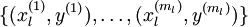
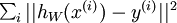
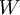
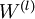

Deep Networks: Overview
=======================

<!-- Jump to: [navigation](#column-one), [search](#searchInput) -->

|  |
| --- |
| Contents* [1 Overview](#Overview)
* [2 Advantages of deep networks](#Advantages_of_deep_networks)
* [3 Difficulty of training deep architectures](#Difficulty_of_training_deep_architectures)
	+ [3.1 Availability of data](#Availability_of_data)
	+ [3.2 Local optima](#Local_optima)
	+ [3.3 Diffusion of gradients](#Diffusion_of_gradients)
* [4 Greedy layer-wise training](#Greedy_layer-wise_training)
	+ [4.1 Availability of data](#Availability_of_data_2)
	+ [4.2 Better local optima](#Better_local_optima)
 |

  Overview
----------

In the previous sections, you constructed a 3-layer neural network comprising
an input, hidden and output layer. While fairly effective for MNIST, this
3-layer model is a fairly **shallow** network; by this, we mean that the
features (hidden layer activations *a*(2)) are computed using
only "one layer" of computation (the hidden layer).

In this section, we begin to discuss **deep** neural networks, meaning ones
in which we have multiple hidden layers; this will allow us to compute much 
more complex features of the input. Because each hidden layer computes a 
non-linear transformation of the previous layer, a deep network can have
significantly greater representational power (i.e., can learn
significantly more complex functions) than a shallow one.

Note that when training a deep network, it is important to use a *non-linear*
activation function  in each hidden layer. This is
because multiple layers of linear functions would itself compute only a linear
function of the input (i.e., composing multiple linear functions together
results in just another linear function), and thus be no more expressive than
using just a single layer of hidden units.

  Advantages of deep networks
-----------------------------

Why do we want to use a deep network? The primary advantage is
that it can compactly represent a significantly larger set of fuctions
than shallow networks. Formally, one can show that there are functions
which a *k*-layer network can represent compactly
(with a number of hidden units that is *polynomial* in the number
of inputs), that a (*k* − 1)-layer network cannot represent
unless it has an exponentially large number of hidden units.

To take a simple example, consider building a boolean circuit/network to
compute the parity (or XOR) of *n* input bits. Suppose each node in
the network can compute either the logical OR of its inputs (or the OR of the 
negation of the inputs), or compute the logical AND. If we have a network with
only one input, one hidden, and one output layer, the parity function would require a number of nodes that
is exponential in the input size *n*. If however we are allowed a
deeper network, then the network/circuit size can be only polynomial in
*n*.

By using a deep network, in the case of images, one can also start to learn part-whole decompositions.
For example, the first layer might learn to group together pixels in an image
in order to detect edges (as seen in the earlier exercises). The second layer might then group together edges to
detect longer contours, or perhaps detect simple "parts of objects." An even deeper layer
might then group together these contours or detect even more complex features.

Finally, cortical computations (in the brain) also have multiple layers of
processing. For example, visual images are processed in multiple stages by the
brain, by cortical area "V1", followed by cortical area "V2" (a different part
of the brain), and so on.

  Difficulty of training deep architectures
-------------------------------------------

While the theoretical benefits of deep networks in terms of their compactness
and expressive power have been appreciated for many decades, until recently
researchers had little success training deep architectures.

The main learning algorithm that researchers were using was to randomly initialize
the weights of a deep network, and then train it using a labeled
training set 
using a supervised learning objective, for example by applying gradient descent to try to
drive down the training error. However, this usually did not work well.
There were several reasons for this.

###  Availability of data

With the method described above, one relies only on
labeled data for training. However, labeled data is often scarce, and thus for many
problems it is difficult to get enough examples to fit the parameters of a
complex model. For example, given the high degree of expressive power of deep networks,
training on insufficient data would also result in overfitting.

###  Local optima

Training a shallow network (with 1 hidden layer) using
supervised learning usually resulted in the parameters converging to reasonable values;
but when we are training a deep network, this works much less well. 
In particular, training a neural network using supervised learning
involves solving a highly non-convex optimization problem (say, minimizing the
training error  as a
function of the network parameters ). 
In a deep network, this problem turns out to be rife with bad local optima, and
training with gradient descent (or methods like conjugate gradient and L-BFGS)
no longer work well.

###  Diffusion of gradients

There is an additional technical reason,
pertaining to the gradients becoming very small, that explains why gradient
descent (and related algorithms like L-BFGS) do not work well on a deep networks
with randomly initialized weights. Specifically, when using backpropagation to
compute the derivatives, the gradients that are propagated backwards (from the
output layer to the earlier layers of the network) rapidly diminish in
magnitude as the depth of the network increases. As a result, the derivative of
the overall cost with respect to the weights in the earlier layers is very
small. Thus, when using gradient descent, the weights of the earlier layers
change slowly, and the earlier layers fail to learn much. This problem
is often called the "diffusion of gradients."

A closely related problem to the diffusion of gradients is that if the last few
layers in a neural network have a large enough number of neurons, it may be
possible for them to model the labeled data alone without the help of the
earlier layers. Hence, training the entire network at once with all the layers
randomly initialized ends up giving similar performance to training a
shallow network (the last few layers) on corrupted input (the result of
the processing done by the earlier layers).

  Greedy layer-wise training
----------------------------

How can we train a deep network? One method that has seen some
success is the **greedy layer-wise training** method. We describe this
method in detail in later sections, but briefly, the main idea is to train the
layers of the network one at a time, so that we first train a network with 1 
hidden layer, and only after that is done, train a network with 2 hidden layers,
and so on. At each step, we take the old network with *k* − 1 hidden
layers, and add an additional *k*-th hidden layer (that takes as 
input the previous hidden layer *k* − 1 that we had just
trained). Training can either be 
supervised (say, with classification error as the objective function on each
step), but more frequently it is 
unsupervised (as in an autoencoder; details to provided later). 
The weights from training the layers individually are then used to initialize the weights 
in the final/overall deep network, and only then is the entire architecture "fine-tuned" (i.e.,
trained together to optimize the labeled training set error).

The success of greedy
layer-wise training has been attributed to a number of factors:

###  Availability of data

While labeled data can be expensive to obtain,
unlabeled data is cheap and plentiful. The promise of self-taught learning is
that by exploiting the massive amount of unlabeled data, we can learn much
better models. By using unlabeled data to learn a good initial value for the
weights in all the layers  (except for the final
classification layer that maps to the outputs/predictions), our algorithm is
able to learn and discover patterns from massively more amounts of data than
purely supervised approaches. This often results in much better classifiers 
being learned.

###  Better local optima

After having trained the network
on the unlabeled data, the weights are now starting at a better location in
parameter space than if they had been randomly initialized. We can then
further fine-tune the weights starting from this location. Empirically, it
turns out that gradient descent from this location is much more likely to
lead to a good local minimum, because the unlabeled data has already provided
a significant amount of "prior" information about what patterns there
are in the input data.

In the next section, we will describe the specific details of how to go about
implementing greedy layer-wise training.

 [From Self-Taught Learning to Deep Networks](Self-Taught_Learning_to_Deep_Networks.md "Self-Taught Learning to Deep Networks") | **Deep Networks: Overview** | [Stacked Autoencoders](Stacked_Autoencoders.md "Stacked Autoencoders") | [Fine-tuning Stacked AEs](Fine-tuning_Stacked_AEs.md "Fine-tuning Stacked AEs") | [Exercise: Implement deep networks for digit classification](Exercise__Implement_deep_networks_for_digit_classification.md "Exercise: Implement deep networks for digit classification")

---

> * Language: [中文](%E6%B7%B1%E5%BA%A6%E7%BD%91%E7%BB%9C%E6%A6%82%E8%A7%88.md "深度网络概览")
> * This page was last modified on 7 April 2013, at 13:31.

