Deriving gradients using the backpropagation idea
=================================================

<!-- Jump to: [navigation](#column-one), [search](#searchInput) -->

|  |
| --- |
| Contents* [1 Introduction](#Introduction)
* [2 Examples](#Examples)
	+ [2.1 Example 1: Objective for weight matrix in sparse coding](#Example_1:_Objective_for_weight_matrix_in_sparse_coding)
	+ [2.2 Example 2: Smoothed topographic L1 sparsity penalty in sparse coding](#Example_2:_Smoothed_topographic_L1_sparsity_penalty_in_sparse_coding)
	+ [2.3 Example 3: ICA reconstruction cost](#Example_3:_ICA_reconstruction_cost)
 |

  Introduction
--------------

In the section on the  [backpropagation algorithm](Backpropagation_Algorithm.md "Backpropagation Algorithm"), you were briefly introduced to backpropagation as a means of deriving gradients for learning in the sparse autoencoder. It turns out that together with matrix calculus, this provides a powerful method and intuition for deriving gradients for more complex matrix functions (functions from matrices to the reals, or symbolically, from 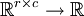).

First, recall the backpropagation idea, which we present in a modified form appropriate for our purposes below:

1. For each output unit *i* in layer *n**l* (the final layer), set

where *J*(*z*) is our "objective function" (explained below).
- For 
For each node *i* in layer *l*, set

- Compute the desired partial derivatives,

Quick notation recap:

* *l* is the number of layers in the neural network
* *n**l* is the number of neurons in the *l*th layer
* 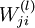 is the weight from the *i*th unit in the *l*th layer to the *j*th unit in the (*l* + 1)th layer
*  is the input to the *i*th unit in the *l*th layer
*  is the activation of the *i*th unit in the *l*th layer
* 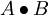 is the Hadamard or element-wise product, which for  matrices *A* and *B* yields the  matrix 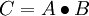 such that 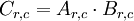* *f*(*l*) is the activation function for units in the *l*th layer

Let's say we have a function *F* that takes a matrix *X* and yields a real number. We would like to use the backpropagation idea to compute the gradient with respect to *X* of *F*, that is 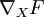. The general idea is to see the function *F* as a multi-layer neural network, and to derive the gradients using the backpropagation idea.

To do this, we will set our "objective function" to be the function *J*(*z*) that when applied to the outputs of the neurons in the last layer yields the value *F*(*X*). For the intermediate layers, we will also choose our activation functions *f*(*l*) to this end.

Using this method, we can easily compute derivatives with respect to the inputs *X*, as well as derivatives with respect to any of the weights in the network, as we shall see later.

  Examples
----------

To illustrate the use of the backpropagation idea to compute derivatives with respect to the inputs, we will use two functions from the section on  [sparse coding](Sparse_Coding__Autoencoder_Interpretation.md "Sparse Coding: Autoencoder Interpretation"), in examples 1 and 2. In example 3, we use a function from  [independent component analysis](Independent_Component_Analysis.md "Independent Component Analysis") to illustrate the use of this idea to compute derivates with respect to weights, and in this specific case, what to do in the case of tied or repeated weights.

###   Example 1: Objective for weight matrix in sparse coding

Recall for  [sparse coding](Sparse_Coding__Autoencoder_Interpretation.md "Sparse Coding: Autoencoder Interpretation"), the objective function for the weight matrix *A*, given the feature matrix *s*:

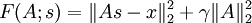

We would like to find the gradient of *F* with respect to *A*, or in symbols, 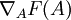. Since the objective function is a sum of two terms in *A*, the gradient is the sum of gradients of each of the individual terms. The gradient of the second term is trivial, so we will consider the gradient of the first term instead.

The first term, 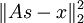, can be seen as an instantiation of neural network taking *s* as an input, and proceeding in four steps, as described and illustrated in the paragraph and diagram below:

1. Apply *A* as the weights from the first layer to the second layer.
- Subtract *x* from the activation of the second layer, which uses the identity activation function.
- Pass this unchanged to the third layer, via identity weights. Use the square function as the activation function for the third layer.
- Sum all the activations of the third layer.

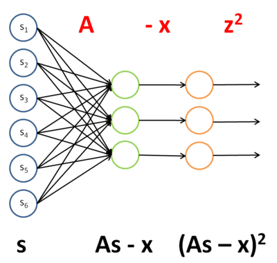

The weights and activation functions of this network are as follows:

| Layer | Weight | Activation function *f* |
| --- | --- | --- |
| 1 | *A* | *f*(*z**i*) = *z**i* (identity) |
| 2 | *I* (identity) | *f*(*z**i*) = *z**i* − *x**i* |
| 3 | N/A | f(z_i) = z_i^2 |

To have *J*(*z*(3)) = *F*(*x*), we can set .

Once we see *F* as a neural network, the gradient  becomes easy to compute - applying backpropagation yields:

| Layer | Derivative of activation function *f*' | Delta | Input *z* to this layer |
| --- | --- | --- | --- |
| 3 | *f*'(*z**i*) = 2*z**i* | *f*'(*z**i*) = 2*z**i* | *A**s* − *x* |
| 2 | *f*'(*z**i*) = 1 | \left( I^T \delta^{(3)} \right) \bullet 1 | *A**s* |
| 1 | *f*'(*z**i*) = 1 | \left( A^T \delta^{(2)} \right) \bullet 1 | *s* |

Hence,

###   Example 2: Smoothed topographic L1 sparsity penalty in sparse coding

Recall the smoothed topographic L1 sparsity penalty on *s* in  [sparse coding](Sparse_Coding__Autoencoder_Interpretation.md "Sparse Coding: Autoencoder Interpretation"):

where *V* is the grouping matrix, *s* is the feature matrix and ε is a constant.

We would like to find 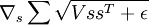. As above, let's see this term as an instantiation of a neural network:

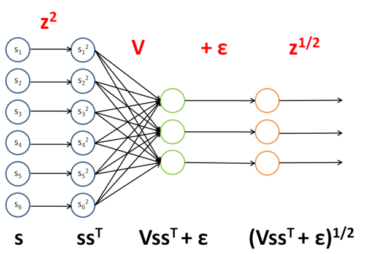

The weights and activation functions of this network are as follows:

| Layer | Weight | Activation function *f* |
| --- | --- | --- |
| 1 | *I* | f(z_i) = z_i^2 |
| 2 | *V* | *f*(*z**i*) = *z**i* |
| 3 | *I* | *f*(*z**i*) = *z**i* + ε |
| 4 | N/A | f(z_i) = z_i^{\frac{1}{2}} |

To have *J*(*z*(4)) = *F*(*x*), we can set 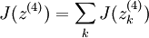.

Once we see *F* as a neural network, the gradient  becomes easy to compute - applying backpropagation yields:

| Layer | Derivative of activation function *f*' | Delta | Input *z* to this layer |
| --- | --- | --- | --- |
| 4 | f'(z_i) = \frac{1}{2} z_i^{-\frac{1}{2}} | f'(z_i) = \frac{1}{2} z_i^{-\frac{1}{2}} | (*V**s**s**T* + ε) |
| 3 | *f*'(*z**i*) = 1 | \left( I^T \delta^{(4)} \right) \bullet 1 | *V**s**s**T* |
| 2 | *f*'(*z**i*) = 1 | \left( V^T \delta^{(3)} \right) \bullet 1 | *s**s**T* |
| 1 | *f*'(*z**i*) = 2*z**i* | \left( I^T \delta^{(2)} \right) \bullet 2s | *s* |

Hence,

###   Example 3: ICA reconstruction cost

Recall the  [independent component analysis (ICA)](Independent_Component_Analysis.md "Independent Component Analysis") reconstruction cost term:
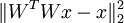
where *W* is the weight matrix and *x* is the input.

We would like to find 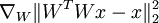 - the derivative of the term with respect to the **weight matrix**, rather than the **input** as in the earlier two examples. We will still proceed similarly though, seeing this term as an instantiation of a neural network:

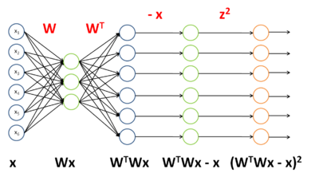

The weights and activation functions of this network are as follows:

| Layer | Weight | Activation function *f* |
| --- | --- | --- |
| 1 | *W* | *f*(*z**i*) = *z**i* |
| 2 | *W**T* | *f*(*z**i*) = *z**i* |
| 3 | *I* | *f*(*z**i*) = *z**i* − *x**i* |
| 4 | N/A | f(z_i) = z_i^2 |

To have *J*(*z*(4)) = *F*(*x*), we can set .

Now that we can see *F* as a neural network, we can try to compute the gradient 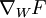. However, we now face the difficulty that *W* appears twice in the network. Fortunately, it turns out that if *W* appears multiple times in the network, the gradient with respect to *W* is simply the sum of gradients for each instance of *W* in the network (you may wish to work out a formal proof of this fact to convince yourself). With this in mind, we will proceed to work out the deltas first:

| Layer | Derivative of activation function *f*' | Delta | Input *z* to this layer |
| --- | --- | --- | --- |
| 4 | *f*'(*z**i*) = 2*z**i* | *f*'(*z**i*) = 2*z**i* | (*W**T**W**x* − *x*) |
| 3 | *f*'(*z**i*) = 1 | \left( I^T \delta^{(4)} \right) \bullet 1 | *W**T**W**x* |
| 2 | *f*'(*z**i*) = 1 | \left( (W^T)^T \delta^{(3)} \right) \bullet 1 | *W**x* |
| 1 | *f*'(*z**i*) = 1 | \left( W^T \delta^{(2)} \right) \bullet 1 | *x* |

To find the gradients with respect to *W*, first we find the gradients with respect to each instance of *W* in the network.

With respect to *W**T*:

With respect to *W*:

Taking sums, noting that we need to transpose the gradient with respect to *W**T* to get the gradient with respect to *W*, yields the final gradient with respect to *W* (pardon the slight abuse of notation here):

---

> * Language: [中文](%E7%94%A8%E5%8F%8D%E5%90%91%E4%BC%A0%E5%AF%BC%E6%80%9D%E6%83%B3%E6%B1%82%E5%AF%BC.md "用反向传导思想求导")
> * This page was last modified on 8 April 2013, at 04:26.

