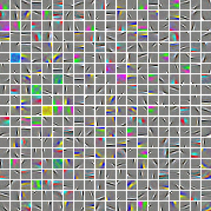
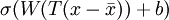
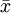
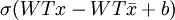
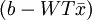

Exercise:Convolution and Pooling
================================

<!-- Jump to: [navigation](#column-one), [search](#searchInput) -->

|  |
| --- |
| Contents* [1 Convolution and Pooling](#Convolution_and_Pooling)
	+ [1.1 Dependencies](#Dependencies)
	+ [1.2 Step 1: Load learned features](#Step_1:_Load_learned_features)
	+ [1.3 Step 2: Implement and test convolution and pooling](#Step_2:_Implement_and_test_convolution_and_pooling)
		- [1.3.1 Step 2a: Implement convolution](#Step_2a:_Implement_convolution)
		- [1.3.2 Step 2b: Check your convolution](#Step_2b:_Check_your_convolution)
		- [1.3.3 Step 2c: Pooling](#Step_2c:_Pooling)
		- [1.3.4 Step 2d: Check your pooling](#Step_2d:_Check_your_pooling)
	+ [1.4 Step 3: Convolve and pool with the dataset](#Step_3:_Convolve_and_pool_with_the_dataset)
	+ [1.5 Step 4: Use pooled features for classification](#Step_4:_Use_pooled_features_for_classification)
	+ [1.6 Step 5: Test classifier](#Step_5:_Test_classifier)
 |

  Convolution and Pooling
-------------------------

In this exercise you will use the features you learned on 8x8 patches sampled from images from the STL-10 dataset in  [the earlier exercise on linear decoders](Exercise_Learning_color_features_with_Sparse_Autoencoders.md "Exercise:Learning color features with Sparse Autoencoders") for classifying images from a reduced STL-10 dataset applying  [convolution](Feature_extraction_using_convolution.md "Feature extraction using convolution") and  [pooling](Pooling.md "Pooling"). The reduced STL-10 dataset comprises 64x64 images from 4 classes (airplane, car, cat, dog).

In the file [cnn\_exercise.zip](http://ufldl.stanford.edu/wiki/resources/cnn_exercise.zip) we have provided some starter code. You should write your code at the places indicated "YOUR CODE HERE" in the files.

For this exercise, you will need to modify **cnnConvolve.m** and **cnnPool.m**.

###   Dependencies

The following additional files are required for this exercise:

* [A subset of the STL10 Dataset (stlSubset.zip)](http://ufldl.stanford.edu/wiki/resources/stlSubset.zip)
* [Starter Code (cnn\_exercise.zip)](http://ufldl.stanford.edu/wiki/resources/cnn_exercise.zip)

You will also need:

* sparseAutoencoderLinear.m or your saved features from [Exercise:Learning color features with Sparse Autoencoders](Exercise_Learning_color_features_with_Sparse_Autoencoders.md "Exercise:Learning color features with Sparse Autoencoders")
* feedForwardAutoencoder.m (and related functions) from [Exercise:Self-Taught Learning](Exercise_Self-Taught_Learning.md "Exercise:Self-Taught Learning")
* softmaxTrain.m (and related functions) from [Exercise:Softmax Regression](Exercise_Softmax_Regression.md "Exercise:Softmax Regression")

*If you have not completed the exercises listed above, we strongly suggest you complete them first.*

###   Step 1: Load learned features

In this step, you will use the features from [Exercise:Learning color features with Sparse Autoencoders](Exercise_Learning_color_features_with_Sparse_Autoencoders.md "Exercise:Learning color features with Sparse Autoencoders"). If you have completed that exercise, you can load the color features that were previously saved. To verify that the features are good, the visualized features should look like the following:



###   Step 2: Implement and test convolution and pooling

In this step, you will implement convolution and pooling, and test them on a small part of the data set to ensure that you have implemented these two functions correctly. In the next step, you will actually convolve and pool the features with the STL-10 images.

####   Step 2a: Implement convolution

Implement convolution, as described in [feature extraction using convolution](Feature_extraction_using_convolution.md "Feature extraction using convolution"), in the function cnnConvolve in cnnConvolve.m. Implementing convolution is somewhat involved, so we will guide you through the process below.

First, we want to compute σ(*W**x*(*r*,*c*) + *b*) for all *valid* (*r*,*c*) (*valid* meaning that the entire 8x8 patch is contained within the image; this is as opposed to a *full* convolution, which allows the patch to extend outside the image, with the area outside the image assumed to be 0), where *W* and *b* are the learned weights and biases from the input layer to the hidden layer, and *x*(*r*,*c*) is the 8x8 patch with the upper left corner at (*r*,*c*). To accomplish this, one naive method is to loop over all such patches and compute σ(*W**x*(*r*,*c*) + *b*) for each of them; while this is fine in theory, it can very slow. Hence, we usually use Matlab's built in convolution functions, which are well optimized.

Observe that the convolution above can be broken down into the following three small steps. First, compute *W**x*(*r*,*c*) for all (*r*,*c*). Next, add b to all the computed values. Finally, apply the sigmoid function to the resulting values. This doesn't seem to buy you anything, since the first step still requires a loop. However, you can replace the loop in the first step with one of MATLAB's optimized convolution functions, conv2, speeding up the process significantly.

However, there are two important points to note in using conv2.

First, conv2 performs a 2-D convolution, but you have 5 "dimensions" - image number, feature number, row of image, column of image, and (color) channel of image - that you want to convolve over. Because of this, you will have to convolve each feature and image channel separately for each image, using the row and column of the image as the 2 dimensions you convolve over. This means that you will need three outer loops over the image number imageNum, feature number featureNum, and the channel number of the image channel. Inside the three nested for-loops, you will perform a conv2 2-D convolution, using the weight matrix for the featureNum-th feature and channel-th channel, and the image matrix for the imageNum-th image.

Second, because of the mathematical definition of convolution, the feature matrix must be "flipped" before passing it to conv2. The following implementation tip explains the "flipping" of feature matrices when using MATLAB's convolution functions:

**Implementation tip:** Using conv2 and convn

Because the mathematical definition of convolution involves "flipping" the matrix to convolve with (reversing its rows and its columns), to use MATLAB's convolution functions, you must first "flip" the weight matrix so that when MATLAB "flips" it according to the mathematical definition the entries will be at the correct place. For example, suppose you wanted to convolve two matrices image (a large image) and W (the feature) using conv2(image, W), and W is a 3x3 matrix as below:


If you use conv2(image, W), MATLAB will first "flip" W, reversing its rows and columns, before convolving W with image, as below:


If the original layout of W was correct, after flipping, it would be incorrect. For the layout to be correct after flipping, you will have to flip W before passing it into conv2, so that after MATLAB flips W in conv2, the layout will be correct. For conv2, this means reversing the rows and columns, which can be done with flipud and fliplr, as shown below:

```
% Flip W for use in conv2
W = flipud(fliplr(W));
```

Next, to each of the convolvedFeatures, you should then add b, the corresponding bias for the featureNum-th feature.

However, there is one additional complication. If we had not done any preprocessing of the input patches, you could just follow the procedure as described above, and apply the sigmoid function to obtain the convolved features, and we'd be done. However, because you preprocessed the patches before learning features on them, you must also apply the same preprocessing steps to the convolved patches to get the correct feature activations.

In particular, you did the following to the patches:

1. subtract the mean patch, meanPatch to zero the mean of the patches 
- ZCA whiten using the whitening matrix ZCAWhite.

These same three steps must also be applied to the input image patches.

Taking the preprocessing steps into account, the feature activations that you should compute is , where *T* is the whitening matrix and  is the mean patch. Expanding this, you obtain , which suggests that you should convolve the images with *W**T* rather than *W* as earlier, and you should add , rather than just *b* to convolvedFeatures, before finally applying the sigmoid function.

####   Step 2b: Check your convolution

We have provided some code for you to check that you have done the convolution correctly. The code randomly checks the convolved values for a number of (feature, row, column) tuples by computing the feature activations using feedForwardAutoencoder for the selected features and patches directly using the sparse autoencoder.

####   Step 2c: Pooling

Implement [pooling](Pooling.md "Pooling") in the function cnnPool in cnnPool.m. You should implement *mean* pooling (i.e., averaging over feature responses) for this part.

####   Step 2d: Check your pooling

We have provided some code for you to check that you have done the pooling correctly. The code runs cnnPool against a test matrix to see if it produces the expected result.

###   Step 3: Convolve and pool with the dataset

In this step, you will convolve each of the features you learned with the full 64x64 images from the STL-10 dataset to obtain the convolved features for both the training and test sets. You will then pool the convolved features to obtain the pooled features for both training and test sets. The pooled features for the training set will be used to train your classifier, which you can then test on the test set.

Because the convolved features matrix is very large, the code provided does the convolution and pooling 50 features at a time to avoid running out of memory.

###   Step 4: Use pooled features for classification

In this step, you will use the pooled features to train a softmax classifier to map the pooled features to the class labels. The code in this section uses softmaxTrain from the softmax exercise to train a softmax classifier on the pooled features for 500 iterations, which should take around a few minutes.

###   Step 5: Test classifier

Now that you have a trained softmax classifier, you can see how well it performs on the test set. These pooled features for the test set will be run through the softmax classifier, and the accuracy of the predictions will be computed. You should expect to get an accuracy of around 80%.
> * This page was last modified on 3 June 2011, at 19:16.

