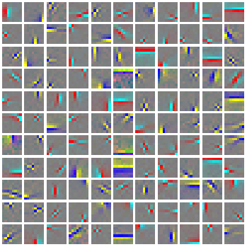
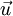
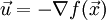
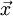
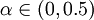

Exercise:Independent Component Analysis
=======================================

<!-- Jump to: [navigation](#column-one), [search](#searchInput) -->

|  |
| --- |
| Contents* [1 Independent Component Analysis](#Independent_Component_Analysis)
	+ [1.1 Dependencies](#Dependencies)
	+ [1.2 Step 0: Initialization](#Step_0:_Initialization)
	+ [1.3 Step 1: Sample patches](#Step_1:_Sample_patches)
	+ [1.4 Step 2: ZCA whiten patches](#Step_2:_ZCA_whiten_patches)
	+ [1.5 Step 3: Implement and check ICA cost functions](#Step_3:_Implement_and_check_ICA_cost_functions)
		- [1.5.1 Step 4: Optimization](#Step_4:_Optimization)
	+ [1.6 Appendix](#Appendix)
		- [1.6.1 Backtracking line search](#Backtracking_line_search)
 |

  Independent Component Analysis
--------------------------------

In this exercise, you will implement [Independent Component Analysis](Independent_Component_Analysis.md "Independent Component Analysis") on color images from the STL-10 dataset.

In the file [independent\_component\_analysis\_exercise.zip](http://ufldl.stanford.edu/wiki/resources/independent_component_analysis_exercise.zip) we have provided some starter code. You should write your code at the places indicated "YOUR CODE HERE" in the files.

For this exercise, you will need to modify **OrthonormalICACost.m** and **ICAExercise.m**.

###   Dependencies

You will need:

* computeNumericalGradient.m from [Exercise:Sparse Autoencoder](Exercise_Sparse_Autoencoder.md "Exercise:Sparse Autoencoder")
* displayColorNetwork.m from [Exercise:Learning color features with Sparse Autoencoders](Exercise_Learning_color_features_with_Sparse_Autoencoders.md "Exercise:Learning color features with Sparse Autoencoders")

The following additional file is also required for this exercise:

* [Sampled 8x8 patches from the STL-10 dataset (stl10\_patches\_100k.zip)](http://ufldl.stanford.edu/wiki/resources/stl10_patches_100k.zip)

*If you have not completed the exercises listed above, we strongly suggest you complete them first.*

###   Step 0: Initialization

In this step, we initialize some parameters used for the exercise.

###   Step 1: Sample patches

In this step, we load and use a portion of the 8x8 patches from the STL-10 dataset (which you first saw in the exercise on  [linear decoders](Exercise_Learning_color_features_with_Sparse_Autoencoders.md "Exercise:Learning color features with Sparse Autoencoders")).

###   Step 2: ZCA whiten patches

In this step, we ZCA whiten the patches as required by orthonormal ICA.

###   Step 3: Implement and check ICA cost functions

In this step, you should implement the ICA cost function:
orthonormalICACost in orthonormalICACost.m, which computes the cost and gradient for the orthonormal ICA objective. Note that the orthonormality constraint is **not** enforced in the cost function. It will be enforced by a projection in the gradient descent step, which you will have to complete in step 4.

When you have implemented the cost function, you should check the gradients numerically.

**Hint** - if you are having difficulties deriving the gradients, you may wish to consult the page on [deriving gradients using the backpropagation idea](Deriving_gradients_using_the_backpropagation_idea.md "Deriving gradients using the backpropagation idea").

####   Step 4: Optimization

In step 4, you will optimize for the orthonormal ICA objective using gradient descent with backtracking line search (the code for which has already been provided for you. For more details on the backtracking line search, you may wish to consult the  [appendix](Exercise_Independent_Component_Analysis#Appendix.md "Exercise:Independent Component Analysis")  of this exercise). The orthonormality constraint should be enforced with a projection, which you should fill in.

Once you have filled in the code for the projection, check that it is correct by using the verification code provided. Once you have verified that your projection is correct, comment out the verification code and run the optimization. 1000 iterations of gradient descent should take less than 15 minutes, and produce a basis which looks like the following:

It is comparatively difficult to optimize for the objective while enforcing the orthonormality constraint using gradient descent, and convergence can be slow. Hence, in situations where an orthonormal basis is not required, other faster methods of learning bases (such as  [sparse coding](Sparse_Coding__Autoencoder_Interpretation.md "Sparse Coding: Autoencoder Interpretation")) may be preferable.

###   Appendix

####   Backtracking line search

The backtracking line search used in the exercise is based off that in [Convex Optimization by Boyd and Vandenbergh](http://www.stanford.edu/~boyd/cvxbook/). In the backtracking line search, given a descent direction  (in this exercise we use ), we want to find a good step size *t* that gives us a steep descent. The general idea is to use a linear approximation (the first order Taylor approximation) to the function *f* at the current point , and to search for a step size *t* such that we can decrease the function's value by more than α times the decrease predicted by the linear approximation (. For more details, you may wish to consult [the book](http://www.stanford.edu/~boyd/cvxbook/).

However, it is not necessary to use the backtracking line search here. Gradient descent with a small step size, or backtracking to a step size so that the objective decreases is sufficient for this exercise.
> * This page was last modified on 4 October 2011, at 04:31.

