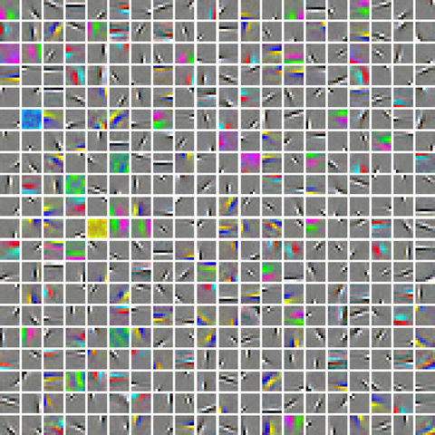

Exercise:Learning color features with Sparse Autoencoders
=========================================================

<!-- Jump to: [navigation](#column-one), [search](#searchInput) -->

|  |
| --- |
| Contents* [1 Learning color features with Sparse Autoencoders](#Learning_color_features_with_Sparse_Autoencoders)
	+ [1.1 Dependencies](#Dependencies)
	+ [1.2 Learning from color image patches](#Learning_from_color_image_patches)
	+ [1.3 Step 0: Initialization](#Step_0:_Initialization)
	+ [1.4 Step 1: Modify your sparse autoencoder to use a linear decoder](#Step_1:_Modify_your_sparse_autoencoder_to_use_a_linear_decoder)
	+ [1.5 Step 2: Learn features on small patches](#Step_2:_Learn_features_on_small_patches)
 |

  Learning color features with Sparse Autoencoders
--------------------------------------------------

In this exercise, you will implement a  [linear decoder](Linear_Decoders.md "Linear Decoders") (a sparse autoencoder whose output layer uses a linear activation function). You will then apply it to learn features on color images from the STL-10 dataset. These features will be used in an later  [exercise on convolution and pooling](Exercise_Convolution_and_Pooling.md "Exercise:Convolution and Pooling") for classifying STL-10 images.

In the file [linear\_decoder\_exercise.zip](http://ufldl.stanford.edu/wiki/resources/linear_decoder_exercise.zip) we have provided some starter code. You should write your code at the places indicated "YOUR CODE HERE" in the files.

For this exercise, you will need to copy and modify **sparseAutoencoderCost.m** from the  [sparse autoencoder exercise](Exercise_Sparse_Autoencoder.md "Exercise:Sparse Autoencoder").

###   Dependencies

You will need:

* sparseAutoencoderCost.m (and related functions) from [Exercise:Sparse Autoencoder](Exercise_Sparse_Autoencoder.md "Exercise:Sparse Autoencoder")

The following additional file is also required for this exercise:

* [Sampled 8x8 patches from the STL-10 dataset (stl10\_patches\_100k.zip)](http://ufldl.stanford.edu/wiki/resources/stl10_patches_100k.zip)

*If you have not completed the exercise listed above, we strongly suggest you complete it first.*

###   Learning from color image patches

In all the exercises so far, you have been working only with grayscale images. In this exercise, you will get to work with RGB color images for the first time.

Conveniently, the fact that an image has three color channels (RGB), rather than a single gray channel, presents little difficulty for the sparse autoencoder. You can just combine the intensities from all the color channels for the pixels into one long vector, as if you were working with a grayscale image with 3x the number of pixels as the original image.

###   Step 0: Initialization

In this step, we initialize some parameters used in the exercise (see starter code for details).

###   Step 1: Modify your sparse autoencoder to use a linear decoder

Copy sparseAutoencoderCost.m to the directory for this exercise and rename it to sparseAutoencoderLinearCost.m. Rename the function sparseAutoencoderCost in the file to sparseAutoencoderLinearCost, and modify it to use a  [linear decoder](Linear_Decoders.md "Linear Decoders"). In particular, you should change the cost and gradients returned to reflect the change from a sigmoid to a linear decoder. After making this change, check your gradients to ensure that they are correct.

###   Step 2: Learn features on small patches

You will now use your sparse autoencoder to learn features on a set of 100,000 small 8x8 patches sampled from the larger 96x96 STL-10 images (The [STL-10 dataset](http://www.stanford.edu/~acoates//stl10/) comprises 5000 training and 8000 test examples, with each example being a 96x96 labelled color image belonging to one of ten classes: airplane, bird, car, cat, deer, dog, horse, monkey, ship, truck.)

The code provided in this step trains your sparse autoencoder for 400 iterations with the default parameters initialized in step 0. This should take around 45 minutes. Your sparse autoencoder should learn features which when visualized, look like edges and "opponent colors," as in the figure below.

If your parameters are improperly tuned (the default parameters should work), or if your implementation of the autoencoder is buggy, you might instead get images that look like one of the following:

|  |  |
| --- | --- |
| Cnn Features Bad1.png | Cnn Features Bad2.png |

The learned features will be saved to STL10Features.mat, which will be used in the later  [exercise on convolution and pooling](Exercise_Convolution_and_Pooling.md "Exercise:Convolution and Pooling").
> * This page was last modified on 21 June 2011, at 21:00.

