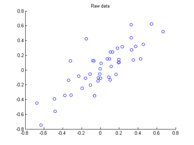
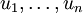
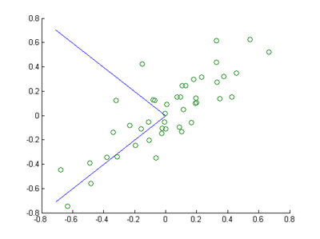
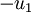
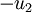
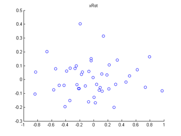
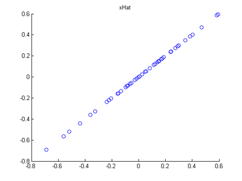
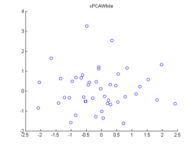
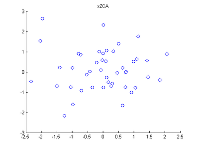

Exercise:PCA in 2D
==================

<!-- Jump to: [navigation](#column-one), [search](#searchInput) -->

|  |
| --- |
| Contents* [1 PCA, PCA whitening and ZCA whitening in 2D](#PCA.2C_PCA_whitening_and_ZCA_whitening_in_2D)
	+ [1.1 Step 0: Load data](#Step_0:_Load_data)
	+ [1.2 Step 1: Implement PCA](#Step_1:_Implement_PCA)
		- [1.2.1 Step 1a: Finding the PCA basis](#Step_1a:_Finding_the_PCA_basis)
		- [1.2.2 Step 1b: Check xRot](#Step_1b:_Check_xRot)
	+ [1.3 Step 2: Dimension reduce and replot](#Step_2:_Dimension_reduce_and_replot)
	+ [1.4 Step 3: PCA Whitening](#Step_3:_PCA_Whitening)
	+ [1.5 Step 4: ZCA Whitening](#Step_4:_ZCA_Whitening)
 |

  PCA, PCA whitening and ZCA whitening in 2D
--------------------------------------------

In this exercise you will implement PCA, PCA whitening and ZCA whitening, as described in the earlier sections of this tutorial, and generate the images shown in the earlier sections yourself. You will build on the starter code that has been provided at [pca\_2d.zip](http://ufldl.stanford.edu/wiki/resources/pca_2d.zip). You need only write code at the places indicated by "YOUR CODE HERE" in the files. The only file you need to modify is pca\_2d.m. Implementing this exercise will make the next exercise significantly easier to understand and complete.

###   Step 0: Load data

The starter code contains code to load 45 2D data points. When plotted using the scatter function, the results should look like the following:

###   Step 1: Implement PCA

In this step, you will implement PCA to obtain *x**r**o**t*, the matrix in which the data is "rotated" to the basis comprising  made up of the principal components. As mentioned in the implementation notes, you should make use of MATLAB's svd function here.

####   Step 1a: Finding the PCA basis

Find  and , and draw two lines in your figure to show the resulting basis on top of the given data points. You may find it useful to use MATLAB's hold on and hold off functions. (After calling hold on, plotting functions such as plot will draw the new data on top of the previously existing figure rather than erasing and replacing it; and hold off turns this off.) You can use plot([x1,x2], [y1,y2], '-') to draw a line between (x1,y1) and (x2,y2). Your figure should look like this:

If you are doing this in Matlab, you will probably get a plot that's identical to ours. However, eigenvectors are defined only up to a sign. I.e., instead of returning  as the first eigenvector, Matlab/Octave could just as easily have returned , and similarly instead of  Matlab/Octave could have returned . So if you wound up with one or both of the eigenvectors pointing in a direction opposite (180 degrees difference) from what's shown above, that's okay too.

####   Step 1b: Check xRot

Compute xRot, and use the scatter function to check that xRot looks as it should, which should be something like the following:

Because Matlab/Octave could have returned  and/or  instead of  and , it's also possible that you might have gotten a figure which is "flipped" or "reflected" along the - and/or -axis; a flipped/reflected version of this figure is also a completely correct result.

###   Step 2: Dimension reduce and replot

In the next step, set *k*, the number of components to retain, to be 1 (we have already done this for you). Compute the resulting xHat and plot the results. You should get the following (this figure should **not** be flipped along the - or -axis):

###   Step 3: PCA Whitening

Implement PCA whitening using the formula from the notes. Plot xPCAWhite, and verify that it looks like the following (a figure that is flipped/reflected on either/both axes is also correct):

###   Step 4: ZCA Whitening

Implement ZCA whitening and plot the results. The results should look like the following (this should not be flipped/reflected along the - or -axis):

[PCA](PCA.md "PCA") | [Whitening](Whitening.md "Whitening") | [Implementing PCA/Whitening](/wayback-mooc/stanford-ufldl/wiki/Implementing_PCA/Whitening "Implementing PCA/Whitening") | **Exercise:PCA in 2D** | [Exercise:PCA and Whitening](Exercise_PCA_and_Whitening.md "Exercise:PCA and Whitening")

 Category: Exercises
> * This page was last modified on 26 May 2011, at 11:01.

