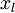
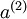
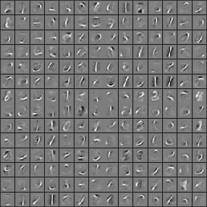

Exercise:Self-Taught Learning
=============================

<!-- Jump to: [navigation](#column-one), [search](#searchInput) -->

|  |
| --- |
| Contents* [1 Overview](#Overview)
* [2 Dependencies](#Dependencies)
* [3 Step 1: Generate the input and test data sets](#Step_1:_Generate_the_input_and_test_data_sets)
* [4 Step 2: Train the sparse autoencoder](#Step_2:_Train_the_sparse_autoencoder)
* [5 Step 3: Extracting features](#Step_3:_Extracting_features)
* [6 Step 4: Training and testing the logistic regression model](#Step_4:_Training_and_testing_the_logistic_regression_model)
* [7 Step 5: Classifying on the test set](#Step_5:_Classifying_on_the_test_set)
 |

###  Overview

In this exercise, we will use the self-taught learning paradigm with the sparse autoencoder and softmax classifier to build a classifier for handwritten digits.

You will be building upon your code from the earlier exercises. First, you will train your sparse autoencoder on an "unlabeled" training dataset of handwritten digits. This produces feature that are penstroke-like. We then extract these learned features from a labeled dataset of handwritten digits. These features will then be used as inputs to the softmax classifier that you wrote in the previous exercise.

Concretely, for each example in the the labeled training dataset , we forward propagate the example to obtain the activation of the hidden units . We now represent this example using  (the "replacement" representation), and use this to as the new feature representation with which to train the softmax classifier.

Finally, we also extract the same features from the test data to obtain predictions.

In this exercise, our goal is to distinguish between the digits from 0 to 4. We will use the digits 5 to 9 as our 
"unlabeled" dataset which which to learn the features; we will then use a labeled dataset with the digits 0 to 4 with
which to train the softmax classifier.

In the starter code, we have provided a file **stlExercise.m** that will help walk you through the steps in this exercise.

###   Dependencies

The following additional files are required for this exercise:

* [MNIST Dataset](http://yann.lecun.com/exdb/mnist/)
* [Support functions for loading MNIST in Matlab](Using_the_MNIST_Dataset.md "Using the MNIST Dataset")
* [Starter Code (stl\_exercise.zip)](http://ufldl.stanford.edu/wiki/resources/stl_exercise.zip)

You will also need your code from the following exercises:

* [Exercise:Sparse Autoencoder](Exercise_Sparse_Autoencoder.md "Exercise:Sparse Autoencoder")
* [Exercise:Vectorization](Exercise_Vectorization.md "Exercise:Vectorization")
* [Exercise:Softmax Regression](Exercise_Softmax_Regression.md "Exercise:Softmax Regression")

*If you have not completed the exercises listed above, we strongly suggest you complete them first.*

###  Step 1: Generate the input and test data sets

Download and decompress [stl\_exercise.zip](http://ufldl.stanford.edu/wiki/resources/stl_exercise.zip), which contains starter code for this exercise. Additionally, you will need to download the datasets from the MNIST Handwritten Digit Database for this project.

###  Step 2: Train the sparse autoencoder

Next, use the unlabeled data (the digits from 5 to 9) to train a sparse autoencoder, using the same sparseAutoencoderCost.m function as you had written in the previous exercise. (From the earlier exercise, you should have a working and vectorized implementation of the sparse autoencoder.) For us, the training step took less than 25 minutes on a fast desktop. When training is complete, you should get a visualization of pen strokes like the image shown below:

Informally, the features learned by the sparse autoencoder should correspond to penstrokes.

###  Step 3: Extracting features

After the sparse autoencoder is trained, you will use it to extract features from the handwritten digit images.

Complete feedForwardAutoencoder.m to produce a matrix whose columns correspond to activations of the hidden layer for each example, i.e., the vector *a*(2) corresponding to activation of layer 2. (Recall that we treat the inputs as layer 1).

After completing this step, calling feedForwardAutoencoder.m should convert the raw image data to hidden unit activations *a*(2).

###  Step 4: Training and testing the logistic regression model

Use your code from the softmax exercise (softmaxTrain.m) to train a softmax classifier using the training set features (trainFeatures) and labels (trainLabels).

###  Step 5: Classifying on the test set

Finally, complete the code to make predictions on the test set (testFeatures) and see how your learned features perform! If you've done all the steps correctly, you should get an accuracy of about **98%** percent.

As a comparison, when *raw pixels* are used (instead of the learned features), we obtained a test accuracy of only around 96% (for the same train and test sets).

[Self-Taught Learning](Self-Taught_Learning.md "Self-Taught Learning") | **Exercise:Self-Taught Learning**

 Category: Exercises
> * This page was last modified on 26 May 2011, at 11:02.

