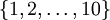
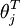
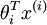
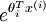
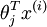
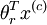
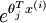
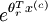

Exercise:Softmax Regression
===========================

<!-- Jump to: [navigation](#column-one), [search](#searchInput) -->

|  |
| --- |
| Contents* [1 Softmax regression](#Softmax_regression)
	+ [1.1 Dependencies](#Dependencies)
	+ [1.2 Step 0: Initialize constants and parameters](#Step_0:_Initialize_constants_and_parameters)
	+ [1.3 Step 1: Load data](#Step_1:_Load_data)
	+ [1.4 Step 2: Implement softmaxCost](#Step_2:_Implement_softmaxCost)
	+ [1.5 Step 3: Gradient checking](#Step_3:_Gradient_checking)
	+ [1.6 Step 4: Learning parameters](#Step_4:_Learning_parameters)
	+ [1.7 Step 5: Testing](#Step_5:_Testing)
 |

  Softmax regression
--------------------

In this problem set, you will use [softmax regression](Softmax_regression.md "Softmax regression") to classify MNIST images. The goal of this exercise is to build a softmax classifier that you will be able to reuse in the future exercises and also on other classification problems that you might encounter.

In the file [softmax\_exercise.zip](http://ufldl.stanford.edu/wiki/resources/softmax_exercise.zip), we have provided some starter code. You should write your code in the places indicated by "YOUR CODE HERE" in the files.

In the starter code, you will need to modify **softmaxCost.m** and **softmaxPredict.m** for this exercise.

We have also provided **softmaxExercise.m** that will help walk you through the steps in this exercise.

###   Dependencies

The following additional files are required for this exercise:

* [MNIST Dataset](http://yann.lecun.com/exdb/mnist/)
* [Support functions for loading MNIST in Matlab](Using_the_MNIST_Dataset.md "Using the MNIST Dataset")
* [Starter Code (softmax\_exercise.zip)](http://ufldl.stanford.edu/wiki/resources/softmax_exercise.zip)

You will also need:

* computeNumericalGradient.m from [Exercise:Sparse Autoencoder](Exercise_Sparse_Autoencoder.md "Exercise:Sparse Autoencoder")

*If you have not completed the exercises listed above, we strongly suggest you complete them first.*

###   Step 0: Initialize constants and parameters

We've provided the code for this step in softmaxExercise.m.

Two constants, inputSize and numClasses, corresponding to the size of each input vector and the number of class labels have been defined in the starter code. This will allow you to reuse your code on a different data set in a later exercise. We also initialize lambda, the weight decay parameter here.

###   Step 1: Load data

The starter code loads the MNIST images and labels into inputData and labels respectively. The images are pre-processed to scale the pixel values to the range [0,1], and the label 0 is remapped to 10 for convenience of implementation, so that the labels take values in . You will not need to change any code in this step for this exercise, but note that your code should be general enough to operate on data of arbitrary size belonging to any number of classes.

###   Step 2: Implement softmaxCost

In softmaxCost.m, implement code to compute the softmax cost function *J*(θ). Remember to include the weight decay term in the cost as well. Your code should also compute the appropriate gradients, as well as the predictions for the input data (which will be used in the cross-validation step later).

It is important to vectorize your code so that it runs quickly. We also provide several implementation tips below:

Note: In the provided starter code, theta is a matrix where each the *jth row* is 

**Implementation Tip**: Computing the ground truth matrix - In your code, you may need to compute the ground truth matrix M, such that M(r, c) is 1 if *y*(*c*) = *r* and 0 otherwise. This can be done quickly, without a loop, using the MATLAB functions sparse and full. Specifically, the command M = sparse(r, c, v) creates a sparse matrix such that M(r(i), c(i)) = v(i) for all i. That is, the vectors r and c give the position of the elements whose values we wish to set, and v the corresponding values of the elements. Running full on a sparse matrix gives a "full" representation of the matrix for use (meaning that Matlab will no longer try to represent it as a sparse matrix in memory). The code for using sparse and full to compute the ground truth matrix has already been included in softmaxCost.m.

**Implementation Tip:** Preventing overflows - in softmax regression, you will have to compute the hypothesis


When the products  are large, the exponential function  will become very large and possibly overflow. When this happens, you will not be able to compute your hypothesis. However, there is an easy solution - observe that we can multiply the top and bottom of the hypothesis by some constant without changing the output:

![
\begin{align} 
h(x^{(i)}) &=

\frac{1}{ \sum_{j=1}^{k}{e^{ \theta_j^T x^{(i)} }} }
\begin{bmatrix} 
e^{ \theta_1^T x^{(i)} } \\
e^{ \theta_2^T x^{(i)} } \\
\vdots \\
e^{ \theta_k^T x^{(i)} } \\
\end{bmatrix} \\

&=

\frac{ e^{-\alpha} }{ e^{-\alpha} \sum_{j=1}^{k}{e^{ \theta_j^T x^{(i)} }} }
\begin{bmatrix} 
e^{ \theta_1^T x^{(i)} } \\
e^{ \theta_2^T x^{(i)} } \\
\vdots \\
e^{ \theta_k^T x^{(i)} } \\
\end{bmatrix} \\

&=

\frac{ 1 }{ \sum_{j=1}^{k}{e^{ \theta_j^T x^{(i)} - \alpha }} }
\begin{bmatrix} 
e^{ \theta_1^T x^{(i)} - \alpha } \\
e^{ \theta_2^T x^{(i)} - \alpha } \\
\vdots \\
e^{ \theta_k^T x^{(i)} - \alpha } \\
\end{bmatrix} \\

\end{align}

](images/math/5/8/c/58c78b3b8fe301539fca1ac6babd173c.png)

Hence, to prevent overflow, simply subtract some large constant value from each of the  terms before computing the exponential. In practice, for each example, you can use the maximum of the  terms as the constant. Assuming you have a matrix M containing these terms such that M(r, c) is , then you can use the following code to accomplish this:

```
% M is the matrix as described in the text
M = bsxfun(@minus, M, max(M, [], 1));

```

max(M) yields a row vector with each element giving the maximum value in that column. bsxfun (short for binary singleton expansion function) applies minus along each row of M, hence subtracting the maximum of each column from every element in the column.

**Implementation Tip:**  Computing the predictions - you may also find bsxfun useful in computing your predictions - if you have a matrix M containing the  terms, such that M(r, c) contains the  term, you can use the following code to compute the hypothesis (by dividing all elements in each column by their column sum):

```
% M is the matrix as described in the text
M = bsxfun(@rdivide, M, sum(M))

```

The operation of bsxfun in this case is analogous to the earlier example.

###   Step 3: Gradient checking

Once you have written the softmax cost function, you should check your gradients numerically. In general, whenever implementing any learning algorithm, you should always check your gradients numerically before proceeding to train the model. The norm of the difference between the numerical gradient and your analytical gradient should be small, on the order of 10 − 9.

**Implementation Tip:** Faster gradient checking - when debugging, you can speed up gradient checking by reducing the number of parameters your model uses. In this case, we have included code for reducing the size of the input data, using the first 8 pixels of the images instead of the full 28x28 images. This code can be used by setting the variable DEBUG to true, as described in step 1 of the code.

###   Step 4: Learning parameters

Now that you've verified that your gradients are correct, you can train your softmax model using the function softmaxTrain in softmaxTrain.m. softmaxTrain which uses the L-BFGS algorithm, in the function minFunc. Training the model on the entire MNIST training set of 60000 28x28 images should be rather quick, and take less than 5 minutes for 100 iterations.

Factoring softmaxTrain out as a function means that you will be able to easily reuse it to train softmax models on other data sets in the future by invoking the function with different parameters.

Use the following parameter when training your softmax classifier:

```
lambda = 1e-4

```

###   Step 5: Testing

Now that you've trained your model, you will test it against the MNIST test set, comprising 10000 28x28 images. However, to do so, you will first need to complete the function softmaxPredict in softmaxPredict.m, a function which generates predictions for input data under a trained softmax model.

Once that is done, you will be able to compute the accuracy (the proportion of correctly classified images) of your model using the code provided. Our implementation achieved an accuracy of **92.6%**. If your model's accuracy is significantly less (less than 91%), check your code, ensure that you are using the trained weights, and that you are training your model on the full 60000 training images. Conversely, if your accuracy is too high (99-100%), ensure that you have not accidentally trained your model on the test set as well.

---

[Softmax Regression](Softmax_Regression.md "Softmax Regression") | **Exercise:Softmax Regression**

 Category: Exercises
> * This page was last modified on 26 May 2011, at 11:02.

