Exercise:Sparse Autoencoder
===========================

<!-- Jump to: [navigation](#column-one), [search](#searchInput) -->

|  |
| --- |
| Contents* [1 Download Related Reading](#Download_Related_Reading)
* [2 Sparse autoencoder implementation](#Sparse_autoencoder_implementation)
	+ [2.1 Step 1: Generate training set](#Step_1:_Generate_training_set)
	+ [2.2 Step 2: Sparse autoencoder objective](#Step_2:_Sparse_autoencoder_objective)
	+ [2.3 Step 3: Gradient checking](#Step_3:_Gradient_checking)
	+ [2.4 Step 4: Train the sparse autoencoder](#Step_4:_Train_the_sparse_autoencoder)
	+ [2.5 Step 5: Visualization](#Step_5:_Visualization)
* [3 Results](#Results)
 |

 Download Related Reading
-------------------------

* [sparseae\_reading.pdf](http://nlp.stanford.edu/~socherr/sparseAutoencoder_2011new.pdf)
* [sparseae\_exercise.pdf](http://www.stanford.edu/class/cs294a/cs294a_2011-assignment.pdf)

 Sparse autoencoder implementation
----------------------------------

In this problem set, you will implement the sparse autoencoder
algorithm, and show how it discovers that edges are a good
representation for natural images. (Images provided by
Bruno Olshausen.) The sparse autoencoder algorithm is described in
the lecture notes found on the course website.

In the file [sparseae\_exercise.zip](http://ufldl.stanford.edu/wiki/resources/sparseae_exercise.zip), we have provided some starter code in
Matlab. You should write your code at the places indicated
in the files ("YOUR CODE HERE"). You have to complete the following files:
sampleIMAGES.m, sparseAutoencoderCost.m, computeNumericalGradient.m. 
The starter code in train.m shows how these functions are used.

Specifically, in this exercise you will implement a sparse autoencoder, 
trained with 8×8 image patches using the L-BFGS optimization algorithm.

**A note on the software:** The provided .zip file includes a subdirectory
minFunc with 3rd party software implementing L-BFGS, that 
is licensed under a Creative Commons, Attribute, Non-Commercial license. 
If you need to use this software for commercial purposes, you can 
download and use a different function (fminlbfgs) that can serve the same
purpose, but runs ~3x slower for this exercise (and thus is less recommended). 
You can read more about this in the [Fminlbfgs\_Details](Fminlbfgs_Details.md "Fminlbfgs Details") page.

###  Step 1: Generate training set

The first step is to generate a training set. To get a single training 
example *x*, randomly pick one of the 10 images, then randomly sample 
an 8×8 image patch from the selected image, and convert the image patch (either 
in row-major order or column-major order; it doesn't matter) into a 64-dimensional 
vector to get a training example 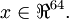

Complete the code in sampleIMAGES.m. Your code should sample 10000 image 
patches and concatenate them into a 64×10000 matrix.

To make sure your implementation is working, run the code in "Step 1" of train.m.
This should result in a plot of a random sample of 200 patches from the dataset.

**Implementational tip:** When we run our implemented 
sampleImages(), it takes under 5 seconds. If your implementation
takes over 30 seconds, it may be because you are accidentally making a
copy of an entire 512×512 image each time you're picking a random
image. By copying a 512×512 image 10000 times, this can make your
implementation much less efficient. While this doesn't slow down your
code significantly for this exercise (because we have only 10000
examples), when we scale to much larger problems later this quarter
with 106 or more examples, this will significantly slow down your
code. Please implement sampleIMAGES so that you aren't making a
copy of an entire 512×512 image each time you need to cut out an 8x8
image patch.

###  Step 2: Sparse autoencoder objective

Implement code to compute the sparse autoencoder cost function *J*sparse(*W*,*b*) 
(Section 3 of the lecture notes)
and the corresponding derivatives of *J*sparse with respect to 
the different parameters. Use the sigmoid function for the activation function, 
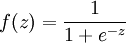. 
In particular, complete the code in sparseAutoencoderCost.m.

The sparse autoencoder is parameterized by matrices 
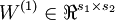,
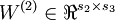 
vectors 
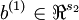, 
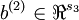.
However, for subsequent notational convenience, we will "unroll" all of these parameters
into a very long parameter vector θ with *s*1*s*2 + *s*2*s*3 + *s*2 + *s*3 elements. The
code for converting between the (*W*(1),*W*(2),*b*(1),*b*(2)) and the θ parameterization 
is already provided in the starter code.

**Implementational tip:** The objective *J*sparse(*W*,*b*) contains 3 terms, corresponding
to the squared error term, the weight decay term, and the sparsity penalty. You're welcome
to implement this however you want, but for ease of debugging,
you might implement the cost function and derivative computation (backpropagation) only for the 
squared error term first (this corresponds to setting λ = β = 0), and implement 
the gradient checking method in the next section to first verify that this code is correct. Then only
after you have verified that the objective and derivative calculations corresponding to the squared error 
term are working, add in code to compute the weight decay and sparsity penalty terms and their corresponding derivatives.

###  Step 3: Gradient checking

Following Section 2.3 of the lecture notes, implement code for gradient checking. 
Specifically, complete the code in computeNumericalGradient.m. Please 
use EPSILON = 10-4 as described in the lecture notes.

We've also provided code in checkNumericalGradient.m for you to test your code. 
This code defines a simple quadratic function 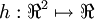 given by 
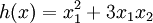, and evaluates it at the point *x* = (4,10)*T*. It allows you
to verify that your numerically evaluated gradient is very close to the true (analytically
computed) gradient.

After using checkNumericalGradient.m to make sure your implementation is correct, 
next use computeNumericalGradient.m to make sure that your sparseAutoencoderCost.m
is computing derivatives correctly. For details, see Steps 3 in train.m. We strongly
encourage you not to proceed to the next step until you've verified that your derivative
computations are correct.

**Implementational tip:** If you are debugging your code, performing gradient checking on smaller models 
and smaller training sets (e.g., using only 10 training examples and 1-2 hidden 
units) may speed things up.

###  Step 4: Train the sparse autoencoder

Now that you have code that computes 
*J*sparse and its derivatives, we're ready to minimize 
*J*sparse with respect to its parameters, and thereby train our
sparse autoencoder.

We will use the L-BFGS algorithm. This is provided to you in a function called
minFunc (code provided by Mark Schmidt) included in the starter code. (For the purpose of this
assignment, you only need to call minFunc with the default parameters. You do
not need to know how L-BFGS works.) We have already provided code in train.m
(Step 4) to call minFunc. The minFunc code assumes that the parameters
to be optimized are a long parameter vector; so we will use the "θ" parameterization
rather than the "(*W*(1),*W*(2),*b*(1),*b*(2))" parameterization when passing our parameters
to it.

Train a sparse autoencoder with 64 input units, 25 hidden units, and 64 output units.
In our starter code, we have provided a function for initializing the parameters.
We initialize the biases  to zero, and the weights 
to random numbers drawn uniformly from the interval 
![\left[-\sqrt{\frac{6}{n_{\rm in}+n_{\rm out}+1}},\sqrt{\frac{6}{n_{\rm in}+n_{\rm out}+1}}\,\right]](images/math/b/1/e/b1e650d9fdd8c53c515c23d49fc8fe40.png), where *n*in is the fan-in
(the number of inputs feeding into a node) and *n*out is the fan-in (the number of
units that a node feeds into).

The values we provided for the various parameters (λ,β,ρ, etc.)
should work, but feel free to play with different settings of the parameters as
well.

**Implementational tip:** Once you have your backpropagation implementation correctly computing the derivatives (as verified using gradient checking in Step 3), when you are now using it with L-BFGS to optimize *J*sparse(*W*,*b*), make sure you're not doing gradient-checking on every step. Backpropagation can be used to compute the derivatives of *J*sparse(*W*,*b*) fairly efficiently, and if you were additionally computing the gradient numerically on every step, this would slow down your program significantly.

###  Step 5: Visualization

After training the autoencoder, use display\_network.m to visualize the learned
weights. (See train.m, Step 5.) Run "print -djpeg weights.jpg" to save
the visualization to a file "weights.jpg" (which you will submit together with
your code).

 Results
--------

To successfully complete this assignment, you should demonstrate your sparse
autoencoder algorithm learning a set of edge detectors. For example, this
was the visualization we obtained:

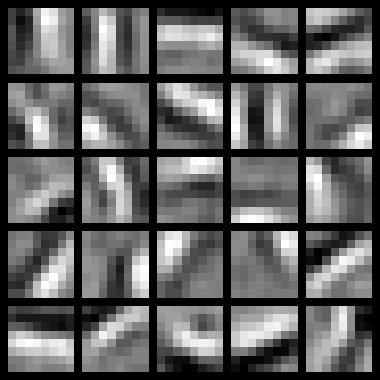

Our implementation took around 5 minutes to run on a fast computer.
In case you end up needing to try out multiple implementations or 
different parameter values, be sure to budget enough time for debugging 
and to run the experiments you'll need.

Also, by way of comparison, here are some visualizations from implementations
that we do not consider successful (either a buggy implementation, or where
the parameters were poorly tuned):

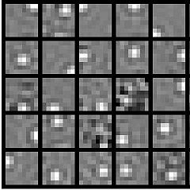 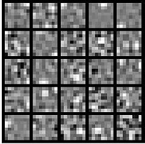 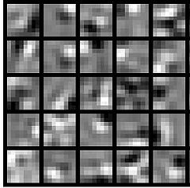

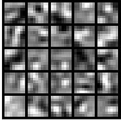 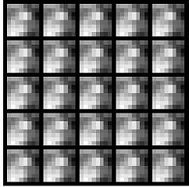 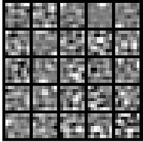

[Neural Networks](Neural_Networks.md "Neural Networks") | [Backpropagation Algorithm](Backpropagation_Algorithm.md "Backpropagation Algorithm") | [Gradient checking and advanced optimization](Gradient_checking_and_advanced_optimization.md "Gradient checking and advanced optimization") | [Autoencoders and Sparsity](Autoencoders_and_Sparsity.md "Autoencoders and Sparsity") | [Visualizing a Trained Autoencoder](Visualizing_a_Trained_Autoencoder.md "Visualizing a Trained Autoencoder") | [Sparse Autoencoder Notation Summary](Sparse_Autoencoder_Notation_Summary.md "Sparse Autoencoder Notation Summary") | **Exercise:Sparse Autoencoder**

 Category: Exercises
> * This page was last modified on 10 July 2012, at 14:34.

