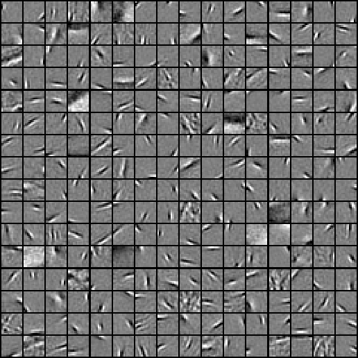
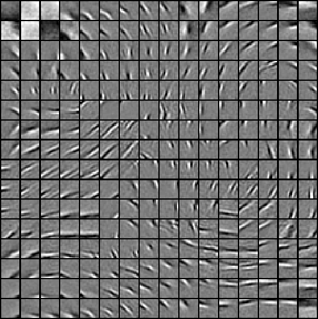

Exercise:Sparse Coding
======================

<!-- Jump to: [navigation](#column-one), [search](#searchInput) -->

|  |
| --- |
| Contents* [1 Sparse Coding](#Sparse_Coding)
	+ [1.1 Dependencies](#Dependencies)
	+ [1.2 Step 0: Initialization](#Step_0:_Initialization)
	+ [1.3 Step 1: Sample patches](#Step_1:_Sample_patches)
	+ [1.4 Step 2: Implement and check sparse coding cost functions](#Step_2:_Implement_and_check_sparse_coding_cost_functions)
	+ [1.5 Step 3: Iterative optimization](#Step_3:_Iterative_optimization)
 |

  Sparse Coding
---------------

In this exercise, you will implement  [sparse coding](Sparse_Coding__Autoencoder_Interpretation.md "Sparse Coding: Autoencoder Interpretation") and  [topographic sparse coding](Sparse_Coding__Autoencoder_Interpretation.md "Sparse Coding: Autoencoder Interpretation") on black-and-white natural images.

In the file [sparse\_coding\_exercise.zip](http://ufldl.stanford.edu/wiki/resources/sparse_coding_exercise.zip) we have provided some starter code. You should write your code at the places indicated "YOUR CODE HERE" in the files.

For this exercise, you will need to modify **sparseCodingWeightCost.m**, **sparseCodingFeatureCost.m** and **sparseCodingExercise.m**.

###   Dependencies

You will need:

* computeNumericalGradient.m from [Exercise:Sparse Autoencoder](Exercise_Sparse_Autoencoder.md "Exercise:Sparse Autoencoder")
* display\_network.m from [Exercise:Sparse Autoencoder](Exercise_Sparse_Autoencoder.md "Exercise:Sparse Autoencoder")

*If you have not completed the exercise listed above, we strongly suggest you complete it first.*

###   Step 0: Initialization

In this step, we initialize some parameters used for the exercise.

###   Step 1: Sample patches

In this step, we sample some patches from the IMAGES.mat dataset comprising 10 black-and-white pre-whitened natural images.

###   Step 2: Implement and check sparse coding cost functions

In this step, you should implement the two sparse coding cost functions:

1. sparseCodingWeightCost in sparseCodingWeightCost.m, which is used for optimizing the weight cost given the features
- sparseCodingFeatureCost in sparseCodingFeatureCost.m, which is used for optimizing the feature cost given the weights

Each of these functions should compute the appropriate cost and gradient. You may wish to implement the non-topographic version of sparseCodingFeatureCost first, ignoring the grouping matrix and assuming that none of the features are grouped. You can then extend this to the topographic version later. Alternatively, you may implement the topographic version directly - using the non-topographic version will then involve setting the grouping matrix to the identity matrix.

Once you have implemented these functions, you should check the gradients numerically.

**Implementation tip** - gradient checking the feature cost. One particular point to note is that when checking the gradient for the feature cost, epsilon should be set to a larger value, for instance 1e-2 (as has been done for you in the checking code provided), to ensure that checking the gradient numerically makes sense. This is necessary because as epsilon becomes smaller, the function sqrt(x + epsilon) becomes "sharper" and more "pointed", making the numerical gradient computed near 0 less and less accurate. To see this, consider what would happen if the numerical gradient was computed by using a point with x less than 0 and a point with x greater than 0 - the computed numerical slope would be wildly inaccurate.

###   Step 3: Iterative optimization

In this step, you will iteratively optimize for the weights and features to learn a basis for the data, as described in the section on  [sparse coding](Sparse_Coding__Autoencoder_Interpretation.md "Sparse Coding: Autoencoder Interpretation"). Mini-batching and initialization of the features *s* has already been done for you. However, you need to still need to fill in the analytic solution to the the optimization problem with respect to the weight matrix, given the feature matrix.

Once that is done, you should check that your solution is correct using the given checking code, which checks that the gradient at the point determined by your analytic solution is close to 0. Once your solution has been verified, comment out the checking code, and run the iterative optimization code. 200 iterations should take less than 45 minutes to run, and by 100 iterations you should be able to see bases that look like edges, similar to those you learned in  [the sparse autoencoder exercise](Exercise_Sparse_Autoencoder.md "Exercise:Sparse Autoencoder").

For the non-topographic case, these features will not be "ordered", and will look something like the following:

For the topographic case, the features will be "ordered topographically", and will look something like the following:

> * This page was last modified on 29 May 2011, at 06:59.

