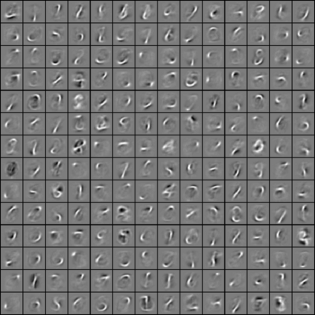

Exercise:Vectorization
======================

<!-- Jump to: [navigation](#column-one), [search](#searchInput) -->

|  |
| --- |
| Contents* [1 Vectorization](#Vectorization)
	+ [1.1 Support Code/Data](#Support_Code.2FData)
	+ [1.2 Step 1: Vectorize your Sparse Autoencoder Implementation](#Step_1:_Vectorize_your_Sparse_Autoencoder_Implementation)
	+ [1.3 Step 2: Learn features for handwritten digits](#Step_2:_Learn_features_for_handwritten_digits)
 |

  Vectorization
---------------

In the previous problem set, we implemented a sparse autoencoder for patches taken from natural images. In this problem set, you will vectorize your code to make it run much faster, and further adapt your sparse autoencoder to work on images of handwritten digits. Your network for learning from handwritten digits will be much larger than the one you'd trained on the natural images, and so using the original implementation would have been painfully slow. But with a vectorized implementation of the autoencoder, you will be able to get this to run in a reasonable amount of computation time.

###   Support Code/Data

The following additional files are required for this exercise:

* [MNIST Dataset (Training Images)](http://yann.lecun.com/exdb/mnist/train-images-idx3-ubyte.gz)
* [MNIST Dataset (Training Labels)](http://yann.lecun.com/exdb/mnist/train-labels-idx1-ubyte.gz)
* [Support functions for loading MNIST in Matlab](Using_the_MNIST_Dataset.md "Using the MNIST Dataset")

###   Step 1: Vectorize your Sparse Autoencoder Implementation

Using the ideas from [Vectorization](Vectorization.md "Vectorization") and [Neural Network Vectorization](Neural_Network_Vectorization.md "Neural Network Vectorization"), vectorize your implementation of sparseAutoencoderCost.m. In our implementation, we were able to remove all for-loops with the use of matrix operations and repmat. (If you want to play with more advanced vectorization ideas, also type help bsxfun. The bsxfun function provides an alternative to repmat for some of the vectorization steps, but is not necessary for this exercise). A vectorized version of our sparse autoencoder code ran in under one minute on a fast computer (for learning 25 features from 10000 8x8 image patches).

(Note that you do not need to vectorize the code in the other files.)

###   Step 2: Learn features for handwritten digits

Now that you have vectorized the code, it is easy to learn larger sets of features on medium sized images. In this part of the exercise, you will use your sparse autoencoder to learn features for handwritten digits from the MNIST dataset.

The MNIST data is available at [[1]](http://yann.lecun.com/exdb/mnist/). Download the file train-images-idx3-ubyte.gz and decompress it. After obtaining the source images, you should use  [helper functions that we provide](Using_the_MNIST_Dataset.md "Using the MNIST Dataset") to load the data into Matlab as matrices. While the helper functions that we provide will load both the input examples *x* and the class labels *y*, for this assignment, you will only need the input examples *x* since the sparse autoencoder is an *unsupervised* learning algorithm. (In a later assignment, we will use the labels *y* as well.)

The following set of parameters worked well for us to learn good features on the MNIST dataset:

```
visibleSize = 28*28
hiddenSize = 196
sparsityParam = 0.1
lambda = 3e-3
beta = 3
patches = first 10000 images from the MNIST dataset

```

After 400 iterations of updates using minFunc, your autoencoder should have learned features that resemble pen strokes. In other words, this has learned to represent handwritten characters in terms of what pen strokes appear in an image. Our implementation takes around 15-20 minutes on a fast machine. Visualized, the features should look like the following image:



If your parameters are improperly tuned, or if your implementation of the autoencoder is buggy, you may get one of the following images instead:

|  |  |
| --- | --- |
| MNIST-false-bad-1.png | MNIST-false-bad-2.png |

If your image looks like one of the above images, check your code and parameters again. Learning these features are a prelude to the later exercises, where we shall see how they will be useful for classification.

[Vectorization](Vectorization.md "Vectorization") | [Logistic Regression Vectorization Example](Logistic_Regression_Vectorization_Example.md "Logistic Regression Vectorization Example") | [Neural Network Vectorization](Neural_Network_Vectorization.md "Neural Network Vectorization") | **Exercise:Vectorization**
> * This page was last modified on 26 May 2011, at 11:00.

