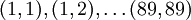
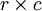
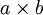
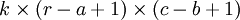

Feature extraction using convolution
====================================

<!-- Jump to: [navigation](#column-one), [search](#searchInput) -->

|  |
| --- |
| Contents* [1 Overview](#Overview)
* [2 Fully Connected Networks](#Fully_Connected_Networks)
* [3 Locally Connected Networks](#Locally_Connected_Networks)
* [4 Convolutions](#Convolutions)
 |

  Overview
----------

In the previous exercises, you worked through problems which involved images that were relatively low in resolution, such as small image patches and small images of hand-written digits. In this section, we will develop methods which will allow us to scale up these methods to more realistic datasets that have larger images.

  Fully Connected Networks
--------------------------

In the sparse autoencoder, one design choice that we had made was to "fully connect" all the hidden units to all the input units. On the relatively small images that we were working with (e.g., 8x8 patches for the sparse autoencoder assignment, 28x28 images for the MNIST dataset), it was computationally feasible to learn features on the entire image. However, with larger images (e.g., 96x96 images) learning features that span the entire image (fully connected networks) is very computationally expensive--you would have about 104 input units, and assuming you want to learn 100 features, you would have on the order of 106 parameters to learn. The feedforward and backpropagation computations would also be about 102 times slower, compared to 28x28 images.

  Locally Connected Networks
----------------------------

One simple solution to this problem is to restrict the connections between the hidden units and the input units, allowing each hidden unit to connect to only a small subset of the input units. Specifically, each hidden unit will connect to only a small contiguous region of pixels in the input. (For input modalities different than images, there is often also a natural way to select "contiguous groups" of input units to connect to a single hidden unit as well; for example, for audio, a hidden unit might be connected to only the input units corresponding to a certain time span of the input audio clip.)

This idea of having locally connected networks also draws inspiration from how the early visual system is wired up in biology. Specifically, neurons in the visual cortex have localized receptive fields (i.e., they respond only to stimuli in a certain location).

  Convolutions
--------------

Natural images have the property of being **stationary**, meaning that the statistics of one part of the image are the same as any other part. This suggests that the features that we learn at one part of the image can also be applied to other parts of the image, and we can use the same features at all locations.

More precisely, having learned features over small (say 8x8) patches sampled randomly from the larger image, we can then apply this learned 8x8 feature detector anywhere in the image. Specifically, we can take the learned 8x8 features and 
**convolve** them with the larger image, thus obtaining a different feature activation value at each location in the image.

To give a concrete example, suppose you have learned features on 8x8 patches sampled from a 96x96 image. Suppose further this was done with an autoencoder that has 100 hidden units. To get the convolved features, for every 8x8 region of the 96x96 image, that is, the 8x8 regions starting at , you would extract the 8x8 patch, and run it through your trained sparse autoencoder to get the feature activations. This would result in 100 sets 89x89 convolved features.

Formally, given some large  images *x**l**a**r**g**e*, we first train a sparse autoencoder on small  patches *x**s**m**a**l**l* sampled from these images, learning *k* features *f* = σ(*W*(1)*x**s**m**a**l**l* + *b*(1)) (where σ is the sigmoid function), given by the weights *W*(1) and biases *b*(1) from the visible units to the hidden units. For every  patch *x**s* in the large image, we compute *f**s* = σ(*W*(1)*x**s* + *b*(1)), giving us *f**c**o**n**v**o**l**v**e**d*, a  array of convolved features.

In the next section, we further describe how to "pool" these features together to get even better features for classification.

---

> * Language: [中文](%E5%8D%B7%E7%A7%AF%E7%89%B9%E5%BE%81%E6%8F%90%E5%8F%96.md "卷积特征提取")
> * This page was last modified on 8 April 2013, at 04:11.

