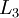

Fine-tuning Stacked AEs
=======================

<!-- Jump to: [navigation](#column-one), [search](#searchInput) -->
###   Introduction

Fine tuning is a strategy that is commonly found in deep learning. As such, it can also be used to greatly improve the performance of a stacked autoencoder. From a high level perspective, fine tuning treats all layers of a stacked autoencoder as a single model, so that in one iteration, we are improving upon all the weights in the stacked autoencoder.

###   General Strategy

Fortunately, we already have all the tools necessary to implement fine tuning for stacked autoencoders! In order to compute the gradients for all the layers of the stacked autoencoder in each iteration, we use the [Backpropagation Algorithm](Backpropagation_Algorithm.md "Backpropagation Algorithm"), as discussed in the sparse autoencoder section. As the backpropagation algorithm can be extended to apply for an arbitrary number of layers, we can actually use this algorithm on a stacked autoencoder of arbitrary depth.

###   Finetuning with Backpropagation

For your convenience, the summary of the backpropagation algorithm using element wise notation is below:

 1. Perform a feedforward pass, computing the activations for layers , , up to the output layer , using the equations defining the forward propagation steps.
 2. For the output layer (layer ), set 

(When using softmax regression, the softmax layer has  where *I* is the input labels and *P* is the vector of conditional probabilities.)

 3. For 
Set

 4. Compute the desired partial derivatives: 

![\begin{align}
J(W,b)
&= \left[ \frac{1}{m} \sum_{i=1}^m J(W,b;x^{(i)},y^{(i)}) \right]
\end{align}](images/math/0/6/e/06e46d21d188dcbc2b7da7cfc1ff976f.png)

Note: While one could consider the softmax classifier as an additional layer, the derivation above does not. Specifically, we consider the "last layer" of the network to be the features that goes into the softmax classifier. Therefore, the derivatives (in Step 2) are computed using , where .

 [From Self-Taught Learning to Deep Networks](Self-Taught_Learning_to_Deep_Networks.md "Self-Taught Learning to Deep Networks") | [Deep Networks: Overview](Deep_Networks__Overview.md "Deep Networks: Overview") | [Stacked Autoencoders](Stacked_Autoencoders.md "Stacked Autoencoders") | **Fine-tuning Stacked AEs** | [Exercise: Implement deep networks for digit classification](Exercise__Implement_deep_networks_for_digit_classification.md "Exercise: Implement deep networks for digit classification")

---

> * Language: [中文](%E5%BE%AE%E8%B0%83%E5%A4%9A%E5%B1%82%E8%87%AA%E7%BC%96%E7%A0%81%E7%AE%97%E6%B3%95.md "微调多层自编码算法")
> * This page was last modified on 8 April 2013, at 04:04.

