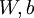

Gradient checking and advanced optimization
===========================================

<!-- Jump to: [navigation](#column-one), [search](#searchInput) -->
Backpropagation is a notoriously difficult algorithm to debug and get right,
especially since many subtly buggy implementations of it—for example, one
that has an off-by-one error in the indices and that thus only trains some of
the layers of weights, or an implementation that omits the bias term—will
manage to learn something that can look surprisingly reasonable
(while performing less well than a correct implementation). Thus, even with a
buggy implementation, it may not at all be apparent that anything is amiss.
In this section, we describe a method for numerically checking the derivatives computed
by your code to make sure that your implementation is correct. Carrying out the
derivative checking procedure described here will significantly increase
your confidence in the correctness of your code.

Suppose we want to minimize  as a function of .
For this example, suppose , so that .
In this 1-dimensional case, one iteration of gradient descent is given by

Suppose also that we have implemented some function  that purportedly
computes , so that we implement gradient descent
using the update . How can we check if our implementation of
 is correct?

Recall the mathematical definition of the derivative as

Thus, at any specific value of , we can numerically approximate the derivative
as follows:

In practice, we set EPSILON to a small constant, say around .
(There's a large range of values of EPSILON that should work well, but
we don't set EPSILON to be "extremely" small, say ,
as that would lead to numerical roundoff errors.)

Thus, given a function  that is supposedly computing
, we can now numerically verify its correctness
by checking that

The degree to which these two values should approximate each other
will depend on the details of . But assuming ,
you'll usually find that the left- and right-hand sides of the above will agree
to at least 4 significant digits (and often many more).

Now, consider the case where  is a vector rather than a single real
number (so that we have  parameters that we want to learn), and . In
our neural network example we used "," but one can imagine "unrolling"
the parameters  into a long vector . We now generalize our derivative
checking procedure to the case where  may be a vector.

Suppose we have a function  that purportedly computes
; we'd like to check if 
is outputting correct derivative values. Let , where

is the -th basis vector (a
vector of the same dimension as , with a "1" in the -th position
and "0"s everywhere else). So,
 is the same as , except its -th element has been incremented
by EPSILON. Similarly, let  be the
corresponding vector with the -th element decreased by EPSILON.
We can now numerically verify 's correctness by checking, for each ,
that:

When implementing backpropagation to train a neural network, in a correct implementation
we will have that

This result shows that the final block of psuedo-code in [Backpropagation Algorithm](Backpropagation_Algorithm.md "Backpropagation Algorithm") is indeed
implementing gradient descent.
To make sure your implementation of gradient descent is correct, it is
usually very helpful to use the method described above to
numerically compute the derivatives of , and thereby verify that
your computations of  and  are
indeed giving the derivatives you want.

Finally, so far our discussion has centered on using gradient descent to minimize . If you have
implemented a function that computes  and , it turns out there are more
sophisticated algorithms than gradient descent for trying to minimize . For example, one can envision
an algorithm that uses gradient descent, but automatically tunes the learning rate  so as to try to
use a step-size that causes  to approach a local optimum as quickly as possible.
There are other algorithms that are even more
sophisticated than this; for example, there are algorithms that try to find an approximation to the
Hessian matrix, so that it can take more rapid steps towards a local optimum (similar to Newton's method). A full discussion of these
algorithms is beyond the scope of these notes, but one example is
the **L-BFGS** algorithm. (Another example is the **conjugate gradient** algorithm.) You will use one of
these algorithms in the programming exercise.
The main thing you need to provide to these advanced optimization algorithms is that for any , you have to be able
to compute  and . These optimization algorithms will then do their own
internal tuning of the learning rate/step-size  (and compute its own approximation to the Hessian, etc.)
to automatically search for a value of  that minimizes . Algorithms
such as L-BFGS and conjugate gradient can often be much faster than gradient descent.

[Neural Networks](Neural_Networks.md "Neural Networks") | [Backpropagation Algorithm](Backpropagation_Algorithm.md "Backpropagation Algorithm") | **Gradient checking and advanced optimization** | [Autoencoders and Sparsity](Autoencoders_and_Sparsity.md "Autoencoders and Sparsity") | [Visualizing a Trained Autoencoder](Visualizing_a_Trained_Autoencoder.md "Visualizing a Trained Autoencoder") | [Sparse Autoencoder Notation Summary](Sparse_Autoencoder_Notation_Summary.md "Sparse Autoencoder Notation Summary") | [Exercise:Sparse Autoencoder](Exercise_Sparse_Autoencoder.md "Exercise:Sparse Autoencoder")

---

> * Language: [中文](%E6%A2%AF%E5%BA%A6%E6%A3%80%E9%AA%8C%E4%B8%8E%E9%AB%98%E7%BA%A7%E4%BC%98%E5%8C%96.md "梯度检验与高级优化")
> * This page was last modified on 7 April 2013, at 12:40.

