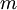
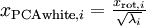

Implementing PCA/Whitening
==========================

<!-- Jump to: [navigation](#column-one), [search](#searchInput) -->
In this section, we summarize the PCA, PCA whitening and ZCA whitening algorithms,
and also describe how you can implement them using efficient linear algebra libraries.

First, we need to ensure that the data has (approximately) zero-mean. For natural images, we achieve this (approximately) by subtracting the mean value of each image patch.

We achieve this by computing the mean for each patch and subtracting it for each patch. In Matlab, we can do this by using

```
avg = mean(x, 1);     % Compute the mean pixel intensity value separately for each patch. 
x = x - repmat(avg, size(x, 1), 1);

```

Next, we need to compute . If you're implementing this in Matlab (or even if you're implementing this in C++, Java, etc., but have access to an efficient linear algebra library), doing it as an explicit sum is inefficient. Instead, we can compute this in one fell swoop as

```
sigma = x * x' / size(x, 2);

```

(Check the math yourself for correctness.) 
Here, we assume that *x* is a data structure that contains one training example per column (so, *x* is a -by- matrix).

Next, PCA computes the eigenvectors of Σ. One could do this using the Matlab eig function. However, because Σ is a symmetric positive semi-definite matrix, it is more numerically reliable to do this using the svd function. Concretely, if you implement

```
[U,S,V] = svd(sigma);

```

then the matrix *U* will contain the eigenvectors of *S**i**g**m**a* (one eigenvector per column, sorted in order from top to bottom eigenvector), and the diagonal entries of the matrix *S* will contain the corresponding eigenvalues (also sorted in decreasing order). The matrix *V* will be equal to transpose of *U*, and can be safely ignored.

(Note: The svd function actually computes the singular vectors and singular values of a matrix, which for the special case of a symmetric positive semi-definite matrix---which is all that we're concerned with here---is equal to its eigenvectors and eigenvalues. A full discussion of singular vectors vs. eigenvectors is beyond the scope of these notes.)

Finally, you can compute  and  as follows:

```
xRot = U' * x;          % rotated version of the data. 
xTilde = U(:,1:k)' * x; % reduced dimension representation of the data, 
                        % where k is the number of eigenvectors to keep

```

This gives your PCA representation of the data in terms of . 
Incidentally, if *x* is a -by- matrix containing all your training data, this is a vectorized
implementation, and the expressions
above work too for computing *x*rot and  for your entire training set
all in one go. The resulting 
*x*rot and  will have one column corresponding to each training example.

To compute the PCA whitened data , use

```
xPCAwhite = diag(1./sqrt(diag(S) + epsilon)) * U' * x;

```

Since *S*'s diagonal contains the eigenvalues , 
this turns out to be a compact way 
of computing 
simultaneously for all .

Finally, you can also compute the ZCA whitened data  as:

```
xZCAwhite = U * diag(1./sqrt(diag(S) + epsilon)) * U' * x;

```

[PCA](PCA.md "PCA") | [Whitening](Whitening.md "Whitening") | **Implementing PCA/Whitening** | [Exercise:PCA in 2D](Exercise_PCA_in_2D.md "Exercise:PCA in 2D") | [Exercise:PCA and Whitening](Exercise_PCA_and_Whitening.md "Exercise:PCA and Whitening")

---

> * Language: [中文](%E5%AE%9E%E7%8E%B0%E4%B8%BB%E6%88%90%E5%88%86%E5%88%86%E6%9E%90%E5%92%8C%E7%99%BD%E5%8C%96.md "实现主成分分析和白化")
> * This page was last modified on 7 April 2013, at 13:22.

