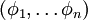
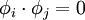
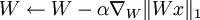
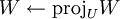
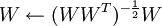

Independent Component Analysis
==============================

<!-- Jump to: [navigation](#column-one), [search](#searchInput) -->
  Introduction
--------------

If you recall, in  [sparse coding](Sparse_Coding.md "Sparse Coding"), we wanted to learn an **over-complete** basis for the data. In particular, this implies that the basis vectors that we learn in sparse coding will not be linearly independent. While this may be desirable in certain situations, sometimes we want to learn a linearly independent basis for the data. In independent component analysis (ICA), this is exactly what we want to do. Further, in ICA, we want to learn not just any linearly independent basis, but an **orthonormal** basis for the data. (An orthonormal basis is a basis  such that  if  and 1 if *i* = *j*).

Like sparse coding, independent component analysis has a simple mathematical formulation. Given some data *x*, we would like to learn a set of basis vectors which we represent in the columns of a matrix *W*, such that, firstly, as in sparse coding, our features are **sparse**; and secondly, our basis is an **orthonormal** basis. (Note that while in sparse coding, our matrix *A* was for mapping **features** *s* to **raw data**, in independent component analysis, our matrix *W* works in the opposite direction, mapping **raw data** *x* to **features** instead). This gives us the following objective function:

This objective function is equivalent to the sparsity penalty on the features *s* in sparse coding, since *W**x* is precisely the features that represent the data. Adding in the orthonormality constraint gives us the full optimization problem for independent component analysis:

As is usually the case in deep learning, this problem has no simple analytic solution, and to make matters worse, the orthonormality constraint makes it slightly more difficult to optimize for the objective using gradient descent - every iteration of gradient descent must be followed by a step that maps the new basis back to the space of orthonormal bases (hence enforcing the constraint).

In practice, optimizing for the objective function while enforcing the orthonormality constraint (as described in  [Orthonormal ICA](Independent_Component_Analysis#Orthonormal_ICA.md "Independent Component Analysis") section below) is feasible but slow. Hence, the use of orthonormal ICA is limited to situations where it is important to obtain an orthonormal basis (TODO: what situations) .

  Orthonormal ICA
-----------------

The orthonormal ICA objective is:

Observe that the constraint *W**W**T* = *I* implies two other constraints.

Firstly, since we are learning an orthonormal basis, the number of basis vectors we learn must be less than the dimension of the input. In particular, this means that we cannot learn over-complete bases as we usually do in  [sparse coding](Sparse_Coding__Autoencoder_Interpretation.md "Sparse Coding: Autoencoder Interpretation").

Secondly, the data must be  [ZCA whitened](Whitening.md "Whitening") with no regularization (that is, with ε set to 0). (TODO Why must this be so?)

Hence, before we even begin to optimize for the orthonormal ICA objective, we must ensure that our data has been **whitened**, and that we are learning an **under-complete** basis.

Following that, to optimize for the objective, we can use gradient descent, interspersing gradient descent steps with projection steps to enforce the orthonormality constraint. Hence, the procedure will be as follows:

Repeat until done:

1. -  where *U* is the space of matrices satisfying *W**W**T* = *I*

In practice, the learning rate α is varied using a line-search algorithm to speed up the descent, and the projection step is achieved by setting , which can actually be seen as ZCA whitening (TODO explain how it is like ZCA whitening).

  Topographic ICA
-----------------

Just like  [sparse coding](Sparse_Coding__Autoencoder_Interpretation.md "Sparse Coding: Autoencoder Interpretation"), independent component analysis can be modified to give a topographic variant by adding a topographic cost term.

---

> * Language: [中文](%E7%8B%AC%E7%AB%8B%E6%88%90%E5%88%86%E5%88%86%E6%9E%90.md "独立成分分析")
> * This page was last modified on 8 April 2013, at 04:35.

