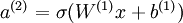
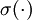
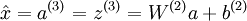
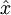
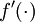

Linear Decoders
===============

<!-- Jump to: [navigation](#column-one), [search](#searchInput) -->
  Sparse Autoencoder Recap
--------------------------

In the sparse autoencoder, we had 3 layers of neurons: an input layer, a hidden layer and an output layer. In our previous description
of autoencoders (and of neural networks), every neuron in the neural network used the same activation function.
In these notes, we describe a modified version of the autoencoder in which some of the neurons use a different activation function.
This will result in a model that is sometimes simpler to apply, and can also be more robust to variations in the parameters.

Recall that each neuron (in the output layer) computed the following:

where *a*(3) is the output. In the autoencoder, *a*(3) is our approximate reconstruction of the input *x* = *a*(1).

Because we used a sigmoid activation function for *f*(*z*(3)), we needed to constrain or scale the inputs to be in the range [0,1], 
since the sigmoid function outputs numbers in the range [0,1]. 
While some datasets like MNIST fit well with this scaling of the output, this can sometimes be awkward to satisfy. For example, if one uses PCA whitening, the input is 
no longer constrained to [0,1] and it's not clear what the best way is to scale the data to ensure it fits into the constrained range.

  Linear Decoder
----------------

One easy fix for this problem is to set *a*(3) = *z*(3). Formally, this is achieved by having the output
nodes use an activation function that's the identity function *f*(*z*) = *z*, so that *a*(3) = *f*(*z*(3)) = *z*(3). 
This particular activation function  is called the **linear activation function** (though perhaps
"identity activation function" would have been a better name). Note however that in the *hidden* layer of the network, we still use a sigmoid (or tanh) activation function,
so that the hidden unit activations are given by (say) , where  is the sigmoid function, 
*x* is the input, and *W*(1) and *b*(1) are the weight and bias terms for the hidden units. 
It is only in the *output* layer that we use the linear activation function.

An autoencoder in this configuration--with a sigmoid (or tanh) hidden layer and a linear output layer--is called a **linear decoder**. 
In this model, we have . Because the output  is a now linear function of the hidden unit activations, by varying *W*(2), each output unit *a*(3) can be made to produce values greater than 1 or less than 0 as well. This allows us to train the sparse autoencoder real-valued inputs without needing to pre-scale every example to a specific range.

Since we have changed the activation function of the output units, the gradients of the output units also change. Recall that for each output unit, we had set set the error terms as follows:

where *y* = *x* is the desired output,  is the output of our autoencoder, and  is our activation function. Because in
the output layer we now have *f*(*z*) = *z*, that implies *f*'(*z*) = 1 and thus 
the above now simplifies to:

Of course, when using backpropagation to compute the error terms for the *hidden* layer:

Because the hidden layer is using a sigmoid (or tanh) activation *f*, in the equation above  should still be the
derivative of the sigmoid (or tanh) function.

---

> * Language: [中文](%E7%BA%BF%E6%80%A7%E8%A7%A3%E7%A0%81%E5%99%A8.md "线性解码器")
> * This page was last modified on 8 April 2013, at 04:06.

