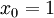
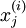

Logistic Regression Vectorization Example
=========================================

<!-- Jump to: [navigation](#column-one), [search](#searchInput) -->
Consider training a logistic regression model using batch gradient ascent.
Suppose our hypothesis is


where (following the notational convention from the OpenClassroom videos and from CS229) we let , so that  
and , and  is our intercept term. We have a training set
 of  examples, and the batch gradient
ascent update rule is , where 
is the log likelihood and  is its derivative.

[Note: Most of the notation below follows that defined in the OpenClassroom videos or in the class 
CS229: Machine Learning. For details, see either the [OpenClassroom videos](http://openclassroom.stanford.edu/MainFolder/CoursePage.php?course=MachineLearning) or Lecture Notes #1 of <http://cs229.stanford.edu/> .]

We thus need to compute the gradient:


Suppose that the Matlab/Octave variable x is a matrix containing the training inputs, so that
x(:,i) is the -th training example , and x(j,i) is . 
Further, suppose the Matlab/Octave variable y is a *row* vector of the labels in the
training set, so that the variable y(i) is . (Here we differ from the 
OpenClassroom/CS229 notation. Specifically, in the matrix-valued x we stack the training inputs in columns rather than in rows;
and y is a row vector rather than a column vector.)

Here's truly horrible, extremely slow, implementation of the gradient computation:

```
% Implementation 1
grad = zeros(n+1,1);
for i=1:m,
  h = sigmoid(theta'*x(:,i));
  temp = y(i) - h; 
  for j=1:n+1,
    grad(j) = grad(j) + temp * x(j,i); 
  end;
end;
```

The two nested for-loops makes this very slow. Here's a more typical implementation,
that partially vectorizes the algorithm and gets better performance:

```
% Implementation 2 
grad = zeros(n+1,1);
for i=1:m,
  grad = grad + (y(i) - sigmoid(theta'*x(:,i)))* x(:,i);
end;
```

However, it turns out to be possible to even further vectorize this. If we can get rid of the for-loop, we can significantly speed up the implementation. In particular, suppose b is a column vector, and A is a matrix. Consider the following ways of computing A \* b:

```
% Slow implementation of matrix-vector multiply
grad = zeros(n+1,1);
for i=1:m,
  grad = grad + b(i) * A(:,i);  % more commonly written A(:,i)*b(i)
end;

% Fast implementation of matrix-vector multiply
grad = A*b;
```

We recognize that Implementation 2 of our gradient descent calculation above is using the slow version with a for-loop, with
b(i) playing the role of (y(i) - sigmoid(theta'\*x(:,i))), and A playing the role of x. We can derive a fast implementation as follows:

```
% Implementation 3
grad = x * (y- sigmoid(theta'*x))';
```

Here, we assume that the Matlab/Octave sigmoid(z) takes as input a vector z, applies the sigmoid function component-wise to the input, and returns the result. The output of sigmoid(z) is therefore itself also a vector, of the same dimension as the input z

When the training set is large, this final implementation takes the greatest advantage of Matlab/Octave's highly optimized numerical linear algebra libraries to carry out the matrix-vector operations, and so this is far more efficient than the earlier implementations.

Coming up with vectorized implementations isn't always easy, and sometimes requires careful thought. But as you gain familiarity with vectorized operations, you'll find that there are design patterns (i.e., a small number of ways of vectorizing) that apply to many different pieces of code.

[Vectorization](Vectorization.md "Vectorization") | **Logistic Regression Vectorization Example** | [Neural Network Vectorization](Neural_Network_Vectorization.md "Neural Network Vectorization") | [Exercise:Vectorization](Exercise_Vectorization.md "Exercise:Vectorization")

---

> * Language: [中文](%E9%80%BB%E8%BE%91%E5%9B%9E%E5%BD%92%E7%9A%84%E5%90%91%E9%87%8F%E5%8C%96%E5%AE%9E%E7%8E%B0%E6%A0%B7%E4%BE%8B.md "逻辑回归的向量化实现样例")
> * This page was last modified on 7 April 2013, at 13:09.

