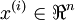
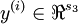
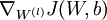
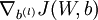
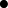

Neural Network Vectorization
============================

<!-- Jump to: [navigation](#column-one), [search](#searchInput) -->
In this section, we derive a vectorized version of our neural network. In our earlier description of [Neural Networks](Neural_Networks.md "Neural Networks"), we had already given a partially vectorized implementation, that is quite efficient if we are working with only a single example at a time. We now describe how to implement the algorithm so that it simultaneously processes multiple training examples. Specifically, we will do this for the forward propagation and backpropagation steps, as well as for learning a sparse set of features.

  Forward propagation
---------------------

Consider a 3 layer neural network (with one input, one hidden, and one output layer), and suppose x is a column vector containing a single training example . Then the forward propagation step is given by:


This is a fairly efficient implementation for a single example. If we have *m* examples, then we would wrap a for loop around this.

Concretely, following the [Logistic Regression Vectorization Example](Logistic_Regression_Vectorization_Example.md "Logistic Regression Vectorization Example"), let the Matlab/Octave variable x be a matrix containing the training inputs, so that x(:,i) is the -th training example. We can then implement forward propagation as:

```

% Unvectorized implementation
for i=1:m, 
  z2 = W1 * x(:,i) + b1;
  a2 = f(z2);
  z3 = W2 * a2 + b2;
  h(:,i) = f(z3);
end;
```

Can we get rid of the for loop? For many algorithms, we will represent intermediate stages of computation via vectors. For example, z2, a2, and z3 here are all column vectors that're used to compute the activations of the hidden and output layers. In order to take better advantage of parallelism and efficient matrix operations, we would like to *have our algorithm operate simultaneously on many training examples*. Let us temporarily ignore b1 and b2 (say, set them to zero for now). We can then implement the following:

```
% Vectorized implementation (ignoring b1, b2)
z2 = W1 * x;
a2 = f(z2);
z3 = W2 * a2;
h = f(z3)
```

In this implementation, z2, a2, and z3 are all matrices, with one column per training example. A common design pattern in vectorizing across training examples is that whereas previously we had a column vector (such as z2) per training example, we can often instead try to compute a matrix so that all of these column vectors are stacked together to form a matrix. Concretely, in this example, a2 becomes a *s*2 by *m* matrix (where *s*2 is the number of units in layer 2 of the network, and *m* is the number of training examples). And, the *i*-th column of a2 contains the activations of the hidden units (layer 2 of the network) when the *i*-th training example x(:,i) is input to the network.

In the implementation above, we have assumed that the activation function f(z) takes as input a matrix z, and applies the activation function component-wise to the input. Note that your implementation of f(z) should use Matlab/Octave's matrix operations as much as possible, and avoid for loops as well. We illustrate this below, assuming that f(z) is the sigmoid activation function:

```
% Inefficient, unvectorized implementation of the activation function
function output = unvectorized_f(z)
output = zeros(size(z))
for i=1:size(z,1), 
  for j=1:size(z,2),
    output(i,j) = 1/(1+exp(-z(i,j)));
  end; 
end;
end

% Efficient, vectorized implementation of the activation function
function output = vectorized_f(z)
output = 1./(1+exp(-z));     % "./" is Matlab/Octave's element-wise division operator. 
end
```

Finally, our vectorized implementation of forward propagation above had ignored b1 and b2. To incorporate those back in, we will use Matlab/Octave's built-in repmat function. We have:

```
% Vectorized implementation of forward propagation
z2 = W1 * x + repmat(b1,1,m);
a2 = f(z2);
z3 = W2 * a2 + repmat(b2,1,m);
h = f(z3)
```

The result of repmat(b1,1,m) is a matrix formed by taking the column vector b1 and stacking *m* copies of them in columns as follows


This forms a *s*2 by *m* matrix. 
Thus, the result of adding this to W1 \* x is that each column of the matrix gets b1 added to it, as desired.
See Matlab/Octave's documentation (type "help repmat") for more information. As a Matlab/Octave built-in function, repmat is very efficient as well, and runs much faster than if you were to implement the same thing yourself using a for loop.

  Backpropagation
-----------------

We now describe the main ideas behind vectorizing backpropagation. Before reading this section, we strongly encourage you to carefully step through all the forward propagation code examples above to make sure you fully understand them. In this text, we'll only sketch the details of how to vectorize backpropagation, and leave you to derive the details in the [Vectorization exercise](Exercise_Vectorization.md "Exercise:Vectorization").

We are in a supervised learning setting, so that we have a training set  of *m* training examples. (For the autoencoder, we simply set *y*(*i*) = *x*(*i*), but our derivation here will consider this more general setting.)

Suppose we have *s*3 dimensional outputs, so that our target labels are . In our Matlab/Octave datastructure, we will stack these in columns to form a Matlab/Octave variable y, so that the *i*-th column y(:,i) is *y*(*i*).

We now want to compute the gradient terms 
 and . Consider the first of
these terms. Following our earlier description of the [Backpropagation Algorithm](Backpropagation_Algorithm.md "Backpropagation Algorithm"), we had that for a single training example (*x*,*y*), we can compute the derivatives as


Here,  denotes element-wise product. For simplicity, our description here will ignore the derivatives with respect to *b*(*l*), though your implementation of backpropagation will have to compute those derivatives too.

Suppose we have already implemented the vectorized forward propagation method, so that the matrix-valued z2, a2, z3 and h are computed as described above. We can then implement an *unvectorized* version of backpropagation as follows:

```
gradW1 = zeros(size(W1));
gradW2 = zeros(size(W2)); 
for i=1:m,
  delta3 = -(y(:,i) - h(:,i)) .* fprime(z3(:,i)); 
  delta2 = W2'*delta3(:,i) .* fprime(z2(:,i));

  gradW2 = gradW2 + delta3*a2(:,i)';
  gradW1 = gradW1 + delta2*a1(:,i)'; 
end;
```

This implementation has a for loop. We would like to come up with an implementation that simultaneously performs backpropagation on all the examples, and eliminates this for loop.

To do so, we will replace the vectors delta3 and delta2 with matrices, where one column of each matrix corresponds to each training example. We will also implement a function fprime(z) that takes as input a matrix z, and applies  element-wise. Each of the four lines of Matlab in the for loop above can then be vectorized and replaced with a single line of Matlab code (without a surrounding for loop).

In the [Vectorization exercise](Exercise_Vectorization.md "Exercise:Vectorization"), we ask you to derive the vectorized version of this algorithm by yourself. If you are able to do it from this description, we strongly encourage you to do so. Here also are some [Backpropagation vectorization hints](Backpropagation_vectorization_hints.md "Backpropagation vectorization hints"); however, we encourage you to try to carry out the vectorization yourself without looking at the hints.

  Sparse autoencoder
--------------------

The [sparse autoencoder](Autoencoders_and_Sparsity.md "Autoencoders and Sparsity") neural network has an additional sparsity penalty that constrains neurons' average firing rate to be close to some target activation ρ. When performing backpropagation on a single training example, we had taken into the account the sparsity penalty by computing the following:


In the *unvectorized* case, this was computed as:

```
% Sparsity Penalty Delta
sparsity_delta = - rho ./ rho_hat + (1 - rho) ./ (1 - rho_hat);
for i=1:m,
  ...
  delta2 = (W2'*delta3(:,i) + beta*sparsity_delta).* fprime(z2(:,i)); 
  ...
end;
```

The code above still had a for loop over the training set, and delta2 was a column vector.

In contrast, recall that in the vectorized case, delta2 is now a matrix with *m* columns corresponding to the *m* training examples. Now, notice that the sparsity\_delta term is the same regardless of what training example we are processing. This suggests that vectorizing the computation above can be done by simply adding the same value to each column when constructing the delta2 matrix. Thus, to vectorize the above computation, we can simply add sparsity\_delta (e.g., using repmat) to each column of delta2.

[Vectorization](Vectorization.md "Vectorization") | [Logistic Regression Vectorization Example](Logistic_Regression_Vectorization_Example.md "Logistic Regression Vectorization Example") | **Neural Network Vectorization** | [Exercise:Vectorization](Exercise_Vectorization.md "Exercise:Vectorization")

---

> * Language: [中文](%E7%A5%9E%E7%BB%8F%E7%BD%91%E7%BB%9C%E5%90%91%E9%87%8F%E5%8C%96.md "神经网络向量化")
> * This page was last modified on 7 April 2013, at 13:13.

