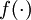
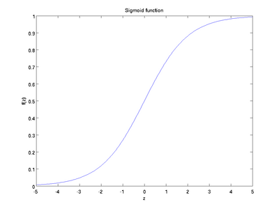
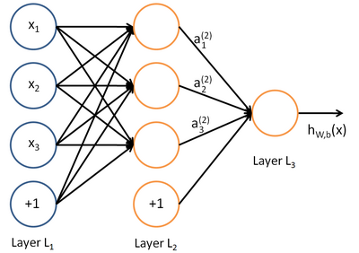
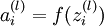
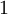
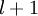

Neural Networks
===============

<!-- Jump to: [navigation](#column-one), [search](#searchInput) -->
Consider a supervised learning problem where we have access to labeled training
examples (*x*(*i*),*y*(*i*)). Neural networks give a way of defining a complex,
non-linear form of hypotheses *h**W*,*b*(*x*), with parameters *W*,*b* that we can
fit to our data.

To describe neural networks, we will begin by describing the simplest possible
neural network, one which comprises a single "neuron." We will use the following
diagram to denote a single neuron:

This "neuron" is a computational unit that takes as input *x*1,*x*2,*x*3 (and a +1 intercept term), and
outputs , where  is
called the **activation function**. In these notes, we will choose
 to be the sigmoid function:

Thus, our single
neuron corresponds exactly to the input-output mapping defined by logistic regression.

Although these notes will use the sigmoid function, it is worth noting that
another common choice for *f* is the hyperbolic tangent, or tanh, function:

Here are plots of the sigmoid and tanh functions:

The tanh(*z*) function is a rescaled version of the sigmoid, and its output range is
[ − 1,1] instead of [0,1].

Note that unlike some other venues (including the OpenClassroom videos, and parts of CS229), we are not using the convention
here of *x*0 = 1. Instead, the intercept term is handled separately by the parameter *b*.

Finally, one identity that'll be useful later: If *f*(*z*) = 1 / (1 + exp( − *z*)) is the sigmoid
function, then its derivative is given by *f*'(*z*) = *f*(*z*)(1 − *f*(*z*)).
(If *f* is the tanh function, then its derivative is given by
*f*'(*z*) = 1 − (*f*(*z*))2.) You can derive this yourself using the definition of
the sigmoid (or tanh) function.

  Neural Network model
----------------------

A neural network is put together by hooking together many of our simple
"neurons," so that the output of a neuron can be the input of another. For
example, here is a small neural network:

In this figure, we have used circles to also denote the inputs to the network. The circles
labeled "+1" are called **bias units**, and correspond to the intercept term.
The leftmost layer of the network is called the **input layer**, and the
rightmost layer the **output layer** (which, in this example, has only one
node). The middle layer of nodes is called the **hidden layer**, because its
values are not observed in the training set. We also say that our example
neural network has 3 **input units** (not counting the bias unit), 3 
**hidden units**, and 1 **output unit**.

We will let *n**l*
denote the number of layers in our network; thus *n**l* = 3 in our example. We label layer *l* as
*L**l*, so layer *L*1 is the input layer, and layer  the output layer.
Our neural network has parameters (*W*,*b*) = (*W*(1),*b*(1),*W*(2),*b*(2)), where
we write
 to denote the parameter (or weight) associated with the connection
between unit *j* in layer *l*, and unit *i* in layer *l* + 1. (Note the order of the indices.)
Also,  is the bias associated with unit *i* in layer *l* + 1.
Thus, in our example, we have , and .
Note that bias units don't have inputs or connections going into them, since they always output
the value +1. We also let *s**l* denote the number of nodes in layer *l* (not counting the bias unit).

We will write  to denote the **activation** (meaning output value) of
unit *i* in layer *l*. For *l* = 1, we also use  to denote the *i*-th input.
Given a fixed setting of
the parameters *W*,*b*, our neural
network defines a hypothesis *h**W*,*b*(*x*) that outputs a real number. Specifically, the
computation that this neural network represents is given by:

In the sequel, we also let  denote the total weighted sum of inputs to unit *i* in layer *l*,
including the bias term (e.g., ), so that
.

Note that this easily lends itself to a more compact notation. Specifically, if we extend the
activation function 
to apply to vectors in an element-wise fashion (i.e.,
*f*([*z*1,*z*2,*z*3]) = [*f*(*z*1),*f*(*z*2),*f*(*z*3)]), then we can write
the equations above more
compactly as:

We call this step **forward propagation.** More generally, recalling that we also use *a*(1) = *x* to also denote the values from the input layer,
then given layer *l*'s activations *a*(*l*), we can compute layer *l* + 1's activations *a*(*l* + 1) as:

By organizing our parameters in matrices and using matrix-vector operations, we can take
advantage of fast linear algebra routines to quickly perform calculations in our network.

We have so far focused on one example neural network, but one can also build neural
networks with other **architectures** (meaning patterns of connectivity between neurons), including ones with multiple hidden layers.
The most common choice is a -layered network
where layer  is the input layer, layer  is the output layer, and each
layer  is densely connected to layer . In this setting, to compute the
output of the network, we can successively compute all the activations in layer
, then layer , and so on, up to layer , using the equations above that describe the forward propagation step. This is one
example of a **feedforward** neural network, since the connectivity graph
does not have any directed loops or cycles.

Neural networks can also have multiple output units. For example, here is a network
with two hidden layers layers *L*2 and *L*3 and two output units in layer *L*4:

To train this network, we would need training examples (*x*(*i*),*y*(*i*))
where . This sort of network is useful if there're multiple
outputs that you're interested in predicting. (For example, in a medical
diagnosis application, the vector *x* might give the input features of a
patient, and the different outputs *y**i*'s might indicate presence or absence
of different diseases.)

**Neural Networks** | [Backpropagation Algorithm](Backpropagation_Algorithm.md "Backpropagation Algorithm") | [Gradient checking and advanced optimization](Gradient_checking_and_advanced_optimization.md "Gradient checking and advanced optimization") | [Autoencoders and Sparsity](Autoencoders_and_Sparsity.md "Autoencoders and Sparsity") | [Visualizing a Trained Autoencoder](Visualizing_a_Trained_Autoencoder.md "Visualizing a Trained Autoencoder") | [Sparse Autoencoder Notation Summary](Sparse_Autoencoder_Notation_Summary.md "Sparse Autoencoder Notation Summary") | [Exercise:Sparse Autoencoder](Exercise_Sparse_Autoencoder.md "Exercise:Sparse Autoencoder")

---

> * Language: [中文](%E7%A5%9E%E7%BB%8F%E7%BD%91%E7%BB%9C.md "神经网络")
> * This page was last modified on 6 April 2013, at 19:38.

