PCA
===

<!-- Jump to: [navigation](#column-one), [search](#searchInput) -->

|  |
| --- |
| Contents* [1 Introduction](#Introduction)
* [2 Example and Mathematical Background](#Example_and_Mathematical_Background)
* [3 Rotating the Data](#Rotating_the_Data)
* [4 Reducing the Data Dimension](#Reducing_the_Data_Dimension)
* [5 Recovering an Approximation of the Data](#Recovering_an_Approximation_of_the_Data)
* [6 Number of components to retain](#Number_of_components_to_retain)
* [7 PCA on Images](#PCA_on_Images)
* [8 References](#References)
 |

  Introduction
--------------

Principal Components Analysis (PCA) is a dimensionality reduction algorithm
that can be used to significantly speed up your unsupervised feature learning
algorithm. More importantly, understanding PCA will enable us to later
implement **whitening**, which is an important pre-processing step for many
algorithms.

Suppose you are training your algorithm on images. Then the input will be
somewhat redundant, because the values of adjacent pixels in an image are
highly correlated. Concretely, suppose we are training on 16x16 grayscale
image patches. Then 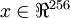 are 256 dimensional vectors, with one
feature 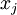 corresponding to the intensity of each pixel. Because of the
correlation between adjacent pixels, PCA will allow us to approximate the input with
a much lower dimensional one, while incurring very little error.

  Example and Mathematical Background
-------------------------------------

For our running example, we will use a dataset 
 with 
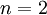 dimensional inputs, so that 
.
Suppose we want to reduce the data 
from 2 dimensions to 1. (In practice, we might want to reduce data
from 256 to 50 dimensions, say; but using lower dimensional data in our example
allows us to visualize the algorithms better.) Here is our dataset:

This data has already been pre-processed so that each of the features  and 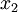
have about the same mean (zero) and variance.

For the purpose of illustration, we have also colored each of the points one of
three colors, depending on their  value; these colors are not used by the
algorithm, and are for illustration only.

PCA will find a lower-dimensional subspace onto which to project our data. 
From visually examining the data, it appears that 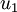 is the principal direction of 
variation of the data, and 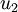 the secondary direction of variation:

I.e., the data varies much more in the direction  than . 
To more formally find the directions  and , we first compute the matrix 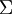
as follows:

If  has zero mean, then  is exactly the covariance matrix of . (The symbol "", pronounced "Sigma", is the standard notation for denoting the covariance matrix. Unfortunately it looks just like the summation symbol, as in ; but these are two different things.)

It can then be shown that ---the principal direction of variation of the data---is 
the top (principal) eigenvector of , and  is
the second eigenvector.

Note: If you are interested in seeing a more formal mathematical derivation/justification of this result, see the CS229 (Machine Learning) lecture notes on PCA (link at bottom of this page). You won't need to do so to follow along this course, however.

You can use standard numerical linear algebra software to find these eigenvectors (see Implementation Notes).
Concretely, let us compute the eigenvectors of , and stack
the eigenvectors in columns to form the matrix :

Here,  is the principal eigenvector (corresponding to the largest eigenvalue),
 is the second eigenvector, and so on. 
Also, let 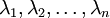 be the corresponding eigenvalues.

The vectors  and  in our example form a new basis in which we 
can represent the data. Concretely, let  be some training example. Then 
is the length (magnitude) of the projection of  onto the vector .

Similarly,  is the magnitude of  projected onto the vector .

  Rotating the Data
-------------------

Thus, we can represent  in the 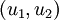-basis by computing

(The subscript "rot" comes from the observation that this corresponds to
a rotation (and possibly reflection) of the original data.)
Lets take the entire training set, and compute 
 for every . Plotting this transformed data 
, we get:

This is the training set rotated into the , basis. In the general
case, 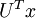 will be the training set rotated into the basis 
,, ...,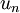.

One of the properties of  is that it is an "orthogonal" matrix, which means
that it satisfies 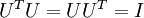. 
So if you ever need to go from the rotated vectors  back to the 
original data , you can compute

because .

  Reducing the Data Dimension
-----------------------------

We see that the principal direction of variation of the data is the first
dimension  of this rotated data. Thus, if we want to
reduce this data to one dimension, we can set

More generally, if 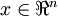 and we want to reduce it to 
a  dimensional representation 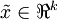 (where 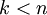), we would
take the first  components of , which correspond to
the top  directions of variation.

Another way of explaining PCA is that  is an  dimensional
vector, where the first few components are likely to 
be large (e.g., in our example, we saw that 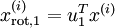 takes
reasonably large values for most examples ), and
the later components are likely to be small (e.g., in our example, 
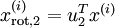 was more likely to be small). What
PCA does it it 
drops the the later (smaller) components of , and
just approximates them with 0's. Concretely, our definition of 
 can also be arrived at by using an approximation to
 where 
all but the first
 components are zeros. In other words, we have:

In our example, this gives us the following plot of  (using ):

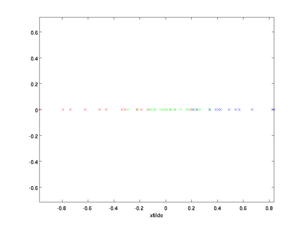

However, since the final 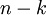 components of  as defined above would
always be zero, there is no need to keep these zeros around, and so we
define  as a -dimensional vector with just the first  (non-zero) components.

This also explains why we wanted to express our data in the  basis:
Deciding which components to keep becomes just keeping the top  components. When we
do this, we also say that we are "retaining the top  PCA (or principal) components."

  Recovering an Approximation of the Data
-----------------------------------------

Now,  is a lower-dimensional, "compressed" representation
of the original . Given , how can we recover an approximation  to 
the original value of ? From an [earlier section](#Rotating_the_Data), we know that 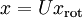. Further, 
we can think of  as an approximation to , where we have
set the last  components to zeros. Thus, given , we can 
pad it out with  zeros to get our approximation to . Finally, we pre-multiply
by  to get our approximation to . Concretely, we get

The final equality above comes from the definition of  [given earlier](#Example_and_Mathematical_Background).
(In a practical implementation, we wouldn't actually zero pad  and then multiply
by , since that would mean multiplying a lot of things by zeros; instead, we'd just 
multiply  with the first  columns of  as in the final expression above.)
Applying this to our dataset, we get the following plot for :

We are thus using a 1 dimensional approximation to the original dataset.

If you are training an autoencoder or other unsupervised feature learning algorithm,
the running time of your algorithm will depend on the dimension of the input. If you feed 
into your learning algorithm instead of , then you'll be training on a lower-dimensional
input, and thus your algorithm might run significantly faster. For many datasets,
the lower dimensional  representation can be an extremely good approximation 
to the original, and using PCA this way can significantly speed up your algorithm while
introducing very little approximation error.

  Number of components to retain
--------------------------------

How do we set ; i.e., how many PCA components should we retain? In our
simple 2 dimensional example, it seemed natural to retain 1 out of the 2
components, but for higher dimensional data, this decision is less trivial. If  is
too large, then we won't be compressing the data much; in the limit of ,
then we're just using the original data (but rotated into a different basis).
Conversely, if  is too small, then we might be using a very bad
approximation to the data.

To decide how to set , we will usually look at the **percentage of variance retained** 
for different values of . Concretely, if , then we have
an exact approximation to the data, and we say that 100% of the variance is
retained. I.e., all of the variation of the original data is retained. 
Conversely, if , then we are approximating all the data with the zero vector,
and thus 0% of the variance is retained.

More generally, let  be the eigenvalues 
of  (sorted in decreasing order), so that 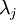 is the eigenvalue
corresponding to the eigenvector 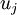. Then if we retain  principal components, 
the percentage of variance retained is given by:

In our simple 2D example above, 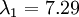, and 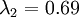. Thus,
by keeping only  principal components, we retained ,
or 91.3% of the variance.

A more formal definition of percentage of variance retained is beyond the scope
of these notes. However, it is possible to show that . Thus, if 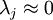, that shows that
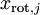 is usually near 0 anyway, and we lose relatively little by
approximating it with a constant 0. This also explains why we retain the top principal
components (corresponding to the larger values of ) instead of the bottom
ones. The top principal components 
 are the ones that're more variable and that take on larger values, 
and for which we would incur a greater approximation error if we were to set them to zero.

In the case of images, one common heuristic is to choose  so as to retain 99% of
the variance. In other words, we pick the smallest value of  that satisfies

Depending on the application, if you are willing to incur some 
additional error, values in the 90-98% range are also sometimes used. When you
describe to others how you applied PCA, saying that you chose  to retain 95% of
the variance will also be a much more easily interpretable description than saying
that you retained 120 (or whatever other number of) components.

  PCA on Images
---------------

For PCA to work, usually we want each of the features 
to have a similar range of values to the others (and to have a mean close to
zero). If you've used PCA on other applications before, you may therefore have
separately pre-processed each feature to have zero mean and unit variance, by
separately estimating the mean and variance of each feature . However,
this isn't the pre-processing that we will apply to most types of images. Specifically,
suppose we are training our algorithm on **natural images**, so that  is
the value of pixel . By "natural images," we informally mean the type of image that
a typical animal or person might see over their lifetime.

Note: Usually we use images of outdoor scenes with grass, trees, etc., and cut out small (say 16x16) image patches randomly from these to train the algorithm. But in practice most feature learning algorithms are extremely robust to the exact type of image it is trained on, so most images taken with a normal camera, so long as they aren't excessively blurry or have strange artifacts, should work.

When training on natural images, it makes little sense to estimate a separate mean and
variance for each pixel, because the statistics in one part
of the image should (theoretically) be the same as any other. 
This property of images is called **stationarity.**

In detail, in order for PCA to work well, informally we require that (i) The
features have approximately zero mean, and (ii) The different features have
similar variances to each other. With natural images, (ii) is already
satisfied even without variance normalization, and so we won't perform any 
variance normalization. 
(If you are training on audio data---say, on
spectrograms---or on text data---say, bag-of-word vectors---we will usually not perform
variance normalization either.) 
In fact, PCA is invariant to the scaling of
the data, and will return the same eigenvectors regardless of the scaling of
the input. More formally, if you multiply each feature vector  by some
positive number (thus scaling every feature in every training example by the
same number), PCA's output eigenvectors will not change.

So, we won't use variance normalization. The only normalization we need to
perform then is mean normalization, to ensure that the features have a mean
around zero. Depending on the application, very often we are not interested
in how bright the overall input image is. For example, in object recognition
tasks, the overall brightness of the image doesn't affect what objects
there are in the image. More formally, we are not interested in the
mean intensity value of an image patch; thus, we can subtract out this value,
as a form of mean normalization.

Concretely, if  are the (grayscale) intensity values of
a 16x16 image patch (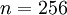), we might normalize the intensity of each image
 as follows:

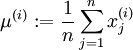

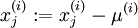, for all 

Note that the two steps above are done separately for each image ,
and that 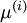 here is the mean intensity of the image . In particular,
this is not the same thing as estimating a mean value separately for each pixel .

If you are training your algorithm on images other than natural images (for example, images of handwritten characters, or images of single isolated objects centered against a white background), other types of normalization might be worth considering, and the best choice may be application dependent. But when training on natural images, using the per-image mean normalization method as given in the equations above would be a reasonable default.

  References
------------

[http://cs229.stanford.edu](http://cs229.stanford.edu/)

**PCA** | [Whitening](Whitening.md "Whitening") | [Implementing PCA/Whitening](/wayback-mooc/stanford-ufldl/wiki/Implementing_PCA/Whitening "Implementing PCA/Whitening") | [Exercise:PCA in 2D](Exercise_PCA_in_2D.md "Exercise:PCA in 2D") | [Exercise:PCA and Whitening](Exercise_PCA_and_Whitening.md "Exercise:PCA and Whitening")

---

> * Language: [中文](%E4%B8%BB%E6%88%90%E5%88%86%E5%88%86%E6%9E%90.md "主成分分析")
> * This page was last modified on 7 April 2013, at 13:18.

