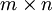

Pooling
=======

<!-- Jump to: [navigation](#column-one), [search](#searchInput) -->
  Pooling: Overview
-------------------

After obtaining features using convolution, we would next like to use them for classification. In theory, one could use all the extracted features with a classifier such as a softmax classifier, but this can be computationally challenging. Consider for instance images of size 96x96 pixels, and suppose we have learned 400 features over 8x8 inputs. Each convolution results in an output of size (96 − 8 + 1) \* (96 − 8 + 1) = 7921, and since we have 400 features, this results in a vector of 892 \* 400 = 3,168,400 features per example. Learning a classifier with inputs having 3+ million features can be unwieldy, and can also be prone to over-fitting.

To address this, first recall that we decided to obtain convolved features because images have the "stationarity" property, which implies that features that are useful in one region are also likely to be useful for other regions. Thus, to describe a large image, one natural approach is to aggregate statistics of these features at various locations. For example, one could compute the mean (or max) value of a particular feature over a region of the image. These summary statistics are much lower in dimension (compared to using all of the extracted features) and can also improve results (less over-fitting). We aggregation operation is called this operation **pooling**, or sometimes **mean pooling** or **max pooling** (depending on the pooling operation applied).

The following image shows how pooling is done over 4 non-overlapping regions of the image.

  Pooling for Invariance
------------------------

If one chooses the pooling regions to be contiguous areas in the image and only pools features generated from the same (replicated) hidden units. Then, these pooling units will then be **translation invariant**. This means that the same (pooled) feature will be active even when the image undergoes (small) translations. Translation-invariant features are often desirable; in many tasks (e.g., object detection, audio recognition), the label of the example (image) is the same even when the image is translated. For example, if you were to take an MNIST digit and translate it left or right, you would want your classifier to still accurately classify it as the same digit regardless of its final position.

  Formal description
--------------------

Formally, after obtaining our convolved features as described earlier, we decide the size of the region, say  to pool our convolved features over. Then, we divide our convolved features into disjoint  regions, and take the mean (or maximum) feature activation over these regions to obtain the pooled convolved features. These pooled features can then be used for classification.

---

> * Language: [中文](%E6%B1%A0%E5%8C%96.md "池化")
> * This page was last modified on 8 April 2013, at 04:17.

