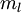
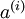
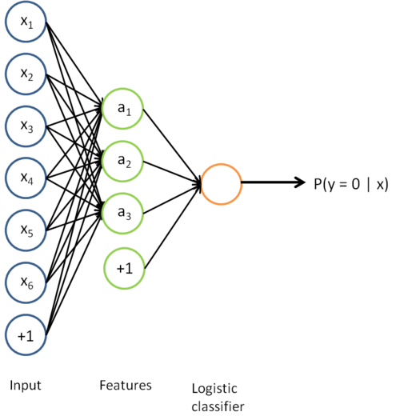
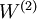

Self-Taught Learning to Deep Networks
=====================================

<!-- Jump to: [navigation](#column-one), [search](#searchInput) -->
In the previous section, you used an autoencoder to learn features that were then fed as input 
to a softmax or logistic regression classifier. In that method, the features were learned using
only unlabeled data. In this section, we describe how you can **fine-tune** and further improve 
the learned features using labeled data. When you have a large amount of labeled
training data, this can significantly improve your classifier's performance.

In self-taught learning, we first trained a sparse autoencoder on the unlabeled data. Then, 
given a new example , we used the hidden layer to extract 
features . This is illustrated in the following diagram:

We are interested in solving a classification task, where our goal is to
predict labels . We have a labeled training set  of  labeled examples.
We showed previously that we can replace the original features  with features 
computed by the sparse autoencoder (the "replacement" representation). This gives us a training set . Finally, we train a logistic
classifier to map from the features  to the classification label .
To illustrate this step, similar to [our earlier notes](Neural_Networks.md "Neural Networks"), we can draw our logistic regression unit (shown in orange) as follows:

Now, consider the overall classifier (i.e., the input-output mapping) that we have learned 
using this method. 
In particular, let us examine the function that our classifier uses to map from from a new test example 
 to a new prediction *p*(*y* = 1 | *x*). 
We can draw a representation of this function by putting together the 
two pictures from above. In particular, the final classifier looks like this:

The parameters of this model were trained in two stages: The first layer of weights 
mapping from the input  to the hidden unit activations  were trained
as part of the sparse autoencoder training process. The second layer
of weights  mapping from the activations  to the output  was
trained using logistic regression (or softmax regression).

But the form of our overall/final classifier is clearly just a whole big neural network. So,
having trained up an initial set of parameters for our model (training the first layer using an 
autoencoder, and the second layer
via logistic/softmax regression), we can further modify all the parameters in our model to try to 
further reduce the training error. In particular, we can **fine-tune** the parameters, meaning perform 
gradient descent (or use L-BFGS) from the current setting of the
parameters to try to reduce the training error on our labeled training set .

When fine-tuning is used, sometimes the original unsupervised feature learning steps 
(i.e., training the autoencoder and the logistic classifier) are called **pre-training.**
The effect of fine-tuning is that the labeled data can be used to modify the weights *W*(1) as
well, so that adjustments can be made to the features *a* extracted by the layer
of hidden units.

So far, we have described this process assuming that you used the "replacement" representation, where
the training examples seen by the logistic classifier are of the form (*a*(*i*),*y*(*i*)),
rather than the "concatenation" representation, where the examples are of the form ((*x*(*i*),*a*(*i*)),*y*(*i*)).
It is also possible to perform fine-tuning too using the "concatenation" representation. (This corresponds
to a neural network where the input units *x**i* also feed directly to the logistic
classifier in the output layer. You can draw this using a slightly different type of neural network
diagram than the ones we have seen so far; in particular, you would have edges that go directly
from the first layer input nodes to the third layer output node, "skipping over" the hidden layer.) 
However, so long as we are using finetuning, usually the "concatenation" representation 
has little advantage over the "replacement" representation. Thus, if we are using fine-tuning usually we will do so
with a network built using the replacement representation. (If you are not using fine-tuning however,
then sometimes the concatenation representation can give much better performance.)

When should we use fine-tuning? It is typically used only if you have a large labeled training 
set; in this setting, fine-tuning can significantly improve the performance of your classifier. 
However, if you
have a large *unlabeled* dataset (for unsupervised feature learning/pre-training) and
only a relatively small labeled training set, then fine-tuning is significantly less likely to
help.

 **From Self-Taught Learning to Deep Networks** | [Deep Networks: Overview](Deep_Networks__Overview.md "Deep Networks: Overview") | [Stacked Autoencoders](Stacked_Autoencoders.md "Stacked Autoencoders") | [Fine-tuning Stacked AEs](Fine-tuning_Stacked_AEs.md "Fine-tuning Stacked AEs") | [Exercise: Implement deep networks for digit classification](Exercise__Implement_deep_networks_for_digit_classification.md "Exercise: Implement deep networks for digit classification")

---

> * Language: [中文](%E4%BB%8E%E8%87%AA%E6%88%91%E5%AD%A6%E4%B9%A0%E5%88%B0%E6%B7%B1%E5%B1%82%E7%BD%91%E7%BB%9C.md "从自我学习到深层网络")
> * This page was last modified on 7 April 2013, at 13:29.

