Softmax Regression
==================

(Redirected from Softmax regression)
<!-- Jump to: [navigation](#column-one), [search](#searchInput) -->

|  |
| --- |
| Contents* [1 Introduction](#Introduction)
* [2 Cost Function](#Cost_Function)
* [3 Properties of softmax regression parameterization](#Properties_of_softmax_regression_parameterization)
* [4 Weight Decay](#Weight_Decay)
* [5 Relationship to Logistic Regression](#Relationship_to_Logistic_Regression)
* [6 Softmax Regression vs. k Binary Classifiers](#Softmax_Regression_vs._k_Binary_Classifiers)
 |

  Introduction
--------------

In these notes, we describe the **Softmax regression** model. This model generalizes logistic regression to
classification problems where the class label *y* can take on more than two possible values.
This will be useful for such problems as MNIST digit classification, where the goal is to distinguish between 10 different
numerical digits. Softmax regression is a supervised learning algorithm, but we will later be
using it in conjuction with our deep learning/unsupervised feature learning methods.

Recall that in logistic regression, we had a training set
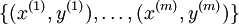
of *m* labeled examples, where the input features are 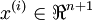. 
(In this set of notes, we will use the notational convention of letting the feature vectors *x* be
*n* + 1 dimensional, with *x*0 = 1 corresponding to the intercept term.) 
With logistic regression, we were in the binary classification setting, so the labels 
were 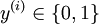. Our hypothesis took the form:

and the model parameters θ were trained to minimize
the cost function

![
\begin{align}
J(\theta) = -\frac{1}{m} \left[ \sum_{i=1}^m y^{(i)} \log h_\theta(x^{(i)}) + (1-y^{(i)}) \log (1-h_\theta(x^{(i)})) \right]
\end{align}
](images/math/f/a/6/fa6565f1e7b91831e306ec404ccc1156.png)

In the softmax regression setting, we are interested in multi-class
classification (as opposed to only binary classification), and so the label
*y* can take on *k* different values, rather than only
two. Thus, in our training set
,
we now have that 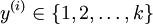. (Note that
our convention will be to index the classes starting from 1, rather than from 0.) For example,
in the MNIST digit recognition task, we would have *k* = 10 different classes.

Given a test input *x*, we want our hypothesis to estimate
the probability that *p*(*y* = *j* | *x*) for each value of 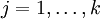.
I.e., we want to estimate the probability of the class label taking
on each of the *k* different possible values. Thus, our hypothesis
will output a *k* dimensional vector (whose elements sum to 1) giving
us our *k* estimated probabilities. Concretely, our hypothesis
*h*θ(*x*) takes the form:

Here 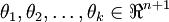 are the
parameters of our model. 
Notice that
the term 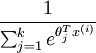
normalizes the distribution, so that it sums to one.

For convenience, we will also write 
θ to denote all the
parameters of our model. When you implement softmax regression, it is usually
convenient to represent θ as a *k*-by-(*n* + 1) matrix obtained by
stacking up 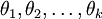 in rows, so that

  Cost Function
---------------

We now describe the cost function that we'll use for softmax regression. In the equation below, 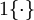 is
the **indicator function,** so that 1{a true statement} = 1, and 1{a false statement} = 0.
For example, 1{2 + 2 = 4} evaluates to 1; whereas 1{1 + 1 = 5} evaluates to 0. Our cost function will be:

![
\begin{align}
J(\theta) = - \frac{1}{m} \left[ \sum_{i=1}^{m} \sum_{j=1}^{k}  1\left\{y^{(i)} = j\right\} \log \frac{e^{\theta_j^T x^{(i)}}}{\sum_{l=1}^k e^{ \theta_l^T x^{(i)} }}\right]
\end{align}
](images/math/7/6/3/7634eb3b08dc003aa4591a95824d4fbd.png)

Notice that this generalizes the logistic regression cost function, which could also have been written:

![
\begin{align}
J(\theta) &= -\frac{1}{m} \left[ \sum_{i=1}^m   (1-y^{(i)}) \log (1-h_\theta(x^{(i)})) + y^{(i)} \log h_\theta(x^{(i)}) \right] \\
&= - \frac{1}{m} \left[ \sum_{i=1}^{m} \sum_{j=0}^{1} 1\left\{y^{(i)} = j\right\} \log p(y^{(i)} = j | x^{(i)} ; \theta) \right]
\end{align}
](images/math/5/4/9/5491271f19161f8ea6a6b2a82c83fc3a.png)

The softmax cost function is similar, except that we now sum over the *k* different possible values
of the class label. Note also that in softmax regression, we have that
.

There is no known closed-form way to solve for the minimum of *J*(θ), and thus as usual we'll resort to an iterative
optimization algorithm such as gradient descent or L-BFGS. Taking derivatives, one can show that the gradient is:

![
\begin{align}
\nabla_{\theta_j} J(\theta) = - \frac{1}{m} \sum_{i=1}^{m}{ \left[ x^{(i)} \left( 1\{ y^{(i)} = j\}  - p(y^{(i)} = j | x^{(i)}; \theta) \right) \right]  }
\end{align}
](images/math/5/9/e/59ef406cef112eb75e54808b560587c9.png)

Recall the meaning of the "" notation. In particular, 
is itself a vector, so that its *l*-th element is 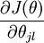
the partial derivative of *J*(θ) with respect to the *l*-th element of θ*j*.

Armed with this formula for the derivative, one can then plug it into an algorithm such as gradient descent, and have it
minimize *J*(θ). For example, with the standard implementation of gradient descent, on each iteration
we would perform the update  (for each ).

When implementing softmax regression, we will typically use a modified version of the cost function described above;
specifically, one that incorporates weight decay. We describe the motivation and details below.

  Properties of softmax regression parameterization
---------------------------------------------------

Softmax regression has an unusual property that it has a "redundant" set of parameters. To explain what this means, 
suppose we take each of our parameter vectors θ*j*, and subtract some fixed vector ψ
from it, so that every θ*j* is now replaced with θ*j* − ψ 
(for every ). Our hypothesis
now estimates the class label probabilities as

In other words, subtracting ψ from every θ*j*
does not affect our hypothesis' predictions at all! This shows that softmax
regression's parameters are "redundant." More formally, we say that our
softmax model is **overparameterized,** meaning that for any hypothesis we might
fit to the data, there are multiple parameter settings that give rise to exactly
the same hypothesis function *h*θ mapping from inputs *x*
to the predictions.

Further, if the cost function *J*(θ) is minimized by some
setting of the parameters 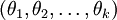,
then it is also minimized by  for any value of ψ. Thus, the
minimizer of *J*(θ) is not unique. (Interestingly, 
*J*(θ) is still convex, and thus gradient descent will
not run into a local optima problems. But the Hessian is singular/non-invertible,
which causes a straightforward implementation of Newton's method to run into
numerical problems.)

Notice also that by setting ψ = θ1, one can always
replace θ1 with 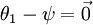 (the vector of all
0's), without affecting the hypothesis. Thus, one could "eliminate" the vector
of parameters θ1 (or any other θ*j*, for
any single value of *j*), without harming the representational power
of our hypothesis. Indeed, rather than optimizing over the *k*(*n* + 1)
parameters  (where
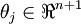), one could instead set  and optimize only with respect to the (*k* − 1)(*n* + 1)
remaining parameters, and this would work fine.

In practice, however, it is often cleaner and simpler to implement the version which keeps
all the parameters 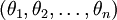, without
arbitrarily setting one of them to zero. But we will
make one change to the cost function: Adding weight decay. This will take care of
the numerical problems associated with softmax regression's overparameterized representation.

  Weight Decay
--------------

We will modify the cost function by adding a weight decay term 
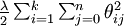
which penalizes large values of the parameters. Our cost function is now

![
\begin{align}
J(\theta) = - \frac{1}{m} \left[ \sum_{i=1}^{m} \sum_{j=1}^{k} 1\left\{y^{(i)} = j\right\} \log \frac{e^{\theta_j^T x^{(i)}}}{\sum_{l=1}^k e^{ \theta_l^T x^{(i)} }}  \right]
              + \frac{\lambda}{2} \sum_{i=1}^k \sum_{j=0}^n \theta_{ij}^2
\end{align}
](images/math/4/7/1/471592d82c7f51526bb3876c6b0f868d.png)

With this weight decay term (for any λ > 0), the cost function
*J*(θ) is now strictly convex, and is guaranteed to have a
unique solution. The Hessian is now invertible, and because *J*(θ) is 
convex, algorithms such as gradient descent, L-BFGS, etc. are guaranteed
to converge to the global minimum.

To apply an optimization algorithm, we also need the derivative of this
new definition of *J*(θ). One can show that the derivative is:
![
\begin{align}
\nabla_{\theta_j} J(\theta) = - \frac{1}{m} \sum_{i=1}^{m}{ \left[ x^{(i)} ( 1\{ y^{(i)} = j\}  - p(y^{(i)} = j | x^{(i)}; \theta) ) \right]  } + \lambda \theta_j
\end{align}
](images/math/3/a/f/3afb4b9181a3063ddc639099bc919197.png)

By minimizing *J*(θ) with respect to θ, we will have a working implementation of softmax regression.

  Relationship to Logistic Regression
-------------------------------------

In the special case where *k* = 2, one can show that softmax regression reduces to logistic regression.
This shows that softmax regression is a generalization of logistic regression. Concretely, when *k* = 2,
the softmax regression hypothesis outputs

Taking advantage of the fact that this hypothesis
is overparameterized and setting ψ = θ1,
we can subtract θ1 from each of the two parameters, giving us

![
\begin{align}
h(x) &=

\frac{1}{ e^{\vec{0}^Tx}  + e^{ (\theta_2-\theta_1)^T x^{(i)} } }
\begin{bmatrix}
e^{ \vec{0}^T x } \\
e^{ (\theta_2-\theta_1)^T x }
\end{bmatrix} \\

&=
\begin{bmatrix}
\frac{1}{ 1 + e^{ (\theta_2-\theta_1)^T x^{(i)} } } \\
\frac{e^{ (\theta_2-\theta_1)^T x }}{ 1 + e^{ (\theta_2-\theta_1)^T x^{(i)} } }
\end{bmatrix} \\

&=
\begin{bmatrix}
\frac{1}{ 1  + e^{ (\theta_2-\theta_1)^T x^{(i)} } } \\
1 - \frac{1}{ 1  + e^{ (\theta_2-\theta_1)^T x^{(i)} } } \\
\end{bmatrix}
\end{align}
](images/math/b/8/1/b81d6e553283fadddbe29fe55226fb38.png)

Thus, replacing θ2 − θ1 with a single parameter vector θ', we find
that softmax regression predicts the probability of one of the classes as
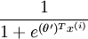,
and that of the other class as
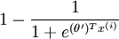,
same as logistic regression.

  Softmax Regression vs. k Binary Classifiers
---------------------------------------------

Suppose you are working on a music classification application, and there are
*k* types of music that you are trying to recognize. Should you use a
softmax classifier, or should you build *k* separate binary classifiers using
logistic regression?

This will depend on whether the four classes are *mutually exclusive.* For example,
if your four classes are classical, country, rock, and jazz, then assuming each
of your training examples is labeled with exactly one of these four class labels,
you should build a softmax classifier with *k* = 4.
(If there're also some examples that are none of the above four classes,
then you can set *k* = 5 in softmax regression, and also have a fifth, "none of the above," class.)

If however your categories are has\_vocals, dance, soundtrack, pop, then the
classes are not mutually exclusive; for example, there can be a piece of pop
music that comes from a soundtrack and in addition has vocals. In this case, it
would be more appropriate to build 4 binary logistic regression classifiers. 
This way, for each new musical piece, your algorithm can separately decide whether
it falls into each of the four categories.

Now, consider a computer vision example, where you're trying to classify images into
three different classes. (i) Suppose that your classes are indoor\_scene,
outdoor\_urban\_scene, and outdoor\_wilderness\_scene. Would you use sofmax regression
or three logistic regression classifiers? (ii) Now suppose your classes are
indoor\_scene, black\_and\_white\_image, and image\_has\_people. Would you use softmax
regression or multiple logistic regression classifiers?

In the first case, the classes are mutually exclusive, so a softmax regression
classifier would be appropriate. In the second case, it would be more appropriate to build
three separate logistic regression classifiers.

---

**Softmax Regression** | [Exercise:Softmax Regression](Exercise_Softmax_Regression.md "Exercise:Softmax Regression")

---

> * Language: [中文](Softmax%E5%9B%9E%E5%BD%92.md "Softmax回归")
> * This page was last modified on 7 April 2013, at 13:24.

