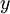
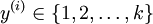
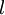
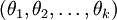
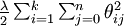

Softmax回归
=========

<!-- Jump to: [navigation](#column-one), [search](#searchInput) -->

|  |
| --- |
| Contents* [1 简介](#.E7.AE.80.E4.BB.8B)
* [2 代价函数](#.E4.BB.A3.E4.BB.B7.E5.87.BD.E6.95.B0)
* [3 Softmax回归模型参数化的特点](#Softmax.E5.9B.9E.E5.BD.92.E6.A8.A1.E5.9E.8B.E5.8F.82.E6.95.B0.E5.8C.96.E7.9A.84.E7.89.B9.E7.82.B9)
* [4 权重衰减](#.E6.9D.83.E9.87.8D.E8.A1.B0.E5.87.8F)
* [5 Softmax回归与Logistic 回归的关系](#Softmax.E5.9B.9E.E5.BD.92.E4.B8.8ELogistic_.E5.9B.9E.E5.BD.92.E7.9A.84.E5.85.B3.E7.B3.BB)
* [6 Softmax 回归 vs. k 个二元分类器](#Softmax_.E5.9B.9E.E5.BD.92_vs._k_.E4.B8.AA.E4.BA.8C.E5.85.83.E5.88.86.E7.B1.BB.E5.99.A8)
* [7 中英文对照](#.E4.B8.AD.E8.8B.B1.E6.96.87.E5.AF.B9.E7.85.A7)
* [8 中文译者](#.E4.B8.AD.E6.96.87.E8.AF.91.E8.80.85)
 |

 简介
---

在本节中，我们介绍Softmax回归模型，该模型是logistic回归模型在多分类问题上的推广，在多分类问题中，类标签  可以取两个以上的值。 Softmax回归模型对于诸如MNIST手写数字分类等问题是很有用的，该问题的目的是辨识10个不同的单个数字。Softmax回归是有监督的，不过后面也会介绍它与深度学习/无监督学习方法的结合。（译者注： MNIST 是一个手写数字识别库，由NYU 的Yann LeCun 等人维护。<http://yann.lecun.com/exdb/mnist/> ）

回想一下在 logistic 回归中，我们的训练集由  个已标记的样本构成： ，其中输入特征。（我们对符号的约定如下：特征向量  的维度为 ，其中  对应截距项 。） 由于 logistic 回归是针对二分类问题的，因此类标记 。假设函数(hypothesis function) 如下：


我们将训练模型参数 ，使其能够最小化代价函数 ：

![
\begin{align}
J(\theta) = -\frac{1}{m} \left[ \sum_{i=1}^m y^{(i)} \log h_\theta(x^{(i)}) + (1-y^{(i)}) \log (1-h_\theta(x^{(i)})) \right]
\end{align}
](images/math/f/a/6/fa6565f1e7b91831e306ec404ccc1156.png)

在 softmax回归中，我们解决的是多分类问题（相对于 logistic 回归解决的二分类问题），类标  可以取  个不同的值（而不是 2 个）。因此，对于训练集 ，我们有 。（注意此处的类别下标从 1 开始，而不是 0）。例如，在 MNIST 数字识别任务中，我们有  个不同的类别。

对于给定的测试输入 ，我们想用假设函数针对每一个类别j估算出概率值 。也就是说，我们想估计  的每一种分类结果出现的概率。因此，我们的假设函数将要输出一个  维的向量（向量元素的和为1）来表示这  个估计的概率值。 具体地说，我们的假设函数  形式如下：


其中  是模型的参数。请注意 这一项对概率分布进行归一化，使得所有概率之和为 1 。

为了方便起见，我们同样使用符号  来表示全部的模型参数。在实现Softmax回归时，将  用一个  的矩阵来表示会很方便，该矩阵是将  按行罗列起来得到的，如下所示：


  代价函数
------

现在我们来介绍 softmax 回归算法的代价函数。在下面的公式中， 是示性函数，其取值规则为：

```
 值为真的表达式 

```

，  值为假的表达式 。举例来说，表达式  的值为1 ，的值为 0。我们的代价函数为：

![
\begin{align}
J(\theta) = - \frac{1}{m} \left[ \sum_{i=1}^{m} \sum_{j=1}^{k}  1\left\{y^{(i)} = j\right\} \log \frac{e^{\theta_j^T x^{(i)}}}{\sum_{l=1}^k e^{ \theta_l^T x^{(i)} }}\right]
\end{align}
](images/math/7/6/3/7634eb3b08dc003aa4591a95824d4fbd.png)

值得注意的是，上述公式是logistic回归代价函数的推广。logistic回归代价函数可以改为：

![
\begin{align}
J(\theta) &= -\frac{1}{m} \left[ \sum_{i=1}^m   (1-y^{(i)}) \log (1-h_\theta(x^{(i)})) + y^{(i)} \log h_\theta(x^{(i)}) \right] \\
&= - \frac{1}{m} \left[ \sum_{i=1}^{m} \sum_{j=0}^{1} 1\left\{y^{(i)} = j\right\} \log p(y^{(i)} = j | x^{(i)} ; \theta) \right]
\end{align}
](images/math/5/4/9/5491271f19161f8ea6a6b2a82c83fc3a.png)

可以看到，Softmax代价函数与logistic 代价函数在形式上非常类似，只是在Softmax损失函数中对类标记的  个可能值进行了累加。注意在Softmax回归中将  分类为类别  的概率为：

.

对于  的最小化问题，目前还没有闭式解法。因此，我们使用迭代的优化算法（例如梯度下降法，或 L-BFGS）。经过求导，我们得到梯度公式如下：

![
\begin{align}
\nabla_{\theta_j} J(\theta) = - \frac{1}{m} \sum_{i=1}^{m}{ \left[ x^{(i)} \left( 1\{ y^{(i)} = j\}  - p(y^{(i)} = j | x^{(i)}; \theta) \right) \right]  }
\end{align}
](images/math/5/9/e/59ef406cef112eb75e54808b560587c9.png)

让我们来回顾一下符号 "" 的含义。 本身是一个向量，它的第  个元素  是 对 的第  个分量的偏导数。

有了上面的偏导数公式以后，我们就可以将它代入到梯度下降法等算法中，来最小化 。 例如，在梯度下降法的标准实现中，每一次迭代需要进行如下更新: (）。

当实现 softmax 回归算法时， 我们通常会使用上述代价函数的一个改进版本。具体来说，就是和权重衰减(weight decay)一起使用。我们接下来介绍使用它的动机和细节。

  Softmax回归模型参数化的特点
-------------------

Softmax 回归有一个不寻常的特点：它有一个“冗余”的参数集。为了便于阐述这一特点，假设我们从参数向量  中减去了向量 ，这时，每一个  都变成了 ()。此时假设函数变成了以下的式子：


换句话说，从  中减去  完全不影响假设函数的预测结果！这表明前面的 softmax 回归模型中存在冗余的参数。更正式一点来说， Softmax 模型被过度参数化了。对于任意一个用于拟合数据的假设函数，可以求出多组参数值，这些参数得到的是完全相同的假设函数 。

进一步而言，如果参数  是代价函数  的极小值点，那么  同样也是它的极小值点，其中  可以为任意向量。因此使  最小化的解不是唯一的。（有趣的是，由于  仍然是一个凸函数，因此梯度下降时不会遇到局部最优解的问题。但是 Hessian 矩阵是奇异的/不可逆的，这会直接导致采用牛顿法优化就遇到数值计算的问题）

注意，当  时，我们总是可以将 替换为（即替换为全零向量），并且这种变换不会影响假设函数。因此我们可以去掉参数向量  （或者其他  中的任意一个）而不影响假设函数的表达能力。实际上，与其优化全部的  个参数  （其中 ），我们可以令 ，只优化剩余的  个参数，这样算法依然能够正常工作。

在实际应用中，为了使算法实现更简单清楚，往往保留所有参数 ，而不任意地将某一参数设置为 0。但此时我们需要对代价函数做一个改动：加入权重衰减。权重衰减可以解决 softmax 回归的参数冗余所带来的数值问题。

 权重衰减
-----

我们通过添加一个权重衰减项  来修改代价函数，这个衰减项会惩罚过大的参数值，现在我们的代价函数变为：

![
\begin{align}
J(\theta) = - \frac{1}{m} \left[ \sum_{i=1}^{m} \sum_{j=1}^{k} 1\left\{y^{(i)} = j\right\} \log \frac{e^{\theta_j^T x^{(i)}}}{\sum_{l=1}^k e^{ \theta_l^T x^{(i)} }}  \right]
              + \frac{\lambda}{2} \sum_{i=1}^k \sum_{j=0}^n \theta_{ij}^2
\end{align}
](images/math/4/7/1/471592d82c7f51526bb3876c6b0f868d.png)

有了这个权重衰减项以后 ()，代价函数就变成了严格的凸函数，这样就可以保证得到唯一的解了。 此时的 Hessian矩阵变为可逆矩阵，并且因为是凸函数，梯度下降法和 L-BFGS 等算法可以保证收敛到全局最优解。

为了使用优化算法，我们需要求得这个新函数  的导数，如下：

![
\begin{align}
\nabla_{\theta_j} J(\theta) = - \frac{1}{m} \sum_{i=1}^{m}{ \left[ x^{(i)} ( 1\{ y^{(i)} = j\}  - p(y^{(i)} = j | x^{(i)}; \theta) ) \right]  } + \lambda \theta_j
\end{align}
](images/math/3/a/f/3afb4b9181a3063ddc639099bc919197.png)

通过最小化 ，我们就能实现一个可用的 softmax 回归模型。

 Softmax回归与Logistic 回归的关系
-------------------------

当类别数  时，softmax 回归退化为 logistic 回归。这表明 softmax 回归是 logistic 回归的一般形式。具体地说，当  时，softmax 回归的假设函数为：


利用softmax回归参数冗余的特点，我们令 ，并且从两个参数向量中都减去向量 ，得到:

![
\begin{align}
h(x) &=

\frac{1}{ e^{\vec{0}^Tx}  + e^{ (\theta_2-\theta_1)^T x^{(i)} } }
\begin{bmatrix}
e^{ \vec{0}^T x } \\
e^{ (\theta_2-\theta_1)^T x }
\end{bmatrix} \\

&=
\begin{bmatrix}
\frac{1}{ 1 + e^{ (\theta_2-\theta_1)^T x^{(i)} } } \\
\frac{e^{ (\theta_2-\theta_1)^T x }}{ 1 + e^{ (\theta_2-\theta_1)^T x^{(i)} } }
\end{bmatrix} \\

&=
\begin{bmatrix}
\frac{1}{ 1  + e^{ (\theta_2-\theta_1)^T x^{(i)} } } \\
1 - \frac{1}{ 1  + e^{ (\theta_2-\theta_1)^T x^{(i)} } } \\
\end{bmatrix}
\end{align}
](images/math/b/8/1/b81d6e553283fadddbe29fe55226fb38.png)

因此，用 来表示，我们就会发现 softmax 回归器预测其中一个类别的概率为 ，另一个类别概率的为 ，这与 logistic回归是一致的。

 Softmax 回归 vs. k 个二元分类器
------------------------

如果你在开发一个音乐分类的应用，需要对k种类型的音乐进行识别，那么是选择使用 softmax 分类器呢，还是使用 logistic 回归算法建立 k 个独立的二元分类器呢？

这一选择取决于你的类别之间是否互斥，例如，如果你有四个类别的音乐，分别为：古典音乐、乡村音乐、摇滚乐和爵士乐，那么你可以假设每个训练样本只会被打上一个标签（即：一首歌只能属于这四种音乐类型的其中一种），此时你应该使用类别数 *k* = 4 的softmax回归。（如果在你的数据集中，有的歌曲不属于以上四类的其中任何一类，那么你可以添加一个“其他类”，并将类别数 *k* 设为5。）

如果你的四个类别如下：人声音乐、舞曲、影视原声、流行歌曲，那么这些类别之间并不是互斥的。例如：一首歌曲可以来源于影视原声，同时也包含人声 。这种情况下，使用4个二分类的 logistic 回归分类器更为合适。这样，对于每个新的音乐作品 ，我们的算法可以分别判断它是否属于各个类别。

现在我们来看一个计算视觉领域的例子，你的任务是将图像分到三个不同类别中。(i) 假设这三个类别分别是：室内场景、户外城区场景、户外荒野场景。你会使用sofmax回归还是 3个logistic 回归分类器呢？ (ii) 现在假设这三个类别分别是室内场景、黑白图片、包含人物的图片，你又会选择 softmax 回归还是多个 logistic 回归分类器呢？

在第一个例子中，三个类别是互斥的，因此更适于选择softmax回归分类器 。而在第二个例子中，建立三个独立的 logistic回归分类器更加合适。

 中英文对照
------

Softmax回归 Softmax Regression
有监督学习 supervised learning
无监督学习 unsupervised learning
深度学习 deep learning
logistic回归 logistic regression
截距项 intercept term
二元分类 binary classification
类型标记 class labels
估值函数/估计值 hypothesis
代价函数 cost function
多元分类 multi-class classification
权重衰减 weight decay

 中文译者
-----

曾俊瑀（knighterzjy@gmail.com）, 王方（fangkey@gmail.com），王文中（wangwenzhong@ymail.com）

**Softmax回归** | [Exercise:Softmax Regression](Exercise_Softmax_Regression.md "Exercise:Softmax Regression")

---

> * Language: [English](Softmax_Regression.md "Softmax Regression")
> * This page was last modified on 8 April 2013, at 05:38.

