Sparse Coding
=============

<!-- Jump to: [navigation](#column-one), [search](#searchInput) -->
  Sparse Coding
---------------

Sparse coding is a class of unsupervised methods for learning sets of over-complete bases to represent data efficiently. The aim of sparse coding is to find a set of basis vectors 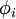 such that we can represent an input vector 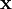 as a linear combination of these basis vectors:

While techniques such as Principal Component Analysis (PCA) allow us to learn a complete set of basis vectors efficiently, we wish to learn an **over-complete** set of basis vectors to represent input vectors 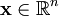 (i.e. such that *k* > *n*). The advantage of having an over-complete basis is that our basis vectors are better able to capture structures and patterns inherent in the input data. However, with an over-complete basis, the coefficients *a**i* are no longer uniquely determined by the input vector . Therefore, in sparse coding, we introduce the additional criterion of **sparsity** to resolve the degeneracy introduced by over-completeness.

Here, we define sparsity as having few non-zero components or having few components not close to zero. The requirement that our coefficients *a**i* be sparse means that given a input vector, we would like as few of our coefficients to be far from zero as possible. The choice of sparsity as a desired characteristic of our representation of the input data can be motivated by the observation that most sensory data such as natural images may be described as the superposition of a small number of atomic elements such as surfaces or edges. Other justifications such as comparisons to the properties of the primary visual cortex have also been advanced.

We define the sparse coding cost function on a set of *m* input vectors as

where *S*(.) is a sparsity cost function which penalizes *a**i* for being far from zero. We can interpret the first term of the sparse coding objective as a reconstruction term which tries to force the algorithm to provide a good representation of  and the second term as a sparsity penalty which forces our representation of  to be sparse. The constant λ is a scaling constant to determine the relative importance of these two contributions.

Although the most direct measure of sparsity is the "*L*0" norm (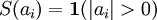), it is non-differentiable and difficult to optimize in general. In practice, common choices for the sparsity cost *S*(.) are the *L*1 penalty 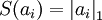 and the log penalty 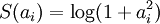.

In addition, it is also possible to make the sparsity penalty arbitrarily small by scaling down *a**i* and scaling  up by some large constant. To prevent this from happening, we will constrain 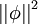 to be less than some constant *C*. The full sparse coding cost function including our constraint on 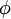 is

  Probabilistic Interpretation [Based on Olshausen and Field 1996]
------------------------------------------------------------------

So far, we have considered sparse coding in the context of finding a sparse, over-complete set of basis vectors to span our input space. Alternatively, we may also approach sparse coding from a probabilistic perspective as a generative model.

Consider the problem of modelling natural images as the linear superposition of *k* independent source features  with some additive noise ν:

Our goal is to find a set of basis feature vectors  such that the distribution of images 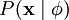 is as close as possible to the empirical distribution of our input data 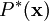. One method of doing so is to minimize the KL divergence between  and  where the KL divergence is defined as:

Since the empirical distribution  is constant across our choice of , this is equivalent to maximizing the log-likelihood of .

Assuming ν is Gaussian white noise with variance σ2, we have that

In order to determine the distribution , we also need to specify the prior distribution 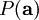. Assuming the independence of our source features, we can factorize our prior probability as

At this point, we would like to incorporate our sparsity assumption -- the assumption that any single image is likely to be the product of relatively few source features. Therefore, we would like the probability distribution of *a**i* to be peaked at zero and have high kurtosis. A convenient parameterization of the prior distribution is

Where *S*(*a**i*) is a function determining the shape of the prior distribution.

Having defined 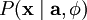 and , we can write the probability of the data  under the model defined by  as

and our problem reduces to finding

Where  < . >  denotes expectation over our input data.

Unfortunately, the integral over 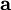 to obtain  is generally intractable. We note though that if the distribution of  is sufficiently peaked (w.r.t. ), we can approximate its integral with the maximum value of  and obtain a approximate solution

As before, we may increase the estimated probability by scaling down *a**i* and scaling up  (since *P*(*a**i*) peaks about zero) , we therefore impose a norm constraint on our features  to prevent this.

Finally, we can recover our original cost function by defining the energy function of this linear generative model

where λ = 2σ2β and irrelevant constants have been hidden. Since maximizing the log-likelihood is equivalent to minimizing the energy function, we recover the original optimization problem:

Using a probabilistic approach, it can also be seen that the choices of the *L*1 penalty 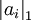 and the log penalty 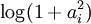 for *S*(.) correspond to the use of the Laplacian 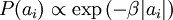 and the Cauchy prior 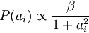 respectively.

  Learning
----------

Learning a set of basis vectors  using sparse coding consists of performing two separate optimizations, the first being an optimization over coefficients *a**i* for each training example  and the second an optimization over basis vectors  across many training examples at once.

Assuming an *L*1 sparsity penalty, learning 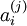 reduces to solving a *L*1 regularized least squares problem which is convex in  for which several techniques have been developed (convex optimization software such as CVX can also be used to perform L1 regularized least squares). Assuming a differentiable *S*(.) such as the log penalty, gradient-based methods such as conjugate gradient methods can also be used.

Learning a set of basis vectors with a *L*2 norm constraint also reduces to a least squares problem with quadratic constraints which is convex in . Standard convex optimization software (e.g. CVX) or other iterative methods can be used to solve for  although significantly more efficient methods such as solving the Lagrange dual have also been developed.

As described above, a significant limitation of sparse coding is that even after a set of basis vectors have been learnt, in order to "encode" a new data example, optimization must be performed to obtain the required coefficients. This significant "runtime" cost means that sparse coding is computationally expensive to implement even at test time especially compared to typical feedforward architectures.

---

> * Language: [中文](%E7%A8%80%E7%96%8F%E7%BC%96%E7%A0%81.md "稀疏编码")
> * This page was last modified on 8 April 2013, at 04:28.

