Sparse Coding: Autoencoder Interpretation
=========================================

<!-- Jump to: [navigation](#column-one), [search](#searchInput) -->

|  |
| --- |
| Contents* [1 Sparse coding](#Sparse_coding)
* [2 Topographic sparse coding](#Topographic_sparse_coding)
* [3 Sparse coding in practice](#Sparse_coding_in_practice)
	+ [3.1 Batching examples into mini-batches](#Batching_examples_into_mini-batches)
	+ [3.2 Good initialization of s](#Good_initialization_of_s)
	+ [3.3 The practical algorithm](#The_practical_algorithm)
 |

  Sparse coding
---------------

In the sparse autoencoder, we tried to learn a set of weights *W* (and associated biases *b*) that would give us sparse features σ(*W**x* + *b*) useful in reconstructing the input *x*.

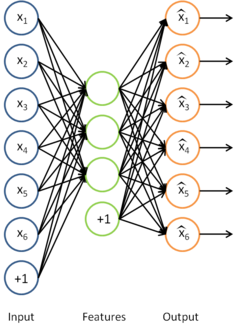

Sparse coding can be seen as a modification of the sparse autoencoder method in which we try to learn the set of features for some data "directly". Together with an associated basis for transforming the learned features from the feature space to the data space, we can then reconstruct the data from the learned features.

Formally, in sparse coding, we have some data *x* we would like to learn features on. In particular, we would like to learn *s*, a set of sparse features useful for representing the data, and *A*, a basis for transforming the features from the feature space to the data space. Our objective function is hence:

(If you are unfamiliar with the notation, 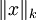 refers to the L*k* norm of the *x* which is equal to 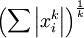. The L2 norm is the familiar Euclidean norm, while the L1 norm is the sum of absolute values of the elements of the vector)

The first term is the error in reconstructing the data from the features using the basis, and the second term is a sparsity penalty term to encourage the learned features to be sparse.

However, the objective function as it stands is not properly constrained - it is possible to reduce the sparsity cost (the second term) by scaling *A* by some constant and scaling *s* by the inverse of the same constant, without changing the error. Hence, we include the additional constraint that that for every column *A**j* of *A*, 
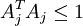. Our problem is thus:

Unfortunately, the objective function is non-convex, and hence impossible to optimize well using gradient-based methods. However, given *A*, the problem of finding *s* that minimizes *J*(*A*,*s*) is convex. Similarly, given *s*, the problem of finding *A* that minimizes *J*(*A*,*s*) is also convex. This suggests that we might try alternately optimizing for *A* for a fixed *s*, and then optimizing for *s* given a fixed *A*. It turns out that this works quite well in practice.

However, the form of our problem presents another difficulty - the constraint that 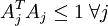 cannot be enforced using simple gradient-based methods. Hence, in practice, this constraint is weakened to a "weight decay" term designed to keep the entries of *A* small. This gives us a new objective function:

(note that the third term, 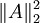 is simply the sum of squares of the entries of A, or 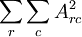)

This objective function presents one last problem - the L1 norm is not differentiable at 0, and hence poses a problem for gradient-based methods. While the problem can be solved using other non-gradient descent-based methods, we will "smooth out" the L1 norm using an approximation which will allow us to use gradient descent. To "smooth out" the L1 norm, we use 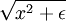 in place of 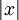, where ε is a "smoothing parameter" which can also be interpreted as a sort of "sparsity parameter" (to see this, observe that when ε is large compared to *x*, the *x* + ε is dominated by ε, and taking the square root yields approximately 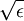). This "smoothing" will come in handy later when considering topographic sparse coding below.

Our final objective function is hence:

(where 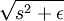 is shorthand for 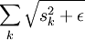)

This objective function can then be optimized iteratively, using the following procedure:

1. Initialize *A* randomly
- Repeat until convergence
	1. Find the *s* that minimizes *J*(*A*,*s*) for the *A* found in the previous step
	 - Solve for the *A* that minimizes *J*(*A*,*s*) for the *s* found in the previous step

Observe that with our modified objective function, the objective function *J*(*A*,*s*) given *s*, that is 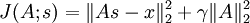 (the L1 term in *s* can be omitted since it is not a function of *A*) is simply a quadratic term in *A*, and hence has an easily derivable analytic solution in *A*. A quick way to derive this solution would be to use matrix calculus - some pages about matrix calculus can be found in the  [useful links](Useful_Links.md "Useful Links") section. Unfortunately, the objective function given *A* does not have a similarly nice analytic solution, so that minimization step will have to be carried out using gradient descent or similar optimization methods.

In theory, optimizing for this objective function using the iterative method as above should (eventually) yield features (the basis vectors of *A*) similar to those learned using the sparse autoencoder. However, in practice, there are quite a few tricks required for better convergence of the algorithm, and these tricks are described in greater detail in the later section on  [sparse coding in practice](Sparse_Coding__Autoencoder_Interpretation#Sparse_coding_in_practice.md "Sparse Coding: Autoencoder Interpretation"). Deriving the gradients for the objective function may be slightly tricky as well, and using matrix calculus or  [using the backpropagation intuition](Deriving_gradients_using_the_backpropagation_idea.md "Deriving gradients using the backpropagation idea") can be helpful.

  Topographic sparse coding
---------------------------

With sparse coding, we can learn a set of features useful for representing the data. However, drawing inspiration from the brain, we would like to learn a set of features that are "orderly" in some manner. For instance, consider visual features. As suggested earlier, the V1 cortex of the brain contains neurons which detect edges at particular orientations. However, these neurons are also organized into hypercolumns in which adjacent neurons detect edges at similar orientations. One neuron could detect a horizontal edge, its neighbors edges oriented slightly off the horizontal, and moving further along the hypercolumn, the neurons detect edges oriented further off the horizontal.

Inspired by this example, we would like to learn features which are similarly "topographically ordered". What does this imply for our learned features? Intuitively, if "adjacent" features are "similar", we would expect that if one feature is activated, its neighbors will also be activated to a lesser extent.

Concretely, suppose we (arbitrarily) organized our features into a square matrix. We would then like adjacent features in the matrix to be similar. The way this is accomplished is to group these adjacent features together in the smoothed L1 penalty, so that instead of say 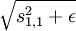, we use say 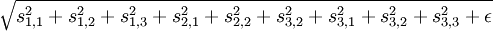 instead, if we group in 3x3 regions. The grouping is usually overlapping, so that the 3x3 region starting at the 1st row and 1st column is one group, the 3x3 region starting at the 1st row and 2nd column is another group, and so on. Further, the grouping is also usually done wrapping around, as if the matrix were a torus, so that every feature is counted an equal number of times.

Hence, in place of the smoothed L1 penalty, we use the sum of smoothed L1 penalties over all the groups, so our new objective function is:

In practice, the "grouping" can be accomplished using a "grouping matrix" *V*, such that the *r*th row of *V* indicates which features are grouped in the *r*th group, so *V**r*,*c* = 1 if group *r* contains feature *c*. Thinking of the grouping as being achieved by a grouping matrix makes the computation of the gradients more intuitive. Using this grouping matrix, the objective function can be rewritten as:

(where 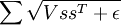 is

|  |  |  |
| --- | --- | --- |
| ∑ | ∑ | *D**r*,*c* |
| *r* | *c* |  |

 if we let 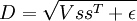)

This objective function can be optimized using the iterated method described in the earlier section. Topographic sparse coding will learn features similar to those learned by sparse coding, except that the features will now be "ordered" in some way.

  Sparse coding in practice
---------------------------

As suggested in the earlier sections, while the theory behind sparse coding is quite simple, writing a good implementation that actually works and converges reasonably quickly to good optima requires a bit of finesse.

Recall the simple iterative algorithm proposed earlier:

1. Initialize *A* randomly
- Repeat until convergence
	1. Find the *s* that minimizes *J*(*A*,*s*) for the *A* found in the previous step
	 - Solve for the *A* that minimizes *J*(*A*,*s*) for the *s* found in the previous step

It turns out that running this algorithm out of the box will not produce very good results, if any results are produced at all. There are two main tricks to achieve faster and better convergence:

1. Batching examples into "mini-batches"
- Good initialization of *s*

###   Batching examples into mini-batches

If you try running the simple iterative algorithm on a large dataset of say 10 000 patches at one go, you will find that each iteration takes a long time, and the algorithm may hence take a long time to converge. To increase the rate of convergence, you can instead run the algorithm on mini-batches instead. To do this, instead of running the algorithm on all 10 000 patches, in each iteration, select a mini-batch - a (different) random subset of say 2000 patches from the 10 000 patches - and run the algorithm on that mini-batch for the iteration instead. This accomplishes two things - firstly, it speeds up each iteration, since now each iteration is operating on 2000 rather than 10 000 patches; secondly, and more importantly, it increases the rate of convergence (TODO: explain why).

###   Good initialization of *s*

Another important trick in obtaining faster and better convergence is good initialization of the feature matrix *s* before using gradient descent (or other methods) to optimize for the objective function for *s* given *A*. In practice, initializing *s* randomly at each iteration can result in poor convergence unless a good optima is found for *s* before moving on to optimize for *A*. A better way to initialize *s* is the following:

1. Set 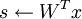 (where *x* is the matrix of patches in the mini-batch)
- For each feature in *s* (i.e. each column of *s*), divide the feature by the norm of the corresponding basis vector in *A*. That is, if *s**r*,*c* is the *r*th feature for the *c*th example, and *A**c* is the *c*th basis vector in *A*, then set 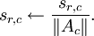

Very roughly and informally speaking, this initialization helps because the first step is an attempt to find a good *s* such that 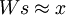, and the second step "normalizes" *s* in an attempt to keep the sparsity penalty small. It turns out that initializing *s* using only one but not both steps results in poor performance in practice. (TODO: a better explanation for why this initialization helps?)

###   The practical algorithm

With the above two tricks, the algorithm for sparse coding then becomes:

1. Initialize *A* randomly
- Repeat until convergence
	1. Select a random mini-batch of 2000 patches
	 - Initialize *s* as described above
	 - Find the *s* that minimizes *J*(*A*,*s*) for the *A* found in the previous step
	 - Solve for the *A* that minimizes *J*(*A*,*s*) for the *s* found in the previous step

With this method, you should be able to reach a good local optima relatively quickly.

---

> * Language: [中文](%E7%A8%80%E7%96%8F%E7%BC%96%E7%A0%81%E8%87%AA%E7%BC%96%E7%A0%81%E8%A1%A8%E8%BE%BE.md "稀疏编码自编码表达")
> * This page was last modified on 19 April 2013, at 02:49.

