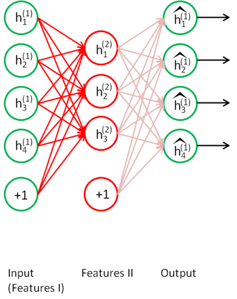
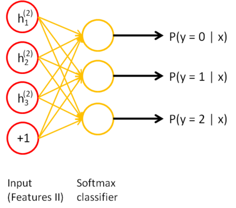

Stacked Autoencoders
====================

<!-- Jump to: [navigation](#column-one), [search](#searchInput) -->

|  |
| --- |
| Contents* [1 Overview](#Overview)
* [2 Training](#Training)
* [3 Concrete example](#Concrete_example)
* [4 Discussion](#Discussion)
 |

###  Overview

The greedy layerwise approach for pretraining a deep network works by training each layer in turn. In this page, you will find out how autoencoders can be "stacked" in a greedy layerwise fashion for pretraining (initializing) the weights of a deep network.

A stacked autoencoder is a neural network consisting of multiple layers of sparse autoencoders in which the outputs of each layer is wired to the inputs of the successive layer. Formally, consider a stacked autoencoder with n layers. Using notation from the autoencoder section, let *W*(*k*,1),*W*(*k*,2),*b*(*k*,1),*b*(*k*,2) denote the parameters *W*(1),*W*(2),*b*(1),*b*(2) for kth autoencoder. Then the encoding step for the stacked autoencoder is given by running the encoding step of each layer in forward order:

The decoding step is given by running the decoding stack of each autoencoder in reverse order:

The information of interest is contained within *a*(*n*), which is the activation of the deepest layer of hidden units. This vector gives us a representation of the input in terms of higher-order features.

The features from the stacked autoencoder can be used for classification problems by feeding *a*(*n*) to a softmax classifier.

###  Training

A good way to obtain good parameters for a stacked autoencoder is to use greedy layer-wise training. To do this, first train the first layer on raw input to obtain parameters *W*(1,1),*W*(1,2),*b*(1,1),*b*(1,2). Use the first layer to transform the raw input into a vector consisting of activation of the hidden units, A. Train the second layer on this vector to obtain parameters *W*(2,1),*W*(2,2),*b*(2,1),*b*(2,2). Repeat for subsequent layers, using the output of each layer as input for the subsequent layer.

This method trains the parameters of each layer individually while freezing parameters for the remainder of the model. To produce better results, after this phase of training is complete,  [fine-tuning](Fine-tuning_Stacked_AEs.md "Fine-tuning Stacked AEs") using backpropagation can be used to improve the results by tuning the parameters of all layers are changed at the same time.

If one is only interested in finetuning for the purposes of classification, the common practice is to then discard the "decoding" layers of the stacked autoencoder and link the last hidden layer *a*(*n*) to the softmax classifier. The gradients from the (softmax) classification error will then be backpropagated into the encoding layers.

###  Concrete example

To give a concrete example, suppose you wished to train a stacked autoencoder with 2 hidden layers for classification of MNIST digits, as you will be doing in  [the next exercise](Exercise__Implement_deep_networks_for_digit_classification.md "Exercise: Implement deep networks for digit classification").

First, you would train a sparse autoencoder on the raw inputs *x*(*k*) to learn primary features *h*(1)(*k*) on the raw input.

Next, you would feed the raw input into this trained sparse autoencoder, obtaining the primary feature activations *h*(1)(*k*) for each of the inputs *x*(*k*). You would then use these primary features as the "raw input" to another sparse autoencoder to learn secondary features *h*(2)(*k*) on these primary features.

Following this, you would feed the primary features into the second sparse autoencoder to obtain the secondary feature activations *h*(2)(*k*) for each of the primary features *h*(1)(*k*) (which correspond to the primary features of the corresponding inputs *x*(*k*)). You would then treat these secondary features as "raw input" to a softmax classifier, training it to map secondary features to digit labels.

Finally, you would combine all three layers together to form a stacked autoencoder with 2 hidden layers and a final softmax classifier layer capable of classifying the MNIST digits as desired.

###  Discussion

A stacked autoencoder enjoys all the benefits of any deep network of greater expressive power.

Further, it often captures a useful "hierarchical grouping" or "part-whole decomposition" of the input. To see this, recall that an autoencoder tends to learn features that form a good representation of its input. The first layer of a stacked autoencoder tends to learn first-order features in the raw input (such as edges in an image). The second layer of a stacked autoencoder tends to learn second-order features corresponding to patterns in the appearance of first-order features (e.g., in terms of what edges tend to occur together--for example, to form contour or corner detectors). Higher layers of the stacked autoencoder tend to learn even higher-order features.

 [From Self-Taught Learning to Deep Networks](Self-Taught_Learning_to_Deep_Networks.md "Self-Taught Learning to Deep Networks") | [Deep Networks: Overview](Deep_Networks__Overview.md "Deep Networks: Overview") | **Stacked Autoencoders** | [Fine-tuning Stacked AEs](Fine-tuning_Stacked_AEs.md "Fine-tuning Stacked AEs") | [Exercise: Implement deep networks for digit classification](Exercise__Implement_deep_networks_for_digit_classification.md "Exercise: Implement deep networks for digit classification")

---

> * Language: [中文](%E6%A0%88%E5%BC%8F%E8%87%AA%E7%BC%96%E7%A0%81%E7%AE%97%E6%B3%95.md "栈式自编码算法")
> * This page was last modified on 7 April 2013, at 13:33.

