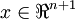
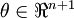
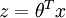

Vectorization
=============

<!-- Jump to: [navigation](#column-one), [search](#searchInput) -->
When working with learning algorithms, having a faster piece of code often 
means that you'll make progress faster on your project. For example, if your
learning algorithm takes 20 minutes to run to completion, that means you can
"try" up to 3 new ideas per hour. But if your code takes 20 hours to
run, that means you can "try" only one idea a day, since that's
how long you have to wait to get feedback from your program. In this latter
case, if you can speed up your code so that it takes only 10 hours to run, 
that can literally double your personal productivity!

**Vectorization** refers to a powerful way to speed up your algorithms. 
Numerical computing and parallel computing researchers have put decades of work
into making certain numerical operations (such as matrix-matrix multiplication,
matrix-matrix addition, matrix-vector multiplication) fast. The idea of
vectorization is that we would like to express our learning algorithms
in terms of these highly optimized operations.

For example, if  and  are vectors 
and you need to compute ,
you can implement (in Matlab):

```
z = 0;
for i=1:(n+1),
  z = z + theta(i) * x(i);
end;
```

or you can more simply implement

```
z = theta' * x;
```

The second piece of code is not only simpler, but it will also run *much* faster.

More generally, a good rule-of-thumb for coding Matlab/Octave is:

**Whenever possible, avoid using explicit for-loops in your code.**

In particular, the first code example used an explicit for loop. By 
implementing the same functionality without the for loop, we sped
it up significantly. A large part
of vectorizing our Matlab/Octave code will focus on getting rid of for loops,
since this lets Matlab/Octave extract more parallelism from your code, while
also incurring less computational overhead from the interpreter.

In terms of a strategy for writing your code, initially you may find that vectorized code is harder to write, read, and/or debug,
and that there may be a tradeoff in ease of programming/debugging vs. running
time. Thus, for your first few programs, you might choose to first implement 
your algorithm without too many vectorization tricks, and verify that it is working correctly
(perhaps by running on a small problem). Then only after it is working, you
can vectorize your code one piece at a time, pausing after each piece to verify
that your code is still computing the same result as before. At the end, you'll
then hopefully have a correct, debugged, and vectorized/efficient piece of code.

After you become familiar with the most common vectorization methods and tricks, 
you'll find that it usually isn't much effort to vectorize your code. Doing 
so will make your code run much faster and, in some cases, simplify it too.

**Vectorization** | [Logistic Regression Vectorization Example](Logistic_Regression_Vectorization_Example.md "Logistic Regression Vectorization Example") | [Neural Network Vectorization](Neural_Network_Vectorization.md "Neural Network Vectorization") | [Exercise:Vectorization](Exercise_Vectorization.md "Exercise:Vectorization")

---

> * Language: [中文](%E7%9F%A2%E9%87%8F%E5%8C%96%E7%BC%96%E7%A8%8B.md "矢量化编程")
> * This page was last modified on 7 April 2013, at 13:07.

