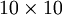
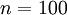

Visualizing a Trained Autoencoder
=================================

<!-- Jump to: [navigation](#column-one), [search](#searchInput) -->
Having trained a (sparse) autoencoder, we would now like to visualize the function
learned by the algorithm, to try to understand what it has learned.
Consider the case of training an autoencoder on  images, so that .
Each hidden unit  computes a function of the input:

We will visualize the function computed by hidden unit ---which depends on the
parameters  (ignoring
the bias term for now)---using a 2D image. In particular, we think of
 as some non-linear feature of the input .
We ask:
What input image  would cause
 to be maximally activated?
(Less formally, what is the feature that hidden unit  is looking for?)
For this question to have a non-trivial answer,
we must impose some constraints on . If we suppose that
the input is
norm constrained by , then one can
show (try doing this yourself)
that the input which maximally activates hidden unit  is given
by setting pixel  (for all 100 pixels, ) to

By displaying the image formed by these pixel intensity values, we can begin
to understand what feature hidden unit  is looking for.

If we have an autoencoder with 100 hidden units (say), then we our
visualization will have 100 such images---one per hidden unit. By examining
these 100 images, we can try to understand what the ensemble of hidden units is
learning.

When we do this for a sparse autoencoder (trained with 100 hidden units on
10x10 pixel inputs1 we get the following result:

 
Each square in the figure above shows the (norm bounded) input image  that
maximally actives one of 100 hidden units. We see that the different hidden
units have learned to detect edges at different positions and orientations in
the image.

These features are, not surprisingly, useful for such tasks as object
recognition and other vision tasks. When applied to other input domains (such
as audio), this algorithm also learns useful representations/features for those
domains too.

---

1 *The learned features were obtained by training on **whitened** natural images. Whitening is a preprocessing step which removes redundancy in the input, by causing adjacent pixels to become less correlated.*

[Neural Networks](Neural_Networks.md "Neural Networks") | [Backpropagation Algorithm](Backpropagation_Algorithm.md "Backpropagation Algorithm") | [Gradient checking and advanced optimization](Gradient_checking_and_advanced_optimization.md "Gradient checking and advanced optimization") | [Autoencoders and Sparsity](Autoencoders_and_Sparsity.md "Autoencoders and Sparsity") | **Visualizing a Trained Autoencoder** | [Sparse Autoencoder Notation Summary](Sparse_Autoencoder_Notation_Summary.md "Sparse Autoencoder Notation Summary") | [Exercise:Sparse Autoencoder](Exercise_Sparse_Autoencoder.md "Exercise:Sparse Autoencoder")

---

> * Language: [中文](%E5%8F%AF%E8%A7%86%E5%8C%96%E8%87%AA%E7%BC%96%E7%A0%81%E5%99%A8%E8%AE%AD%E7%BB%83%E7%BB%93%E6%9E%9C.md "可视化自编码器训练结果")
> * This page was last modified on 7 April 2013, at 12:49.

