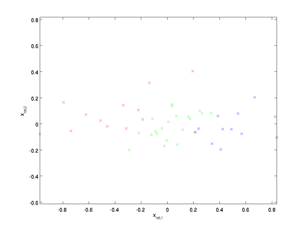
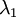
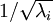
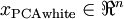
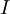

Whitening
=========

<!-- Jump to: [navigation](#column-one), [search](#searchInput) -->

|  |
| --- |
| Contents* [1 Introduction](#Introduction)
* [2 2D example](#2D_example)
* [3 ZCA Whitening](#ZCA_Whitening)
* [4 Regularizaton](#Regularizaton)
 |

  Introduction
--------------

We have used PCA to reduce the dimension of the data. There is a closely related
preprocessing step called **whitening** (or, in some other literatures, **sphering**)
which is needed for some algorithms. If we are training on images,
the raw input is redundant, since adjacent pixel values
are highly correlated. The goal of whitening is to make the input less redundant; more formally,
our desiderata are that our learning algorithms sees a training input where (i) the features are less
correlated with each other, and (ii) the features all have the same variance.

  2D example
------------

We will first describe whitening using our previous 2D example. We will then 
describe how this can be combined with smoothing, and finally how to combine
this with PCA.

How can we make our input features uncorrelated with each other? We had
already done this when computing . 
Repeating our previous figure, our plot for  was:

The covariance matrix of this data is given by:

(Note: Technically, many of the
statements in this section about the "covariance" will be true only if the data
has zero mean. In the rest of this section, we will take this assumption as
implicit in our statements. However, even if the data's mean isn't exactly zero, 
the intuitions we're presenting here still hold true, and so this isn't something
that you should worry about.)

It is no accident that the diagonal values are  and . 
Further, 
the off-diagonal entries are zero; thus, 
 and  are uncorrelated, satisfying one of our desiderata 
for whitened data (that the features be less correlated).

To make each of our input features have unit variance, we can simply rescale
each feature  by . Concretely, we define
our whitened data  as follows:

Plotting , we get:

This data now has covariance equal to the identity matrix . We say that
 is our **PCA whitened** version of the data: The 
different components of  are uncorrelated and have
unit variance.

**Whitening combined with dimensionality reduction.** 
If you want to have data that is whitened and which is lower dimensional than
the original input, you can also optionally keep only the top  components of
. When we combine PCA whitening with regularization
(described later), the last few components of  will be
nearly zero anyway, and thus can safely be dropped.

  ZCA Whitening
---------------

Finally, it turns out that this way of getting the 
data to have covariance identity  isn't unique. 
Concretely, if 
 is any orthogonal matrix, so that it satisfies  (less formally,
if  is a rotation/reflection matrix),
then  will also have identity covariance. 
In **ZCA whitening**,
we choose . We define

Plotting , we get:

It can be shown that out of all possible choices for , 
this choice of rotation causes  to be as close as possible to the 
original input data .

When using ZCA whitening (unlike PCA whitening), we usually keep all  dimensions
of the data, and do not try to reduce its dimension.

  Regularizaton
---------------

When implementing PCA whitening or ZCA whitening in practice, sometimes some
of the eigenvalues  will be numerically close to 0, and thus the scaling
step where we divide by  would involve dividing by a value close to zero; this 
may cause the data to blow up (take on large values) or otherwise be numerically unstable. In practice, we 
therefore implement this scaling step using 
a small amount of regularization, and add a small constant  
to the eigenvalues before taking their square root and inverse:

When  takes values around ![\textstyle [-1,1]](images/math/8/5/a/85a1c5a07f21a9eebbfb1dca380f8d38.png), a value of 
might be typical.

For the case of images, adding  here also has the effect of slightly smoothing (or low-pass
filtering) the input image. This also has a desirable effect of removing aliasing artifacts
caused by the way pixels are laid out in an image, and can improve the features learned 
(details are beyond the scope of these notes).

ZCA whitening is a form of pre-processing of the data that maps it from  to
. It turns out that this is also a rough model of how the
biological eye (the retina) processes images. Specifically, as your eye
perceives images, most adjacent "pixels" in your eye will perceive very
similar values, since adjacent parts of an image tend to be highly correlated
in intensity. It is thus wasteful for your eye to have to transmit every pixel
separately (via your optic nerve) to your brain. Instead, your retina performs
a decorrelation operation (this is done via retinal neurons that compute a function
called "on center, off surround/off center, on surround") which is similar to that
performed by ZCA. This results in a less redundant representation of the input
image, which is then transmitted to your brain.

[PCA](PCA.md "PCA") | **Whitening** | [Implementing PCA/Whitening](/wayback-mooc/stanford-ufldl/wiki/Implementing_PCA/Whitening "Implementing PCA/Whitening") | [Exercise:PCA in 2D](Exercise_PCA_in_2D.md "Exercise:PCA in 2D") | [Exercise:PCA and Whitening](Exercise_PCA_and_Whitening.md "Exercise:PCA and Whitening")

---

> * Language: [中文](%E7%99%BD%E5%8C%96.md "白化")
> * This page was last modified on 7 April 2013, at 13:20.

