主成分分析
=====

<!-- Jump to: [navigation](#column-one), [search](#searchInput) -->

|  |
| --- |
| Contents* [1 引言](#.E5.BC.95.E8.A8.80)
* [2 实例和数学背景](#.E5.AE.9E.E4.BE.8B.E5.92.8C.E6.95.B0.E5.AD.A6.E8.83.8C.E6.99.AF)
* [3 旋转数据](#.E6.97.8B.E8.BD.AC.E6.95.B0.E6.8D.AE)
* [4 数据降维](#.E6.95.B0.E6.8D.AE.E9.99.8D.E7.BB.B4)
* [5 还原近似数据](#.E8.BF.98.E5.8E.9F.E8.BF.91.E4.BC.BC.E6.95.B0.E6.8D.AE)
* [6 选择主成分个数](#.E9.80.89.E6.8B.A9.E4.B8.BB.E6.88.90.E5.88.86.E4.B8.AA.E6.95.B0)
* [7 对图像数据应用PCA算法](#.E5.AF.B9.E5.9B.BE.E5.83.8F.E6.95.B0.E6.8D.AE.E5.BA.94.E7.94.A8PCA.E7.AE.97.E6.B3.95)
* [8 参考文献](#.E5.8F.82.E8.80.83.E6.96.87.E7.8C.AE)
* [9 中英文对照](#.E4.B8.AD.E8.8B.B1.E6.96.87.E5.AF.B9.E7.85.A7)
* [10 中文译者](#.E4.B8.AD.E6.96.87.E8.AF.91.E8.80.85)
 |

  引言
----

主成分分析（PCA）是一种能够极大提升无监督特征学习速度的数据降维算法。更重要的是，理解PCA算法，对实现**白化**算法有很大的帮助，很多算法都先用白化算法作预处理步骤。

假设你使用图像来训练算法，因为图像中相邻的像素高度相关，输入数据是有一定冗余的。具体来说，假如我们正在训练的16x16灰度值图像，记为一个256维向量 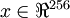 ，其中特征值 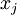 对应每个像素的亮度值。由于相邻像素间的相关性，PCA算法可以将输入向量转换为一个维数低很多的近似向量，而且误差非常小。

  实例和数学背景
---------

在我们的实例中，使用的输入数据集表示为 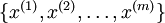 ，维度 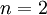 即 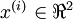 。假设我们想把数据从2维降到1维。（在实际应用中，我们也许需要把数据从256维降到50维；在这里使用低维数据，主要是为了更好地可视化算法的行为）。下图是我们的数据集：

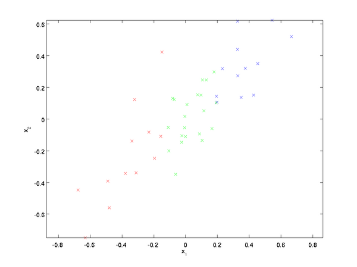

这些数据已经进行了预处理，使得每个特征 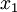 和 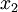 具有相同的均值（零）和方差。

为方便展示，根据  值的大小，我们将每个点分别涂上了三种颜色之一，但该颜色并不用于算法而仅用于图解。

PCA算法将寻找一个低维空间来投影我们的数据。从下图中可以看出， 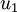 是数据变化的主方向，而 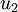 是次方向。

也就是说，数据在  方向上的变化要比在  方向上大。为更形式化地找出方向  和  ，我们首先计算出矩阵 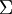 ，如下所示：

假设 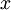 的均值为零，那么  就是x的协方差矩阵。（符号  ，读"Sigma"，是协方差矩阵的标准符号。虽然看起来与求和符号 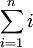 比较像，但它们其实是两个不同的概念。）

可以证明，数据变化的主方向  就是协方差矩阵  的主特征向量，而  是次特征向量。

注：如果你对如何得到这个结果的具体数学推导过程感兴趣，可以参看CS229（机器学习）PCA部分的课件（链接在本页底部）。但如果仅仅是想跟上本课，可以不必如此。

你可以通过标准的数值线性代数运算软件求得特征向量（见实现说明）.我们先计算出协方差矩阵的特征向量，按列排放，而组成矩阵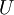：

此处，  是主特征向量（对应最大的特征值），  是次特征向量。以此类推，另记 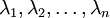 为相应的特征值。

在本例中，向量  和  构成了一个新基，可以用来表示数据。令 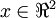 为训练样本，那么 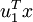 就是样本点  在维度  上的投影的长度（幅值）。同样的， 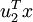 是  投影到  维度上的幅值。

  旋转数据
------

至此，我们可以把  用 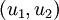 基表达为：

（下标“rot”来源于单词“rotation”，意指这是原数据经过旋转（也可以说成映射）后得到的结果）

对数据集中的每个样本  分别进行旋转： 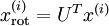 for every  ，然后把变换后的数据 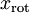 显示在坐标图上，可得：

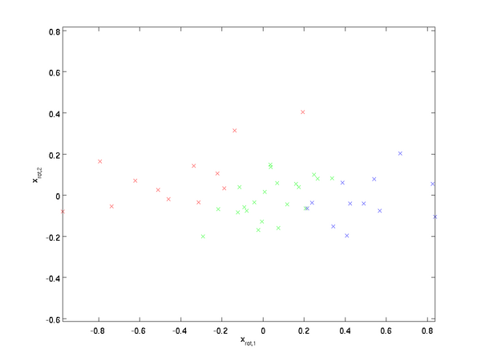

这就是把训练数据集旋转到 ， 基后的结果。一般而言，运算 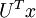 表示旋转到基 ,, ...,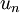 之上的训练数据。矩阵  有正交性，即满足 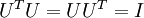 ，所以若想将旋转后的向量  还原为原始数据  ，将其左乘矩阵即可： 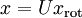 , 验算一下： 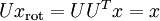.

  数据降维
------

数据的主方向就是旋转数据的第一维 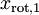 。因此，若想把这数据降到一维，可令：

更一般的，假如想把数据 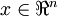 降到 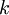 维表示 
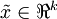 （令 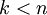 ）,只需选取  的前  个成分，分别对应前  个数据变化的主方向。

PCA的另外一种解释是： 是一个 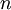 维向量，其中前几个成分可能比较大（例如，上例中大部分样本第一个成分 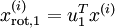 的取值相对较大），而后面成分可能会比较小（例如，上例中大部分样本的 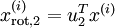 较小）。

PCA算法做的其实就是丢弃  中后面（取值较小）的成分，就是将这些成分的值近似为零。具体的说，设  是  的近似表示，那么将  除了前  个成分外，其余全赋值为零，就得到：

在本例中，可得  的点图如下（取 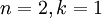 ）：

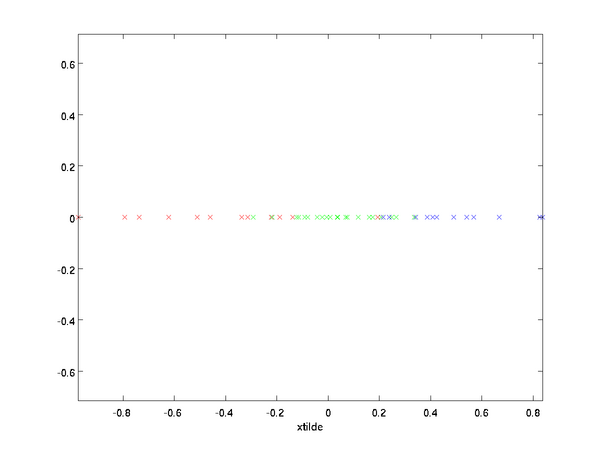

然而，由于上面  的后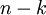项均为零，没必要把这些零项保留下来。所以，我们仅用前  个（非零）成分来定义  维向量  。

这也解释了我们为什么会以 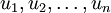 为基来表示数据：要决定保留哪些成分变得很简单，只需取前  个成分即可。这时也可以说，我们“保留了前  个PCA（主）成分”。

  还原近似数据
--------

现在，我们得到了原始数据  的低维“压缩”表征量  ， 反过来，如果给定  ，我们应如何还原原始数据  呢？查看[以往章节](#.E6.97.8B.E8.BD.AC.E6.95.B0.E6.8D.AE)以往章节可知，要转换回来，只需  即可。进一步，我们把  看作将  的最后  个元素被置0所得的近似表示，因此如果给定  ，可以通过在其末尾添加  个0来得到对 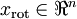 的近似，最后，左乘  便可近似还原出原数据  。具体来说，计算如下：

上面的等式基于[先前](#.E5.AE.9E.E4.BE.8B.E5.92.8C.E6.95.B0.E5.AD.A6.E8.83.8C.E6.99.AF)对  的定义。在实现时，我们实际上并不先给  填0然后再左乘  ，因为这意味着大量的乘0运算。我们可用  来与  的前  列相乘，即上式中最右项，来达到同样的目的。将该算法应用于本例中的数据集，可得如下关于重构数据  的点图：

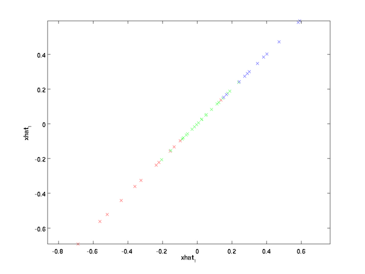

由图可见，我们得到的是对原始数据集的一维近似重构。

在训练自动编码器或其它无监督特征学习算法时，算法运行时间将依赖于输入数据的维数。若用  取代  作为输入数据，那么算法就可使用低维数据进行训练，运行速度将显著加快。对于很多数据集来说，低维表征量  是原数据集的极佳近似，因此在这些场合使用PCA是很合适的，它引入的近似误差的很小，却可显著地提高你算法的运行速度。

  选择主成分个数
---------

我们该如何选择  ，即保留多少个PCA主成分？在上面这个简单的二维实验中，保留第一个成分看起来是自然的选择。对于高维数据来说，做这个决定就没那么简单：如果  过大，数据压缩率不高，在极限情况 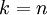 时，等于是在使用原始数据（只是旋转投射到了不同的基）；相反地，如果  过小，那数据的近似误差太太。

决定  值时，我们通常会考虑不同  值可保留的方差百分比。具体来说，如果  ，那么我们得到的是对数据的完美近似，也就是保留了100%的方差，即原始数据的所有变化都被保留下来；相反，如果 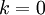 ，那等于是使用零向量来逼近输入数据，也就是只有0%的方差被保留下来。

一般而言，设  表示  的特征值（按由大到小顺序排列），使得 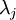 为对应于特征向量 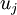 的特征值。那么如果我们保留前  个成分，则保留的方差百分比可计算为：

在上面简单的二维实验中，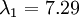 ，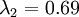 。因此，如果保留 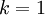 个主成分，等于我们保留了 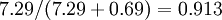 ，即91.3%的方差。

对保留方差的百分比进行更正式的定义已超出了本教程的范围，但很容易证明， 。因此，如果 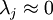 ，则说明  也就基本上接近于0，所以用0来近似它并不会产生多大损失。这也解释了为什么要保留前面的主成分（对应的  值较大）而不是末尾的那些。 这些前面的主成分  变化性更大，取值也更大，如果将其设为0势必引入较大的近似误差。

以处理图像数据为例，一个惯常的经验法则是选择  以保留99%的方差，换句话说，我们选取满足以下条件的最小  值：

对其它应用，如不介意引入稍大的误差，有时也保留90-98%的方差范围。若向他人介绍PCA算法详情，告诉他们你选择的  保留了95%的方差，比告诉他们你保留了前120个（或任意某个数字）主成分更好理解。

  对图像数据应用PCA算法
--------------

为使PCA算法能有效工作，通常我们希望所有的特征  都有相似的取值范围（并且均值接近于0）。如果你曾在其它应用中使用过PCA算法，你可能知道有必要单独对每个特征做预处理，即通过估算每个特征  的均值和方差，而后将其取值范围规整化为零均值和单位方差。但是，对于大部分图像类型，我们却不需要进行这样的预处理。假定我们将在自然图像上训练算法，此时特征  代表的是像素  的值。所谓“自然图像”，不严格的说，是指人或动物在他们一生中所见的那种图像。

注：通常我们选取含草木等内容的户外场景图片，然后从中随机截取小图像块（如16x16像素）来训练算法。在实践中我们发现，大多数特征学习算法对训练图片的确切类型并不敏感，所以大多数用普通照相机拍摄的图片，只要不是特别的模糊或带有非常奇怪的人工痕迹，都可以使用。

在自然图像上进行训练时，对每一个像素单独估计均值和方差意义不大，因为（理论上）图像任一部分的统计性质都应该和其它部分相同，图像的这种特性被称作平稳性（stationarity）。

具体而言，为使PCA算法正常工作，我们通常需要满足以下要求：(1)特征的均值大致为0；(2)不同特征的方差值彼此相似。对于自然图片，即使不进行方差归一化操作，条件(2)也自然满足，故而我们不再进行任何方差归一化操作（对音频数据,如声谱,或文本数据,如词袋向量，我们通常也不进行方差归一化）。实际上，PCA算法对输入数据具有缩放不变性，无论输入数据的值被如何放大（或缩小），返回的特征向量都不改变。更正式的说：如果将每个特征向量  都乘以某个正数（即所有特征量被放大或缩小相同的倍数），PCA的输出特征向量都将不会发生变化。

既然我们不做方差归一化，唯一还需进行的规整化操作就是均值规整化，其目的是保证所有特征的均值都在0附近。根据应用，在大多数情况下，我们并不关注所输入图像的整体明亮程度。比如在对象识别任务中，图像的整体明亮程度并不会影响图像中存在的是什么物体。更为正式地说，我们对图像块的平均亮度值不感兴趣，所以可以减去这个值来进行均值规整化。

具体的步骤是，如果  代表16x16的图像块的亮度（灰度）值（  ），可用如下算法来对每幅图像进行零均值化操作：

, for all 

请注意：1）对每个输入图像块  都要单独执行上面两个步骤，2）这里的  是指图像块  的平均亮度值。尤其需要注意的是，这和为每个像素  单独估算均值是两个完全不同的概念。

如果你处理的图像并非自然图像（比如，手写文字，或者白背景正中摆放单独物体），其他规整化操作就值得考虑了，而哪种做法最合适也取决于具体应用场合。但对自然图像而言，对每幅图像进行上述的零均值规整化，是默认而合理的处理。

  参考文献
------

[http://cs229.stanford.edu](http://cs229.stanford.edu/)

 中英文对照
------

Principal Components Analysis 主成份分析

whitening 白化

intensity 亮度

mean 平均值

variance 方差

covariance matrix 协方差矩阵

basis 基

magnitude 幅值

stationarity 平稳性

normalization 归一化

eigenvector 特征向量

eigenvalue 特征值

 中文译者
-----

郭亮（guoliang2248@gmail.com），张力（emma.lzhang@gmail.com），金峰（jinfengb@gmail.com）, @破破的桥（新浪微博）, 谭晓阳（x.tan@nuaa.edu.cn）

**主成分分析** | [白化](%E7%99%BD%E5%8C%96.md "白化") | [实现主成分分析和白化](%E5%AE%9E%E7%8E%B0%E4%B8%BB%E6%88%90%E5%88%86%E5%88%86%E6%9E%90%E5%92%8C%E7%99%BD%E5%8C%96.md "实现主成分分析和白化") | [Exercise:PCA in 2D](Exercise_PCA_in_2D.md "Exercise:PCA in 2D") | [Exercise:PCA and Whitening](Exercise_PCA_and_Whitening.md "Exercise:PCA and Whitening")

---

> * Language: [English](PCA.md "PCA")
> * This page was last modified on 8 April 2013, at 05:04.

