从自我学习到深层网络
==========

<!-- Jump to: [navigation](#column-one), [search](#searchInput) -->
在前一节中，我们利用自编码器来学习输入至 softmax 或 logistic 回归分类器的特征。这些特征仅利用未标注数据学习获得。在本节中，我们描述如何利用已标注数据进行**微调**，从而进一步优化这些特征。如果有大量已标注数据，通过微调就可以显著提升分类器的性能。

在自我学习中，我们首先利用未标注数据训练一个稀疏自编码器。随后，给定一个新样本 ，我们通过隐含层提取出特征 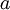。上述过程图示如下：

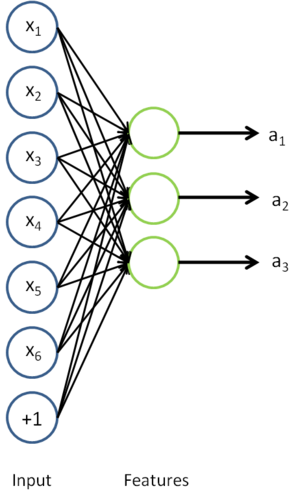

我们感兴趣的是分类问题，目标是预测样本的类别标号 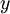。我们拥有标注数据集 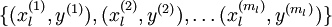，包含 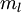 个标注样本。此前我们已经说明，可以利用稀疏自编码器获得的特征 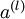 来替代原始特征。这样就可获得训练数据集 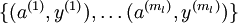。最终，我们训练出一个从特征 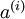 到类标号 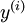 的 logistic 分类器。为说明这一过程，我们按照[神经网络](%E7%A5%9E%E7%BB%8F%E7%BD%91%E7%BB%9C.md "神经网络")一节中的方式，用下图描述 logistic 回归单元（橘黄色）。

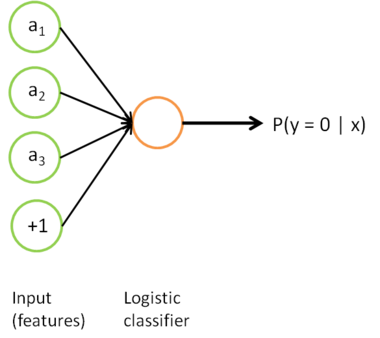

考虑利用这个方法所学到的分类器（输入-输出映射）。它描述了一个把测试样本  映射到预测值 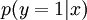 的函数。将此前的两张图片结合起来，就得到该函数的图形表示。也即，最终的分类器可以表示为：

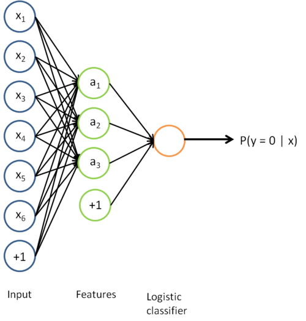

该模型的参数通过两个步骤训练获得：在该网络的第一层，将输入  映射至隐藏单元激活量  的权值 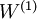 可以通过稀疏自编码器训练过程获得。在第二层，将隐藏单元  映射至输出  的权值 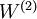 可以通过 logistic 回归或 softmax 回归训练获得。

这个最终分类器整体上显然是一个大的神经网络。因此，在训练获得模型最初参数（利用自动编码器训练第一层，利用 logistic/softmax 回归训练第二层）之后，我们可以进一步修正模型参数，进而降低训练误差。具体来说，我们可以对参数进行微调，在现有参数的基础上采用梯度下降或者 L-BFGS 来降低已标注样本集  上的训练误差。

使用微调时，初始的非监督特征学习步骤（也就是自动编码器和logistic分类器训练）有时候被称为预训练。微调的作用在于，已标注数据集也可以用来修正权值 ，这样可以对隐藏单元所提取的特征  做进一步调整。

到现在为止，我们描述上述过程时，都假设采用了“替代 (Replacement)”表示而不是“级联 (Concatenation)”表示。在替代表示中，logistic 分类器所看到的训练样本格式为 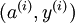；而在级联表示中，分类器所看到的训练样本格式为 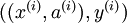。对级联表示同样可以进行微调（在级联表示神经网络中，输入值 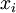 也直接被输入至 logistic 分类器。对此前的神经网络示意图稍加更改，即可获得其示意图。具体的说，第一层的输入节点除了与隐层联接之外，还将越过隐层，与第三层输出节点直接相连）。但是对于微调来说，级联表示相对于替代表示几乎没有优势。因此，如果需要开展微调，我们通常使用替代表示的网络（但是如果不开展微调，级联表示的效果有时候会好得多）。

在什么时候应用微调？通常仅在有大量已标注训练数据的情况下使用。在这样的情况下，微调能显著提升分类器性能。然而，如果有大量未标注数据集（用于非监督特征学习/预训练），却只有相对较少的已标注训练集，微调的作用非常有限。

 中英文对照
------

自我学习 self-taught learning

深层网络 deep networks

微调 fine-tune

稀疏自编码器 sparse autoencoder

梯度下降 gradient descent

非监督特征学习 unsupervised feature learning

预训练 pre-training

 中文译者
-----

杨耀（iamyangyao@163.com），阎志涛（zhitao.yan@gmail.com），王文中（wangwenzhong@ymail.com）

**从自我学习到深层网络** | [深度网络概览](%E6%B7%B1%E5%BA%A6%E7%BD%91%E7%BB%9C%E6%A6%82%E8%A7%88.md "深度网络概览") | [栈式自编码算法](%E6%A0%88%E5%BC%8F%E8%87%AA%E7%BC%96%E7%A0%81%E7%AE%97%E6%B3%95.md "栈式自编码算法") | [微调多层自编码算法](%E5%BE%AE%E8%B0%83%E5%A4%9A%E5%B1%82%E8%87%AA%E7%BC%96%E7%A0%81%E7%AE%97%E6%B3%95.md "微调多层自编码算法") | [Exercise: Implement deep networks for digit classification](Exercise__Implement_deep_networks_for_digit_classification.md "Exercise: Implement deep networks for digit classification")

---

> * Language: [English](Self-Taught_Learning_to_Deep_Networks.md "Self-Taught Learning to Deep Networks")
> * This page was last modified on 10 April 2013, at 13:38.

