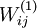
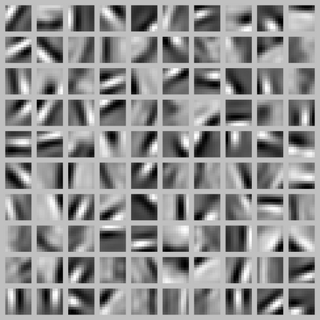

可视化自编码器训练结果
===========

<!-- Jump to: [navigation](#column-one), [search](#searchInput) -->
训练完（稀疏）自编码器，我们还想把这自编码器学到的函数可视化出来，好弄明白它到底学到了什么。我们以在10×10图像（即n=100）上训练自编码器为例。在该自编码器中，每个隐藏单元i对如下关于输入的函数进行计算：

我们将要可视化的函数，就是上面这个以2D图像为输入、并由隐藏单元i计算出来的函数。它是依赖于参数的（暂时忽略偏置项*b**i*）。需要注意的是，可看作输入的非线性特征。不过还有个问题：什么样的输入图像可让得到最大程度的激励？（通俗一点说，隐藏单元要找个什么样的特征？）。这里我们必须给加约束，否则会得到平凡解。若假设输入有范数约束，则可证（请读者自行推导）令隐藏单元得到最大激励的输入应由下面公式计算的像素给出（共需计算100个像素，j=1,…,100）：

当我们用上式算出各像素的值、把它们组成一幅图像、并将图像呈现在我们面前之时，隐藏单元所追寻特征的真正含义也渐渐明朗起来。

假如我们训练的自编码器有100个隐藏单元，可视化结果就会包含100幅这样的图像——每个隐藏单元都对应一幅图像。审视这100幅图像，我们可以试着体会这些隐藏单元学出来的整体效果是什么样的。

当我们对稀疏自编码器（100个隐藏单元，在10X10像素的输入上训练 ）进行上述可视化处理之后，结果如下所示：

 
上图的每个小方块都给出了一个（带有有界范数 的）输入图像，它可使这100个隐藏单元中的某一个获得最大激励。我们可以看到，不同的隐藏单元学会了在图像的不同位置和方向进行边缘检测。

显而易见，这些特征对物体识别等计算机视觉任务是十分有用的。若将其用于其他输入域（如音频），该算法也可学到对这些输入域有用的表示或特征。

 中英文对照
------

可视化 Visualizing
自编码器 Autoencoder
隐藏单元 hidden unit
非线性特征 non-linear feature
激励 activate
平凡解 trivial answer
范数约束 norm constrained
稀疏自编码器 sparse autoencoder
有界范数 norm bounded
输入域 input domains

 中文译者
-----

王方（fangkey@gmail.com），胡伦（hulun499@gmail.com），谢宇（msforbus@sina.com），@小琳爱肉肉（新浪微博账号）, 余凯（kai.yu.cool@gmail.com）

[神经网络](%E7%A5%9E%E7%BB%8F%E7%BD%91%E7%BB%9C.md "神经网络") | [反向传导算法](%E5%8F%8D%E5%90%91%E4%BC%A0%E5%AF%BC%E7%AE%97%E6%B3%95.md "反向传导算法") | [梯度检验与高级优化](%E6%A2%AF%E5%BA%A6%E6%A3%80%E9%AA%8C%E4%B8%8E%E9%AB%98%E7%BA%A7%E4%BC%98%E5%8C%96.md "梯度检验与高级优化") | [自编码算法与稀疏性](%E8%87%AA%E7%BC%96%E7%A0%81%E7%AE%97%E6%B3%95%E4%B8%8E%E7%A8%80%E7%96%8F%E6%80%A7.md "自编码算法与稀疏性") | **可视化自编码器训练结果** | [稀疏自编码器符号一览表](%E7%A8%80%E7%96%8F%E8%87%AA%E7%BC%96%E7%A0%81%E5%99%A8%E7%AC%A6%E5%8F%B7%E4%B8%80%E8%A7%88%E8%A1%A8.md "稀疏自编码器符号一览表") | [Exercise:Sparse\_Autoencoder](Exercise_Sparse_Autoencoder.md "Exercise:Sparse Autoencoder")

---

> * Language: [English](Visualizing_a_Trained_Autoencoder.md "Visualizing a Trained Autoencoder")
> * This page was last modified on 7 May 2013, at 15:50.

