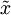
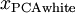
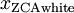

实现主成分分析和白化
==========

<!-- Jump to: [navigation](#column-one), [search](#searchInput) -->
在这一节里，我们将总结PCA, PCA白化和ZCA白化算法，并描述如何使用高效的线性代数库来实现它们。

首先，我们需要确保数据的均值（近似）为零。对于自然图像，我们通过减去每个图像块(patch)的均值（近似地）来达到这一目标。为此，我们计算每个图像块的均值，并从每个图像块中减去它的均值。（译注：参见PCA一章中“对图像数据应用PCA算法”一节）。Matlab实现如下：

```
avg = mean(x, 1);     % 分别为每个图像块计算像素强度的均值。 
x = x - repmat(avg, size(x, 1), 1);

```

下面，我们要计算  ，如果你在Matlab中实现（或者在C++, Java等中实现，但可以使用高效的线性代数库），直接求和效率很低。不过，我们可以这样一气呵成。

```
sigma = x * x' / size(x, 2);

```

（自己推导一下看看）这里，我们假设 *x* 为一数据结构，其中每列表示一个训练样本（所以 *x* 是一个 × 的矩阵）。

接下来，PCA计算 Σ 的特征向量。你可以使用Matlab的 eig 函数来计算。但是由于 Σ 是对称半正定的矩阵，用 svd 函数在数值计算上更加稳定。

具体来说，如果你使用

```
[U,S,V] = svd(sigma);

```

那矩阵 *U* 将包含 *S**i**g**m**a* 的特征向量（一个特征向量一列，从主向量开始排序），矩阵S 对角线上的元素将包含对应的特征值（同样降序排列）。矩阵  等于  的转置，可以忽略。

（注意 svd 函数实际上计算的是一个矩阵的奇异值和奇异向量，就对称半正定矩阵的特殊情况来说，它们对应于特征值和特征向量，这里我们也只关心这一特例。关于奇异向量和特征向量的详细讨论超出了本文范围。）

最后，我们可以这样计 算 和  ：

```
xRot = U' * x;          % 数据旋转后的结果。 
xTilde = U(:,1:k)' * x; % 数据降维后的结果，这里k希望保留的特征向量的数目。

```

这以  的形式给出了数据的PCA表示。顺便说一下，如果 *x* 是一个包括所有训练数据的 × 矩阵，这也是一种向量化的实现方式，上面的式子可以让你一次对所有的训练样本计算出 *x*rot 和  。得到的 *x*rot 和  中，每列对应一个训练样本。

为计算PCA白化后的数据  ，可以用

```
xPCAwhite = diag(1./sqrt(diag(S) + epsilon)) * U' * x;

```

因为 *S* 的对角线包括了特征值  ，这其实就是同时为所有样本计算  的简洁表达。

最后，你也可以这样计算ZCA白化后的数据:

```
xZCAwhite = U * diag(1./sqrt(diag(S) + epsilon)) * U' * x;

```

 中英文对照
------

主成分分析 Principal Components Analysis (PCA)
白化 whitening
均值为零 zero-mean
均值 mean value
特征值 eigenvalue
特征向量 eigenvector
对称半正定矩阵 symmetric positive semi-definite matrix
数值计算上稳定 numerically reliable
降序排列 sorted in decreasing order
奇异值 singular value
奇异向量 singular vector
向量化实现 vectorized implementation
对角线 diagonal

 中文译者
-----

周思远（visualzhou@gmail.com），张力（emma.lzhang@gmail.com），谭晓阳（x.tan@nuaa.edu.cn）

[主成分分析](%E4%B8%BB%E6%88%90%E5%88%86%E5%88%86%E6%9E%90.md "主成分分析") | [白化](%E7%99%BD%E5%8C%96.md "白化") | **实现主成分分析和白化** | [Exercise:PCA in 2D](Exercise_PCA_in_2D.md "Exercise:PCA in 2D") | [Exercise:PCA and Whitening](Exercise_PCA_and_Whitening.md "Exercise:PCA and Whitening")

---

> * Language: [English](/wayback-mooc/stanford-ufldl/wiki/Implementing_PCA/Whitening "Implementing PCA/Whitening")
> * This page was last modified on 8 April 2013, at 05:38.

