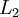
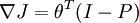

微调多层自编码算法
=========

<!-- Jump to: [navigation](#column-one), [search](#searchInput) -->

|  |
| --- |
| Contents* [1 介绍](#.E4.BB.8B.E7.BB.8D)
* [2 一般策略](#.E4.B8.80.E8.88.AC.E7.AD.96.E7.95.A5)
* [3 使用反向传播法进行微调](#.E4.BD.BF.E7.94.A8.E5.8F.8D.E5.90.91.E4.BC.A0.E6.92.AD.E6.B3.95.E8.BF.9B.E8.A1.8C.E5.BE.AE.E8.B0.83)
* [4 中英文对照](#.E4.B8.AD.E8.8B.B1.E6.96.87.E5.AF.B9.E7.85.A7)
* [5 中文译者](#.E4.B8.AD.E6.96.87.E8.AF.91.E8.80.85)
 |

 介绍
---

微调是深度学习中的常用策略，可以大幅提升一个栈式自编码神经网络的性能表现。从更高的视角来讲，微调将栈式自编码神经网络的所有层视为一个模型，这样在每次迭代中，网络中所有的权重值都可以被优化。

 一般策略
-----

幸运的是，实施微调栈式自编码神经网络所需的工具都已齐备！为了在每次迭代中计算所有层的梯度，我们需要使用稀疏自动编码一节中讨论的反向传播算法。因为反向传播算法可以延伸应用到任意多层，所以事实上，该算法对任意多层的栈式自编码神经网络都适用。

 使用反向传播法进行微调
------------

为方便读者，以下我们简要描述如何实施反向传播算法：

 1. 进行一次前馈传递，对  层、 层直到输出层 ，使用前向传播步骤中定义的公式计算各层上的激活值（激励响应）。

 2. 对输出层（ 层），令

（当使用softmax分类器时，softmax层满足：，其中  为输入数据对应的类别标签， 为条件概率向量。）

 3. 对 
令

 4. 计算所需的偏导数：

![\begin{align}
J(W,b)
&= \left[ \frac{1}{m} \sum_{i=1}^m J(W,b;x^{(i)},y^{(i)}) \right]
\end{align}](images/math/0/6/e/06e46d21d188dcbc2b7da7cfc1ff976f.png)

注：我们可以认为输出层softmax分类器是附加上的一层，但是其求导过程需要单独处理。具体地说，网络“最后一层”的特征会进入softmax分类器。所以，第二步中的导数由  计算，其中 。

 中英文对照
------

栈式自编码神经网络（可以考虑翻译为“多层自动编码机”或“多层自动编码神经网络”） Stacked autoencoder

微调 Fine tuning

反向传播算法 Backpropagation Algorithm

前馈传递 feedforward pass

激活值 （可以考虑翻译为“激励响应”或“响应”） activation

 中文译者
-----

崔巍（watsoncui@gmail.com）, 余凯（kai.yu.cool@gmail.com）, 许利杰（csxulijie@gmail.com）

[从自我学习到深层网络](%E4%BB%8E%E8%87%AA%E6%88%91%E5%AD%A6%E4%B9%A0%E5%88%B0%E6%B7%B1%E5%B1%82%E7%BD%91%E7%BB%9C.md "从自我学习到深层网络") | [深度网络概览](%E6%B7%B1%E5%BA%A6%E7%BD%91%E7%BB%9C%E6%A6%82%E8%A7%88.md "深度网络概览") | [栈式自编码算法](%E6%A0%88%E5%BC%8F%E8%87%AA%E7%BC%96%E7%A0%81%E7%AE%97%E6%B3%95.md "栈式自编码算法") | **微调多层自编码算法** | [Exercise: Implement deep networks for digit classification](Exercise__Implement_deep_networks_for_digit_classification.md "Exercise: Implement deep networks for digit classification")

---

> * Language: [English](Fine-tuning_Stacked_AEs.md "Fine-tuning Stacked AEs")
> * This page was last modified on 8 April 2013, at 05:16.

