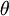
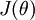
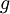
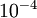
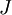
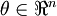
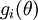
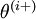
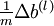

梯度检验与高级优化
=========

<!-- Jump to: [navigation](#column-one), [search](#searchInput) -->
众所周知，反向传播算法很难调试得到正确结果，尤其是当实现程序存在很多难于发现的bug时。举例来说，索引的缺位错误（off-by-one error）会导致只有部分层的权重得到训练，再比如忘记计算偏置项。这些错误会使你得到一个看似十分合理的结果（但实际上比正确代码的结果要差）。因此，但从计算结果上来看，我们很难发现代码中有什么东西遗漏了。本节中，我们将介绍一种对求导结果进行数值检验的方法，该方法可以验证求导代码是否正确。另外，使用本节所述求导检验方法，可以帮助你提升写正确代码的信心。

缺位错误（Off-by-one error）举例说明：比如 循环中循环 次，正确应该是 ，但有时程序员疏忽，会写成 ，这就是缺位错误。

假设我们想要最小化以  为自变量的目标函数。假设 ，则 。在一维的情况下，一次迭代的梯度下降公式是

再假设我们已经用代码实现了计算  的函数 ，接着我们使用  来实现梯度下降算法。那么我们如何检验  的实现是否正确呢？

回忆导数的数学定义：

那么对于任意  值，我们都可以对等式左边的导数用：

来近似。

实际应用中，我们常将  设为一个很小的常量，比如在 数量级（虽然  的取值范围可以很大，但是我们不会将它设得太小，比如 ，因为那将导致数值舍入误差。）

给定一个被认为能计算  的函数，我们可以用下面的数值检验公式

计算两端是否一样来检验函数是否正确。

上式两端值的接近程度取决于  的具体形式。但是在假定 的情况下，你通常会发现上式左右两端至少有4位有效数字是一样的（通常会更多）。

现在，考虑  是一个向量而非一个实数（那么就有个参数要学习得到），并且 。在神经网络的例子里我们使用 ，可以想象为把参数  组合扩展成一个长向量 。现在我们将求导检验方法推广到一般化，即  是一个向量的情况。

假设我们有一个用于计算 的函数 ；我们想要检验  是否输出正确的求导结果。我们定义 ，其中

是第  个基向量（维度和  相同，在第  行是“”而其他行是“”）。所以， 和  几乎相同，除了第  行元素增加了 。类似地， 得到的第  行减小了 。然后我们可以对每个  检查下式是否成立，进而验证  的正确性：

当用反射传播算法求解神经网络时，正确算法实现会得到：

以上结果与反向传播算法中的最后一段伪代码一致，都是计算梯度下降。为了验证梯度下降代码的正确性，使用上述数值检验方法计算  的导数，然后验证  与  是否能够给出正确的求导结果。

迄今为止，我们的讨论都集中在使用梯度下降法来最小化 。如果你已经实现了一个计算  和  的函数，那么其实还有更精妙的算法来最小化 。举例来说，可以想象这样一个算法：它使用梯度下降，并能够自动调整学习速率 ，以得到合适的步长值，最终使  能够快速收敛到一个局部最优解。还有更妙的算法：比如可以寻找一个Hessian矩阵的近似，得到最佳步长值，使用该步长值能够更快地收敛到局部最优（和牛顿法类似）。此类算法的详细讨论已超出了这份讲义的范围，但是L-BFGS算法我们以后会有论述（另一个例子是共轭梯度算法）。你将在编程练习里使用这些算法中的一个。使用这些高级优化算法时，你需要提供关键的函数：即对于任一个 ，需要你计算出  和 。之后，这些优化算法会自动调整学习速率/步长值  的大小（并计算Hessian近似矩阵等等）来自动寻找  最小化时 的值。诸如L-BFGS和共轭梯度算法通常比梯度下降法快很多。

 中英文对照
------

off-by-one error 缺位错误

bias term 偏置项

numerically checking 数值检验

numerical roundoff errors 数值舍入误差

significant digits 有效数字

unrolling 组合扩展

learning rate 学习速率

Hessian matrix Hessian矩阵

Newton's method 牛顿法

conjugate gradient 共轭梯度

step-size 步长值

 中文译者
-----

袁晓丹（shadowwalker1991@gmail.com），王方（fangkey@gmail.com），林锋（xlfg@yeah.net），许利杰（csxulijie@gmail.com）

[神经网络](%E7%A5%9E%E7%BB%8F%E7%BD%91%E7%BB%9C.md "神经网络") | [反向传导算法](%E5%8F%8D%E5%90%91%E4%BC%A0%E5%AF%BC%E7%AE%97%E6%B3%95.md "反向传导算法") | **梯度检验与高级优化** | [自编码算法与稀疏性](%E8%87%AA%E7%BC%96%E7%A0%81%E7%AE%97%E6%B3%95%E4%B8%8E%E7%A8%80%E7%96%8F%E6%80%A7.md "自编码算法与稀疏性") | [可视化自编码器训练结果](%E5%8F%AF%E8%A7%86%E5%8C%96%E8%87%AA%E7%BC%96%E7%A0%81%E5%99%A8%E8%AE%AD%E7%BB%83%E7%BB%93%E6%9E%9C.md "可视化自编码器训练结果") | [稀疏自编码器符号一览表](%E7%A8%80%E7%96%8F%E8%87%AA%E7%BC%96%E7%A0%81%E5%99%A8%E7%AC%A6%E5%8F%B7%E4%B8%80%E8%A7%88%E8%A1%A8.md "稀疏自编码器符号一览表") | [Exercise:Sparse\_Autoencoder](Exercise_Sparse_Autoencoder.md "Exercise:Sparse Autoencoder")

---

> * Language: [English](Gradient_checking_and_advanced_optimization.md "Gradient checking and advanced optimization")
> * This page was last modified on 8 April 2013, at 05:33.

