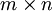

池化
==

<!-- Jump to: [navigation](#column-one), [search](#searchInput) -->

|  |
| --- |
| Contents* [1 池化: 概述](#.E6.B1.A0.E5.8C.96:_.E6.A6.82.E8.BF.B0)
* [2 池化的不变性](#.E6.B1.A0.E5.8C.96.E7.9A.84.E4.B8.8D.E5.8F.98.E6.80.A7)
* [3 形式化描述](#.E5.BD.A2.E5.BC.8F.E5.8C.96.E6.8F.8F.E8.BF.B0)
* [4 中英文对照](#.E4.B8.AD.E8.8B.B1.E6.96.87.E5.AF.B9.E7.85.A7)
* [5 中文译者](#.E4.B8.AD.E6.96.87.E8.AF.91.E8.80.85)
 |

  池化: 概述
--------

在通过卷积获得了特征 (features) 之后，下一步我们希望利用这些特征去做分类。理论上讲，人们可以用所有提取得到的特征去训练分类器，例如 softmax 分类器，但这样做面临计算量的挑战。例如：对于一个 96X96 像素的图像，假设我们已经学习得到了400个定义在8X8输入上的特征，每一个特征和图像卷积都会得到一个 (96 − 8 + 1) \* (96 − 8 + 1) = 7921 维的卷积特征，由于有 400 个特征，所以每个样例 (example) 都会得到一个 892 \* 400 = 3,168,400 维的卷积特征向量。学习一个拥有超过 3 百万特征输入的分类器十分不便，并且容易出现过拟合 (over-fitting)。

为了解决这个问题，首先回忆一下，我们之所以决定使用卷积后的特征是因为图像具有一种“静态性”的属性，这也就意味着在一个图像区域有用的特征极有可能在另一个区域同样适用。因此，为了描述大的图像，一个很自然的想法就是对不同位置的特征进行聚合统计，例如，人们可以计算图像一个区域上的某个特定特征的平均值 (或最大值)。这些概要统计特征不仅具有低得多的维度 (相比使用所有提取得到的特征)，同时还会改善结果(不容易过拟合)。这种聚合的操作就叫做池化 (pooling)，有时也称为平均池化或者最大池化 (取决于计算池化的方法)。

下图显示池化如何应用于一个图像的四块不重合区域。

  池化的不变性
--------

如果人们选择图像中的连续范围作为池化区域，并且只是池化相同(重复)的隐藏单元产生的特征，那么，这些池化单元就具有平移不变性 (translation invariant)。这就意味着即使图像经历了一个小的平移之后，依然会产生相同的 (池化的) 特征。在很多任务中 (例如物体检测、声音识别)，我们都更希望得到具有平移不变性的特征，因为即使图像经过了平移，样例(图像)的标记仍然保持不变。例如，如果你处理一个MNIST数据集的数字，把它向左侧或右侧平移，那么不论最终的位置在哪里，你都会期望你的分类器仍然能够精确地将其分类为相同的数字。

(\*MNIST 是一个手写数字库识别库: <http://yann.lecun.com/exdb/mnist/>)

  形式化描述
-------

形式上，在获取到我们前面讨论过的卷积特征后，我们要确定池化区域的大小(假定为)，来池化我们的卷积特征。那么，我们把卷积特征划分到数个大小为 的不相交区域上，然后用这些区域的平均(或最大)特征来获取池化后的卷积特征。这些池化后的特征便可以用来做分类。

 中英文对照
------

特征 features

样例 example

过拟合 over-fitting

平移不变性 translation invariant

池化 pooling

提取 extract

物体检测 object detection

 中文译者
-----

陈玉栓 (chris\_chen\_cys@hotmail.com) ， 刘鸿鹏飞（just.dark@foxmail.com）， 邓亚峰（dengyafeng@gmail.com）, 晓风（xiaofeng.zhb@alibaba-inc.com）

[卷积特征提取](%E5%8D%B7%E7%A7%AF%E7%89%B9%E5%BE%81%E6%8F%90%E5%8F%96.md "卷积特征提取") | **池化** | [Exercise:Convolution and Pooling](Exercise_Convolution_and_Pooling.md "Exercise:Convolution and Pooling")

---

> * Language: [English](Pooling.md "Pooling")
> * This page was last modified on 8 April 2013, at 05:21.

