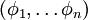
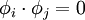
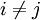
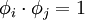
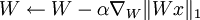
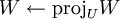
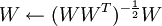

独立成分分析
======

<!-- Jump to: [navigation](#column-one), [search](#searchInput) -->

|  |
| --- |
| Contents* [1 概述](#.E6.A6.82.E8.BF.B0)
* [2 标准正交ICA](#.E6.A0.87.E5.87.86.E6.AD.A3.E4.BA.A4ICA)
* [3 拓扑ICA](#.E6.8B.93.E6.89.91ICA)
* [4 中英文对照](#.E4.B8.AD.E8.8B.B1.E6.96.87.E5.AF.B9.E7.85.A7)
* [5 中文译者](#.E4.B8.AD.E6.96.87.E8.AF.91.E8.80.85)
 |

  概述
----

试着回想一下，在介绍 [稀疏编码算法](Sparse_Coding.md "Sparse Coding")中我们想为样本数据学习得到一个超完备基（over-complete basis）。具体来说，这意味着用稀疏编码学习得到的基向量之间不一定线性独立。尽管在某些情况下这已经满足需要，但有时我们仍然希望得到的是一组线性独立基。独立成分分析算法（ICA）正实现了这一点。而且，在 ICA 中，我们希望学习到的基不仅要线性独立，而且还是一组标准正交基。（一组标准正交基  需要满足条件：（如果 ）或者 （如果 *i* = *j*））

与稀疏编码算法类似，独立成分分析也有一个简单的数学形式。给定数据 x，我们希望学习得到一组基向量――以列向量形式构成的矩阵 *W*，其满足以下特点：首先，与稀疏编码一样，特征是稀疏的；其次，基是标准正交的（注意，在稀疏编码中，矩阵 *A* 用于将特征 *s* 映射到原始数据，而在独立成分分析中，矩阵 *W* 工作的方向相反，是将原始数据 *x* 映射到特征）。这样我们得到以下目标函数：

由于 *W**x* 实际上是描述样本数据的特征，这个目标函数等价于在稀疏编码中特征 *s* 的稀疏惩罚项。加入标准正交性约束后，独立成分分析相当于求解如下优化问题：

与深度学习中的通常情况一样，这个问题没有简单的解析解，而且更糟糕的是，由于标准正交性约束，使得用梯度下降方法来求解该问题变得更加困难――每次梯度下降迭代之后，必须将新的基映射回正交基空间中（以此保证正交性约束）。

实践中，在最优化目标函数的同时施加正交性约束（如下一节 [正交ICA](Independent_Component_Analysis#Orthonormal_ICA.md "Independent Component Analysis")中讲到的）是可行的，但是速度慢。在标准正交基是不可或缺的情况下，标准正交ICA的使用会受到一些限制。（哪些情况见：TODO ）

  标准正交ICA
---------

标准正交ICA的目标函数是：

通过观察可知，约束*W**W**T* = *I*隐含着另外两个约束:

第一，因为要学习到一组标准正交基，所以基向量的个数必须小于输入数据的维度。具体来说，这意味着不能像通常在 [稀疏编码](Sparse_Coding__Autoencoder_Interpretation.md "Sparse Coding: Autoencoder Interpretation")中所做的那样来学习得到超完备基（over-complete bases）。

第二，数据必须经过无正则 [ZCA白化](Whitening.md "Whitening")（也即,ε设为0）。（为什么必须这样做？见TODO）

因此，在优化标准正交ICA目标函数之前，必须确保数据被白化过，并且学习的是一组不完备基（under-complete basis）。

然后，为了优化目标函数，我们可以使用梯度下降法，在梯度下降的每一步中增加投影步骤，以满足标准正交约束。过程如下：

重复以下步骤直到完成：

1. - , 其中*U*是满足*W**W**T* = *I*的矩阵空间

在实际中,学习速率α是可变的,使用一个线搜索算法来加速梯度.投影步骤通过设置来完成,这实际上可以看成就是ZCA白化(TODO:解释为什么这就象ZCA白化).

  拓扑ICA
-------

与 [稀疏编码算法](Sparse_Coding__Autoencoder_Interpretation.md "Sparse Coding: Autoencoder Interpretation")类似，加上一个拓扑代价项，独立成分分析法可以修改成具有拓扑性质的算法。

 中英文对照
------

独立成分分析 Independent Component Analysis 
稀疏编码算法 Sparse coding 
超完备基 Over-complete basis 
标准正交基 Orthonormal basis 
稀疏惩罚项 Sparsity penalty 
梯度下降法 Gradient descent 
白化 Whitened 
不完备基 Under-complete basis 
线搜索算法 Line-search algorithm 
拓扑代价项 Topographic cost term

 中文译者
-----

袁贞明（zmyuan@hznu.edu.cn），晓风（xiaofeng.zhb@alibaba-inc.com）, 林锋（xlfg@yeah.net）

---

> * Language: [English](Independent_Component_Analysis.md "Independent Component Analysis")
> * This page was last modified on 8 April 2013, at 04:37.

