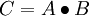
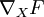
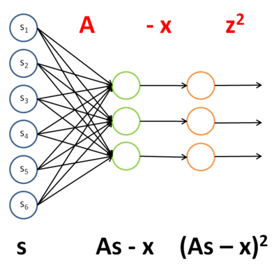
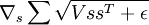
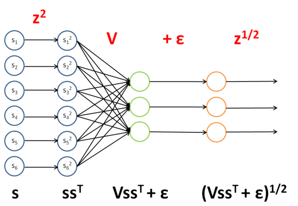
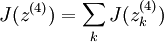
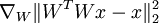
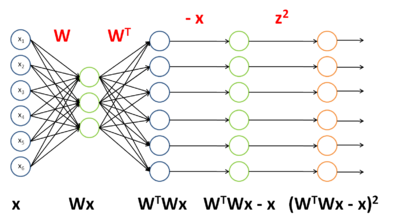
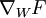

用反向传导思想求导
=========

<!-- Jump to: [navigation](#column-one), [search](#searchInput) -->

|  |
| --- |
| Contents* [1 简介](#.E7.AE.80.E4.BB.8B)
* [2 示例](#.E7.A4.BA.E4.BE.8B)
	+ [2.1 示例1：稀疏编码中权重矩阵的目标函数](#.E7.A4.BA.E4.BE.8B1.EF.BC.9A.E7.A8.80.E7.96.8F.E7.BC.96.E7.A0.81.E4.B8.AD.E6.9D.83.E9.87.8D.E7.9F.A9.E9.98.B5.E7.9A.84.E7.9B.AE.E6.A0.87.E5.87.BD.E6.95.B0)
	+ [2.2 示例2：稀疏编码中的平滑地形L1稀疏罚函数](#.E7.A4.BA.E4.BE.8B2.EF.BC.9A.E7.A8.80.E7.96.8F.E7.BC.96.E7.A0.81.E4.B8.AD.E7.9A.84.E5.B9.B3.E6.BB.91.E5.9C.B0.E5.BD.A2L1.E7.A8.80.E7.96.8F.E7.BD.9A.E5.87.BD.E6.95.B0)
	+ [2.3 示例3：ICA重建代价](#.E7.A4.BA.E4.BE.8B3.EF.BC.9AICA.E9.87.8D.E5.BB.BA.E4.BB.A3.E4.BB.B7)
* [3 中英文对照](#.E4.B8.AD.E8.8B.B1.E6.96.87.E5.AF.B9.E7.85.A7)
* [4 中文译者](#.E4.B8.AD.E6.96.87.E8.AF.91.E8.80.85)
 |

  简介
----

在 [反向传导算法](%E5%8F%8D%E5%90%91%E4%BC%A0%E5%AF%BC%E7%AE%97%E6%B3%95.md "反向传导算法") 一节中，我们介绍了在稀疏自编码器中用反向传导算法来求梯度的方法。事实证明，反向传导算法与矩阵运算相结合的方法，对于计算复杂矩阵函数（从矩阵到实数的函数，或用符号表示为：从  ）的梯度是十分强大和直观的。

首先，我们回顾一下反向传导的思想，为了更适合我们的目的，将其稍作修改呈现于下:

1. 对第 *n**l* 层（最后一层）中的每一个输出单元 *i* ，令

其中 *J*(*z*) 是我们的“目标函数”（稍后解释）。
- 对  , 
对第 *l* 层中的每个节点 *i* , 令 

- 计算我们要的偏导数

符号扼要重述：

* *l* 是神经网络的层数
* *n**l* 第l层神经元的个数
*  是 *l* 层第 *i* 个节点到第 (*l* + 1) 层第 *j* 个节点的权重
*  是第 *l* 层第 *i* 个单元的输入
*  是第 *l* 层第 *i* 个节点的激励
*  是矩阵的Hadamard积或逐个元素乘积，对  矩阵 *A* 和 *B* ，它们的乘积是  矩阵  ，即 * *f*(*l*) 是第 *l* 层中各单元的激励函数

假设我们有一个函数 *F* ， *F* 以矩阵 *X* 为参数生成一个实数。我们希望用反向传导思想计算 *F* 关于 *X* 的梯度，即  。大致思路是将函数 *F* 看成一个多层神经网络，并使用反向传导思想求梯度。

为了实现这个想法，我们取目标函数为 *J*(*z*) ，当计算最后一层神经元的输出时，会产生值 *F*(*X*) 。对于中间层，我们将选择激励函数 *f*(*l*) 。

稍后我们会看到，使用这种方法，我们可以很容易计算出对于输入 *X* 以及网络中任意一个权重的导数。

  示例
----

为了阐述如何使用反向传导思想计算关于输入的导数，我们要在示例1,示例2中用  [稀疏编码](%E7%A8%80%E7%96%8F%E7%BC%96%E7%A0%81%E8%87%AA%E7%BC%96%E7%A0%81%E8%A1%A8%E8%BE%BE.md "稀疏编码自编码表达")  章节中的两个函数。在示例3中，我们使用 [独立成分分析](%E7%8B%AC%E7%AB%8B%E6%88%90%E5%88%86%E5%88%86%E6%9E%90.md "独立成分分析") 一节中的一个函数来说明使用此思想计算关于权重的偏导的方法，以及在这种特殊情况下，如何处理相互捆绑或重复的权重。

###   示例1：稀疏编码中权重矩阵的目标函数

回顾一下 [稀疏编码](%E7%A8%80%E7%96%8F%E7%BC%96%E7%A0%81%E8%87%AA%E7%BC%96%E7%A0%81%E8%A1%A8%E8%BE%BE.md "稀疏编码自编码表达") ，当给定特征矩阵 *s* 时，权重矩阵 *A* 的目标函数为:

我们希望求 *F* 对于 *A* 的梯度，即  。因为目标函数是两个含 *A* 的式子之和，所以它的梯度是每个式子的梯度之和。第二项的梯度很容易求，因此我们只考虑第一项的梯度。

第一项,  ,可以看成一个用 *s* 做输入的神经网络的实例，通过四步进行计算，文字以及图形描述如下：

1. 把 *A* 作为第一层到第二层的权重。
- 将第二层的激励减 *x* ，第二层使用了单位激励函数。
- 通过单位权重将结果不变地传到第三层。在第三层使用平方函数作为激励函数。
- 将第三层的所有激励相加。

该网络的权重和激励函数如下表所示：

| 层 | 权重 | 激励函数 *f* |
| --- | --- | --- |
| 1 | *A* | *f*(*z**i*) = *z**i* (单位函数) |
| 2 | *I* (单位向量) | *f*(*z**i*) = *z**i* − *x**i* |
| 3 | N/A | f(z_i) = z_i^2 |

为了使 *J*(*z*(3)) = *F*(*x*) ，我们可令  。

一旦我们将 *F* 看成神经网络，梯度  就很容易求了——使用反向传导得到：

| 层 | 激励函数的导数*f*' | Delta | 该层输入*z* |
| --- | --- | --- | --- |
| 3 | *f*'(*z**i*) = 2*z**i* | *f*'(*z**i*) = 2*z**i* | *A**s* − *x* |
| 2 | *f*'(*z**i*) = 1 | \left( I^T \delta^{(3)} \right) \bullet 1 | *A**s* |
| 1 | *f*'(*z**i*) = 1 | \left( A^T \delta^{(2)} \right) \bullet 1 | *s* |

因此

###   示例2：稀疏编码中的平滑地形L1稀疏罚函数

回顾 [稀疏编码](%E7%A8%80%E7%96%8F%E7%BC%96%E7%A0%81%E8%87%AA%E7%BC%96%E7%A0%81%E8%A1%A8%E8%BE%BE.md "稀疏编码自编码表达") 一节中对 *s* 的平滑地形L1稀疏罚函数：

其中 *V* 是分组矩阵， *s* 是特征矩阵， ε 是一个常数。

我们希望求得  。像上面那样，我们把这一项看做一个神经网络的实例：

该网络的权重和激励函数如下表所示：

| 层 | 权重 | 激励函数 *f* |
| --- | --- | --- |
| 1 | *I* | f(z_i) = z_i^2 |
| 2 | *V* | *f*(*z**i*) = *z**i* |
| 3 | *I* | *f*(*z**i*) = *z**i* + ε |
| 4 | N/A | f(z_i) = z_i^{\frac{1}{2}} |

为使 *J*(*z*(4)) = *F*(*x*) ，我们可令  。

一旦我们把 *F* 看做一个神经网络，梯度  变得很容易计算——使用反向传导得到：

| 层 | 激励函数的导数 *f*' | Delta | 该层输入*z* |
| --- | --- | --- | --- |
| 4 | f'(z_i) = \frac{1}{2} z_i^{-\frac{1}{2}} | f'(z_i) = \frac{1}{2} z_i^{-\frac{1}{2}} | (*V**s**s**T* + ε) |
| 3 | *f*'(*z**i*) = 1 | \left( I^T \delta^{(4)} \right) \bullet 1 | *V**s**s**T* |
| 2 | *f*'(*z**i*) = 1 | \left( V^T \delta^{(3)} \right) \bullet 1 | *s**s**T* |
| 1 | *f*'(*z**i*) = 2*z**i* | \left( I^T \delta^{(2)} \right) \bullet 2s | *s* |

因此

###   示例3：ICA重建代价

回顾  [独立成分分析(ICA)](%E7%8B%AC%E7%AB%8B%E6%88%90%E5%88%86%E5%88%86%E6%9E%90.md "独立成分分析") 一节重建代价一项：  ，其中 *W* 是权重矩阵， *x* 是输入。

我们希望计算  ——对于**权重矩阵**的导数，而不是像前两例中对于**输入**的导数。不过我们仍然用类似的方法处理，把该项看做一个神经网络的实例：

该网络的权重和激励函数如下表所示：

| 层 | 权重 | 激励函数 *f* |
| --- | --- | --- |
| 1 | *W* | *f*(*z**i*) = *z**i* |
| 2 | *W**T* | *f*(*z**i*) = *z**i* |
| 3 | *I* | *f*(*z**i*) = *z**i* − *x**i* |
| 4 | N/A | f(z_i) = z_i^2 |

为使 *J*(*z*(4)) = *F*(*x*) ，我们可令  。

既然我们可将 *F* 看做神经网络，我们就能计算出梯度  。然而，我们现在面临的难题是 *W* 在网络中出现了两次。幸运的是，可以证明如果 *W* 在网络中出现多次，那么对于 *W* 的梯度是对网络中每个 *W* 实例的梯度的简单相加（你需要自己给出对这一事实的严格证明来说服自己）。知道这一点后，我们将首先计算delta：

| 层 | 激励函数的导数 *f*' | Delta | 该层输入*z* |
| --- | --- | --- | --- |
| 4 | *f*'(*z**i*) = 2*z**i* | *f*'(*z**i*) = 2*z**i* | (*W**T**W**x* − *x*) |
| 3 | *f*'(*z**i*) = 1 | \left( I^T \delta^{(4)} \right) \bullet 1 | *W**T**W**x* |
| 2 | *f*'(*z**i*) = 1 | \left( (W^T)^T \delta^{(3)} \right) \bullet 1 | *W**x* |
| 1 | *f*'(*z**i*) = 1 | \left( W^T \delta^{(2)} \right) \bullet 1 | *x* |

为计算对于 *W* 的梯度，首先计算对网络中每个 *W* 实例的梯度。

对于 *W**T* :

对于 *W* :

最后进行求和，得到对于 *W* 的最终梯度，注意我们需要对 *W**T* 梯度进行转置，来得到关于 *W* 的梯度（原谅我在这里稍稍滥用了符号）：

 中英文对照
------

反向传导 backpropagation
稀疏编码 sparse coding 
权重矩阵 weight matrix
目标函数 objective
平滑地形L1稀疏罚函数 Smoothed topographic L1 sparsity penalty
重建代价 reconstruction cost
稀疏自编码器 sparse autoencoder
梯度 gradient
神经网络 neural network
神经元 neuron
激励 activation
激励函数 activation function
独立成分分析 independent component analysis
单位激励函数 identity activation function
平方函数 square function
分组矩阵 grouping matrix
特征矩阵 feature matrix

 中文译者
-----

葛燕儒（yrgehi@gmail.com）, 顾祺龙（ggnle@hotmail.com）, 李良玥（jackiey99@gmail.com）, 王方（fangkey@gmail.com）

---

> * Language: [English](Deriving_gradients_using_the_backpropagation_idea.md "Deriving gradients using the backpropagation idea")
> * This page was last modified on 8 April 2013, at 09:53.

