白化
==

<!-- Jump to: [navigation](#column-one), [search](#searchInput) -->

|  |
| --- |
| Contents* [1 介绍](#.E4.BB.8B.E7.BB.8D)
* [2 2D 的例子](#2D_.E7.9A.84.E4.BE.8B.E5.AD.90)
* [3 ZCA白化](#ZCA.E7.99.BD.E5.8C.96)
* [4 正则化](#.E6.AD.A3.E5.88.99.E5.8C.96)
* [5 中英文对照](#.E4.B8.AD.E8.8B.B1.E6.96.87.E5.AF.B9.E7.85.A7)
* [6 中文译者](#.E4.B8.AD.E6.96.87.E8.AF.91.E8.80.85)
 |

  介绍
----

我们已经了解了如何使用PCA降低数据维度。在一些算法中还需要一个与之相关的预处理步骤，这个预处理过程称为**白化**（一些文献中也叫**sphering**）。举例来说，假设训练数据是图像，由于图像中相邻像素之间具有很强的相关性，所以用于训练时输入是冗余的。白化的目的就是降低输入的冗余性；更正式的说，我们希望通过白化过程使得学习算法的输入具有如下性质：(i)特征之间相关性较低；(ii)所有特征具有相同的方差。

  2D 的例子
--------

下面我们先用前文的2D例子描述白化的主要思想，然后分别介绍如何将白化与平滑和PCA相结合。

如何消除输入特征之间的相关性? 在前文计算  时实际上已经消除了输入特征之间的相关性。得到的新特征  的分布如下图所示：

这个数据的协方差矩阵如下：

(注: 严格地讲, 这部分许多关于“协方差”的陈述仅当数据均值为0时成立。下文的论述都隐式地假定这一条件成立。不过即使数据均值不为0，下文的说法仍然成立，所以你无需担心这个。)

 协方差矩阵对角元素的值为 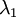 和 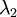 绝非偶然。并且非对角元素值为0; 因此,  和 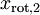 是不相关的, 满足我们对白化结果的第一个要求 (特征间相关性降低)。

为了使每个输入特征具有单位方差，我们可以直接使用 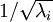 作为缩放因子来缩放每个特征 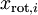 。具体地，我们定义白化后的数据 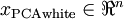 如下：

绘制出 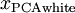 ，我们得到:

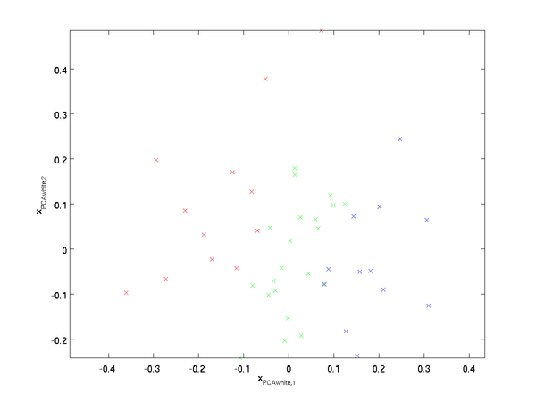

这些数据现在的协方差矩阵为单位矩阵 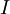 。我们说， 是数据经过**PCA白化后**的版本:  中不同的特征之间不相关并且具有单位方差。

**白化与降维相结合**。 如果你想要得到经过白化后的数据，并且比初始输入维数更低,可以仅保留  中前  个成分。当我们把PCA白化和正则化结合起来时(在稍后讨论)， 中最后的少量成分将总是接近于0，因而舍弃这些成分不会带来很大的问题。

  ZCA白化
-------

最后要说明的是，使数据的协方差矩阵变为单位矩阵  的方式并不唯一。具体地，如果 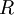 是任意正交矩阵，即满足 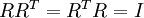 (说它正交不太严格， 可以是旋转或反射矩阵), 那么 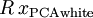 仍然具有单位协方差。在**ZCA白化**中，令 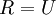 。我们定义ZCA白化的结果为：

绘制 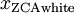，得到:

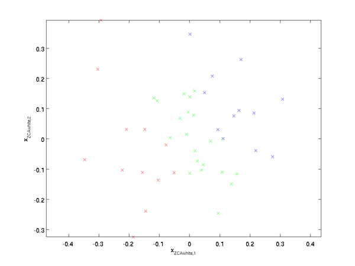

可以证明，对所有可能的 ，这种旋转使得  尽可能地接近原始输入数据  。

当使用 ZCA白化时(不同于 PCA白化)，我们通常保留数据的全部  个维度，不尝试去降低它的维数。

  正则化
-----

实践中需要实现PCA白化或ZCA白化时，有时一些特征值 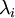 在数值上接近于0，这样在缩放步骤时我们除以 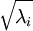 将导致除以一个接近0的值；这可能使数据上溢 (赋为大数值)或造成数值不稳定。因而在实践中，我们使用少量的正则化实现这个缩放过程，即在取平方根和倒数之前给特征值加上一个很小的常数 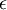：

当  在区间 ![\textstyle [-1,1]](images/math/8/5/a/85a1c5a07f21a9eebbfb1dca380f8d38.png) 上时, 一般取值为 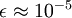。

对图像来说, 这里加上  ，对输入图像也有一些平滑(或低通滤波)的作用。这样处理还能消除在图像的像素信息获取过程中产生的噪声，改善学习到的特征(细节超出了本文的范围)。

ZCA 白化是一种数据预处理方法，它将数据从  映射到  。 事实证明这也是一种生物眼睛(视网膜)处理图像的粗糙模型。具体而言，当你的眼睛感知图像时，由于一幅图像中相邻的部分在亮度上十分相关，大多数临近的“像素”在眼中被感知为相近的值。因此，如果人眼需要分别传输每个像素值（通过视觉神经）到大脑中，会非常不划算。取而代之的是，视网膜进行一个与ZCA中相似的去相关操作 (这是由视网膜上的ON-型和OFF-型光感受器细胞将光信号转变为神经信号完成的)。由此得到对输入图像的更低冗余的表示，并将它传输到大脑。

 中英文对照
------

白化 whitening

冗余 redundant

方差 variance

平滑 smoothing

降维 dimensionality reduction

正则化 regularization

反射矩阵 reflection matrix

去相关 decorrelation

 中文译者
-----

杨海川（yanghaichuan@outlook.com）, 王文中（wangwenzhong@ymail.com）, 谭晓阳（x.tan@nuaa.edu.cn）

[主成分分析](%E4%B8%BB%E6%88%90%E5%88%86%E5%88%86%E6%9E%90.md "主成分分析") | **白化** | [实现主成分分析和白化](%E5%AE%9E%E7%8E%B0%E4%B8%BB%E6%88%90%E5%88%86%E5%88%86%E6%9E%90%E5%92%8C%E7%99%BD%E5%8C%96.md "实现主成分分析和白化") | [Exercise:PCA in 2D](Exercise_PCA_in_2D.md "Exercise:PCA in 2D") | [Exercise:PCA and Whitening](Exercise_PCA_and_Whitening.md "Exercise:PCA and Whitening")

---

> * Language: [English](Whitening.md "Whitening")
> * This page was last modified on 8 April 2013, at 05:37.

