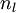

神经网络
====

<!-- Jump to: [navigation](#column-one), [search](#searchInput) -->

|  |
| --- |
| Contents* [1 概述](#.E6.A6.82.E8.BF.B0)
* [2 神经网络模型](#.E7.A5.9E.E7.BB.8F.E7.BD.91.E7.BB.9C.E6.A8.A1.E5.9E.8B)
* [3 中英文对照](#.E4.B8.AD.E8.8B.B1.E6.96.87.E5.AF.B9.E7.85.A7)
* [4 中文译者](#.E4.B8.AD.E6.96.87.E8.AF.91.E8.80.85)
 |

 概述
---

以监督学习为例，假设我们有训练样本集  ，那么神经网络算法能够提供一种复杂且非线性的假设模型  ，它具有参数  ，可以以此参数来拟合我们的数据。

为了描述神经网络，我们先从最简单的神经网络讲起，这个神经网络仅由一个“神经元”构成，以下即是这个“神经元”的图示：

这个“神经元”是一个以  及截距  为输入值的运算单元，其输出为  ，其中函数  被称为“激活函数”。在本教程中，我们选用sigmoid函数作为**激活函数** 

可以看出，这个单一“神经元”的输入－输出映射关系其实就是一个逻辑回归（logistic regression）。

虽然本系列教程采用sigmoid函数，但你也可以选择双曲正切函数（tanh）：

以下分别是sigmoid及tanh的函数图像

 函数是sigmoid函数的一种变体，它的取值范围为 ![\textstyle [-1,1]](images/math/8/5/a/85a1c5a07f21a9eebbfb1dca380f8d38.png) ，而不是sigmoid函数的 ![\textstyle [0,1]](images/math/8/4/2/84235d31ac83fe764546463aba7acc0e.png) 。

注意，与其它地方（包括OpenClassroom公开课以及斯坦福大学CS229课程）不同的是，这里我们不再令  。取而代之，我们用单独的参数  来表示截距。

最后要说明的是，有一个等式我们以后会经常用到：如果选择  ，也就是sigmoid函数，那么它的导数就是  （如果选择tanh函数，那它的导数就是  ，你可以根据sigmoid（或tanh）函数的定义自行推导这个等式。

 神经网络模型
-------

所谓神经网络就是将许多个单一“神经元”联结在一起，这样，一个“神经元”的输出就可以是另一个“神经元”的输入。例如，下图就是一个简单的神经网络：

我们使用圆圈来表示神经网络的输入，标上“”的圆圈被称为**偏置节点**，也就是截距项。神经网络最左边的一层叫做**输入层**，最右的一层叫做**输出层**（本例中，输出层只有一个节点）。中间所有节点组成的一层叫做**隐藏层**，因为我们不能在训练样本集中观测到它们的值。同时可以看到，以上神经网络的例子中有3个**输入单元**（偏置单元不计在内），3个**隐藏单元**及一个**输出单元**。

我们用  来表示网络的层数，本例中  ，我们将第  层记为  ，于是  是输入层，输出层是  。本例神经网络有参数  ，其中  （下面的式子中用到）是第  层第  单元与第  层第  单元之间的联接参数（其实就是连接线上的权重，注意标号顺序），  是第  层第  单元的偏置项。因此在本例中，  ，  。注意，没有其他单元连向偏置单元(即偏置单元没有输入)，因为它们总是输出 。同时，我们用  表示第  层的节点数（偏置单元不计在内）。

我们用  表示第  层第  单元的**激活值**（输出值）。当  时，  ，也就是第  个输入值（输入值的第  个特征）。对于给定参数集合  ，我们的神经网络就可以按照函数  来计算输出结果。本例神经网络的计算步骤如下：

我们用  表示第  层第  单元输入加权和（包括偏置单元），比如，  ，则  。

这样我们就可以得到一种更简洁的表示法。这里我们将激活函数  扩展为用向量（分量的形式）来表示，即 ![\textstyle f([z_1, z_2, z_3]) = [f(z_1), f(z_2), f(z_3)]](images/math/d/b/8/db84346dcd6187f0fbb0f6c1a72eecf8.png) ，那么，上面的等式可以更简洁地表示为：

我们将上面的计算步骤叫作**前向传播**。回想一下，之前我们用  表示输入层的激活值，那么给定第  层的激活值  后，第  层的激活值  就可以按照下面步骤计算得到：

将参数矩阵化，使用矩阵－向量运算方式，我们就可以利用线性代数的优势对神经网络进行快速求解。

目前为止，我们讨论了一种神经网络，我们也可以构建另一种**结构**的神经网络（这里结构指的是神经元之间的联接模式），也就是包含多个隐藏层的神经网络。最常见的一个例子是  层的神经网络，第  层是输入层，第  层是输出层，中间的每个层  与层  紧密相联。这种模式下，要计算神经网络的输出结果，我们可以按照之前描述的等式，按部就班，进行前向传播，逐一计算第  层的所有激活值，然后是第  层的激活值，以此类推，直到第  层。这是一个**前馈**神经网络的例子，因为这种联接图没有闭环或回路。

神经网络也可以有多个输出单元。比如，下面的神经网络有两层隐藏层：  及  ，输出层  有两个输出单元。

要求解这样的神经网络，需要样本集  ，其中  。如果你想预测的输出是多个的，那这种神经网络很适用。（比如，在医疗诊断应用中，患者的体征指标就可以作为向量的输入值，而不同的输出值  可以表示不同的疾病存在与否。）

 中英文对照
------

neural networks 神经网络

activation function 激活函数

hyperbolic tangent 双曲正切函数

bias units 偏置项

activation 激活值

forward propagation 前向传播

feedforward neural network 前馈神经网络(参照Mitchell的《机器学习》的翻译)

 中文译者
-----

孙逊（sunpaofu@foxmail.com），林锋（xlfg@yeah.net），刘鸿鹏飞（just.dark@foxmail.com）, 许利杰（csxulijie@gmail.com）

**神经网络** | [反向传导算法](%E5%8F%8D%E5%90%91%E4%BC%A0%E5%AF%BC%E7%AE%97%E6%B3%95.md "反向传导算法") | [梯度检验与高级优化](%E6%A2%AF%E5%BA%A6%E6%A3%80%E9%AA%8C%E4%B8%8E%E9%AB%98%E7%BA%A7%E4%BC%98%E5%8C%96.md "梯度检验与高级优化") | [自编码算法与稀疏性](%E8%87%AA%E7%BC%96%E7%A0%81%E7%AE%97%E6%B3%95%E4%B8%8E%E7%A8%80%E7%96%8F%E6%80%A7.md "自编码算法与稀疏性") | [可视化自编码器训练结果](%E5%8F%AF%E8%A7%86%E5%8C%96%E8%87%AA%E7%BC%96%E7%A0%81%E5%99%A8%E8%AE%AD%E7%BB%83%E7%BB%93%E6%9E%9C.md "可视化自编码器训练结果") | [稀疏自编码器符号一览表](%E7%A8%80%E7%96%8F%E8%87%AA%E7%BC%96%E7%A0%81%E5%99%A8%E7%AC%A6%E5%8F%B7%E4%B8%80%E8%A7%88%E8%A1%A8.md "稀疏自编码器符号一览表") | [Exercise:Sparse\_Autoencoder](Exercise_Sparse_Autoencoder.md "Exercise:Sparse Autoencoder")

---

> * Language: [English](Neural_Networks.md "Neural Networks")
> * This page was last modified on 7 April 2013, at 12:34.

