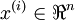
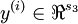
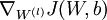
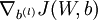

神经网络向量化
=======

<!-- Jump to: [navigation](#column-one), [search](#searchInput) -->
在本节，我们将引入神经网络的向量化版本。在前面关于[神经网络](%E7%A5%9E%E7%BB%8F%E7%BD%91%E7%BB%9C.md "神经网络")介绍的章节中，我们已经给出了一个部分向量化的实现，它在一次输入一个训练样本时是非常有效率的。下边我们看看如何实现同时处理多个训练样本的算法。具体来讲，我们将把正向传播、反向传播这两个步骤以及稀疏特征集学习扩展为多训练样本版本。

|  |
| --- |
| Contents* [1 正向传播](#.E6.AD.A3.E5.90.91.E4.BC.A0.E6.92.AD)
* [2 反向传播](#.E5.8F.8D.E5.90.91.E4.BC.A0.E6.92.AD)
* [3 稀疏自编码网络](#.E7.A8.80.E7.96.8F.E8.87.AA.E7.BC.96.E7.A0.81.E7.BD.91.E7.BB.9C)
* [4 中英文对照](#.E4.B8.AD.E8.8B.B1.E6.96.87.E5.AF.B9.E7.85.A7)
* [5 中文译者](#.E4.B8.AD.E6.96.87.E8.AF.91.E8.80.85)
 |

 正向传播
-----

考虑一个三层网络(一个输入层、一个隐含层、以及一个输出层)，并且假定x是包含一个单一训练样本 的列向量。则向量化的正向传播步骤如下：


这对于单一训练样本而言是非常有效的一种实现，但是当我们需要处理m个训练样本时，则需要把如上步骤放入一个for循环中。

更具体点来说，参照逻辑回归向量化的例子，我们用Matlab/Octave风格变量x表示包含输入训练样本的矩阵，x(:,i)代表第个训练样本。则x正向传播步骤可如下实现：

```
% 非向量化实现
for i=1:m, 
  z2 = W1 * x(:,i) + b1;
  a2 = f(z2);
  z3 = W2 * a2 + b2;
  h(:,i) = f(z3);
end;
```

这个for循环能否去掉呢？对于很多算法而言，我们使用向量来表示计算过程中的中间结果。例如在前面的非向量化实现中，z2,a2,z3都是列向量，分别用来计算隐层和输出层的激励结果。为了充分利用并行化和高效矩阵运算的优势，我们希望算法能同时处理多个训练样本。让我们先暂时忽略前面公式中的b1和b2(把它们设置为0)，那么可以实现如下:

```
% 向量化实现 (忽略 b1, b2)
z2 = W1 * x;
a2 = f(z2);
z3 = W2 * a2;
h = f(z3)
```

在这个实现中，z2,a2,z3都是矩阵，每个训练样本对应矩阵的一列。在对多个训练样本实现向量化时常用的设计模式是，虽然前面每个样本对应一个列向量（比如z2），但我们可把这些列向量堆叠成一个矩阵以充分享受矩阵运算带来的好处。这样，在这个例子中，a2就成了一个*s*2 X *m*的矩阵(*s*2是网络第二层中的神经元数，*m*是训练样本个数)。矩阵a2的物理含义是，当第*i*个训练样本x(:i)输入到网络中时，它的第*i*列就表示这个输入信号对隐神经元 (网络第二层)的激励结果。

在上面的实现中，我们假定激活函数f(z)接受矩阵形式的输入z，并对输入矩阵按列分别施以激活函数。需要注意的是，你在实现f(z)的时候要尽量多用Matlab/Octave的矩阵操作，并尽量避免使用for循环。假定激活函数采用Sigmoid函数，则实现代码如下所示:

```
% 低效的、非向量化的激活函数实现
function output = unvectorized_f(z)
output = zeros(size(z))
for i=1:size(z,1), 
  for j=1:size(z,2),
    output(i,j) = 1/(1+exp(-z(i,j)));
  end; 
end;
end

% 高效的、向量化激活函数实现
function output = vectorized_f(z)
output = 1./(1+exp(-z));     % "./" 在Matlab或Octave中表示对矩阵的每个元素分别进行除法操作
end
```

最后，我们上面的正向传播向量化实现中忽略了b1和b2，现在要把他们包含进来，为此我们需要用到Matlab/Octave的内建函数repmat：

```
% 正向传播的向量化实现
z2 = W1 * x + repmat(b1,1,m);
a2 = f(z2);
z3 = W2 * a2 + repmat(b2,1,m);
h = f(z3)
```

repmat(b1,1,m)的运算效果是，它把列向量b1拷贝*m*份，然后堆叠成如下矩阵：


这就构成一个*s*2 X *m*的矩阵。它和W1 \* x相加，就等于是把W1 \* x矩阵（译者注：这里x是训练矩阵而非向量, 所以W1 \* x代表两个矩阵相乘，结果还是一个矩阵）的每一列加上b1。如果不熟悉的话，可以参考Matlab/Octave的帮助文档获取更多信息(输入“help repmat”)。rampat作为Matlab/Octave的内建函数，运行起来是相当高效的，远远快过我们自己用for循环实现的效果。

 反向传播
-----

现在我们来描述反向传播向量化的思路。在阅读这一节之前，强烈建议各位仔细阅读前面介绍的正向传播的例子代码，确保你已经完全理解。下边我们只会给出反向传播向量化实现的大致纲要，而由你来完成具体细节的推导（见[向量化练习](Exercise_Vectorization.md "Exercise:Vectorization")）。

对于监督学习，我们有一个包含*m*个带类别标号样本的训练集。
(对于自编码网络，我们只需令*y*(*i*) = *x*(*i*)即可, 但这里考虑的是更一般的情况。)

假定网络的输出有*s*3维，因而每个样本的类别标号向量就记为。在我们的Matlab/Octave数据结构实现中，把这些输出按列合在一起形成一个Matlab/Octave风格变量y，其中第i列y(:,i)就是*y*(*i*)。

现在我们要计算梯度项和。对于梯度中的第一项，就像过去在反向传播算法中所描述的那样，对于每个训练样本(*x*,*y*)，我们可以这样来计算：


在这里表示对两个向量按对应元素相乘的运算（译者注：其结果还是一个向量）。为了描述简单起见，我们这里暂时忽略对参数*b*(*l*)的求导，不过在你真正实现反向传播时，还是需要计算关于它们的导数的。

假定我们已经实现了向量化的正向传播方法，如前面那样计算了矩阵形式的变量z2, a2, z3和h，那么反向传播的非向量化版本可如下实现：

```
gradW1 = zeros(size(W1));
gradW2 = zeros(size(W2)); 
for i=1:m,
  delta3 = -(y(:,i) - h(:,i)) .* fprime(z3(:,i)); 
  delta2 = W2'*delta3(:,i) .* fprime(z2(:,i));

  gradW2 = gradW2 + delta3*a2(:,i)';
  gradW1 = gradW1 + delta2*a1(:,i)'; 
end;
```

在这个实现中，有一个for循环。而我们想要一个能同时处理所有样本、且去除这个for循环的向量化版本。

为做到这一点，我们先把向量delta3和delta2替换为矩阵，其中每列对应一个训练样本。我们还要实现一个函数fprime(z)，该函数接受矩阵形式的输入z，并且对矩阵的按元素分别执行。这样，上面for循环中的4行Matlab代码中每行都可单独向量化，以一行新的（向量化的）Matlab代码替换它（不再需要外层的for循环）。

在[向量化练习](Exercise_Vectorization.md "Exercise:Vectorization")中，我们要求你自己去推导出这个算法的向量化版本。如果你已经能从上面的描述中了解如何去做，那么我们强烈建议你去实践一下。虽然我们已经为你准备了[反向传播的向量化实现提示](Backpropagation_vectorization_hints.md "Backpropagation vectorization hints")，但还是鼓励你在不看提示的情况下自己去推导一下。

 稀疏自编码网络
--------

[稀疏自编码](%E8%87%AA%E7%BC%96%E7%A0%81%E7%AE%97%E6%B3%95%E4%B8%8E%E7%A8%80%E7%96%8F%E6%80%A7.md "自编码算法与稀疏性")网络中包含一个额外的稀疏惩罚项，目的是限制神经元的平均激活率，使其接近某个（预设的）目标激活率ρ。其实在对单个训练样本上执行反向传播时，我们已经考虑了如何计算这个稀疏惩罚项，如下所示：


在非向量化的实现中，计算代码如下：

```
% 稀疏惩罚Delta
sparsity_delta = - rho ./ rho_hat + (1 - rho) ./ (1 - rho_hat);
for i=1:m,
  ...
  delta2 = (W2'*delta3(:,i) + beta*sparsity_delta).* fprime(z2(:,i)); 
  ...
end;
```

但在上面的代码中，仍旧含有一个需要在整个训练集上运行的for循环，这里delta2是一个列向量。

作为对照，回想一下在向量化的情况下，delta2现在应该是一个有m列的矩阵，分别对应着*m*个训练样本。还要注意，稀疏惩罚项sparsity\_delta对所有的训练样本一视同仁。这意味着要向量化实现上面的计算，只需在构造delta2时，往矩阵的每一列上分别加上相同的值即可。因此，要向量化上面的代码，我们只需简单的用repmat命令把sparsity\_delta加到delta2的每一列上即可（译者注：这里原文描述得不是很清楚，看似应加到上面代码中delta2行等号右边第一项，即W2'\*delta3上）。

 中英文对照
------

向量化 vectorization
正向传播 forward propagation
反向传播 backpropagation
训练样本 training examples
激活函数 activation function
稀疏自编码网络 sparse autoencoder
稀疏惩罚 sparsity penalty
平均激活率 average firing rate

 中文译者
-----

阎志涛（zhitao.yan@gmail.com）, 谭晓阳（x.tan@nuaa.edu.cn）, 邓亚峰（dengyafeng@gmail.com）

[矢量化编程](%E7%9F%A2%E9%87%8F%E5%8C%96%E7%BC%96%E7%A8%8B.md "矢量化编程") | [逻辑回归的向量化实现样例](%E9%80%BB%E8%BE%91%E5%9B%9E%E5%BD%92%E7%9A%84%E5%90%91%E9%87%8F%E5%8C%96%E5%AE%9E%E7%8E%B0%E6%A0%B7%E4%BE%8B.md "逻辑回归的向量化实现样例") | **神经网络向量化** | [Exercise:Vectorization](Exercise_Vectorization.md "Exercise:Vectorization")

---

> * Language: [English](Neural_Network_Vectorization.md "Neural Network Vectorization")
> * This page was last modified on 8 April 2013, at 05:02.

