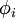
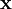
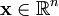
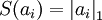
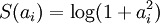
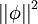
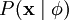
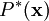
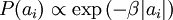
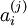

稀疏编码
====

<!-- Jump to: [navigation](#column-one), [search](#searchInput) -->

|  |
| --- |
| Contents* [1 稀疏编码](#.E7.A8.80.E7.96.8F.E7.BC.96.E7.A0.81)
* [2 概率解释 [基于1996年Olshausen与Field的理论]](#.E6.A6.82.E7.8E.87.E8.A7.A3.E9.87.8A_.5B.E5.9F.BA.E4.BA.8E1996.E5.B9.B4Olshausen.E4.B8.8EField.E7.9A.84.E7.90.86.E8.AE.BA.5D)
* [3 学习算法](#.E5.AD.A6.E4.B9.A0.E7.AE.97.E6.B3.95)
* [4 中英文对照](#.E4.B8.AD.E8.8B.B1.E6.96.87.E5.AF.B9.E7.85.A7)
* [5 中文译者](#.E4.B8.AD.E6.96.87.E8.AF.91.E8.80.85)
 |

  稀疏编码
------

稀疏编码算法是一种无监督学习方法，它用来寻找一组“超完备”基向量来更高效地表示样本数据。稀疏编码算法的目的就是找到一组基向量  ，使得我们能将输入向量  表示为这些基向量的线性组合：

虽然形如主成分分析技术（PCA）能使我们方便地找到一组“完备”基向量，但是这里我们想要做的是找到一组**“超完备”**基向量来表示输入向量  （也就是说，*k* > *n*）。超完备基的好处是它们能更有效地找出隐含在输入数据内部的结构与模式。然而，对于超完备基来说，系数 *a**i* 不再由输入向量  唯一确定。因此，在稀疏编码算法中，我们另加了一个评判标准**“稀疏性”**来解决因超完备而导致的退化（degeneracy）问题。

这里，我们把“稀疏性”定义为：只有很少的几个非零元素或只有很少的几个远大于零的元素。要求系数 *a**i* 是稀疏的意思就是说：对于一组输入向量，我们只想有尽可能少的几个系数远大于零。选择使用具有稀疏性的分量来表示我们的输入数据是有原因的，因为绝大多数的感官数据，比如自然图像，可以被表示成少量基本元素的叠加，在图像中这些基本元素可以是面或者线。同时，比如与初级视觉皮层的类比过程也因此得到了提升。

我们把有 *m* 个输入向量的稀疏编码代价函数定义为：

此处 *S*(.) 是一个稀疏代价函数，由它来对远大于零的 *a**i* 进行“惩罚”。我们可以把稀疏编码目标函式的第一项解释为一个重构项，这一项迫使稀疏编码算法能为输入向量  提供一个高拟合度的线性表达式，而公式第二项即“稀疏惩罚”项，它使  的表达式变得“稀疏”。常量 λ 是一个变换量，由它来控制这两项式子的相对重要性。

虽然“稀疏性”的最直接测度标准是 "*L*0" 范式()，但这是不可微的，而且通常很难进行优化。在实际中，稀疏代价函数 *S*(.) 的普遍选择是*L*1 范式代价函数  及对数代价函数  。

此外，很有可能因为减小 *a**i* 或增加  至很大的常量，使得稀疏惩罚变得非常小。为防止此类事件发生，我们将限制  要小于某常量 *C* 。包含了限制条件的稀疏编码代价函数的完整形式如下：

  概率解释 [基于1996年Olshausen与Field的理论]
----------------------------------

到目前为止，我们所考虑的稀疏编码，是为了寻找到一个稀疏的、超完备基向量集，来覆盖我们的输入数据空间。现在换一种方式，我们可以从概率的角度出发，将稀疏编码算法当作一种“生成模型”。

我们将自然图像建模问题看成是一种线性叠加，叠加元素包括 *k* 个独立的源特征  以及加性噪声 ν ：

我们的目标是找到一组特征基向量  ，它使得图像的分布函数  尽可能地近似于输入数据的经验分布函数  。一种实现方式是，最小化  与  之间的 KL 散度，此 KL 散度表示如下：

因为无论我们如何选择  ，经验分布函数  都是常量，也就是说我们只需要最大化对数似然函数  。
假设 ν 是具有方差 σ2 的高斯白噪音，则有下式：

为了确定分布  ，我们需要指定先验分布  。假定我们的特征变量是独立的，我们就可以将先验概率分解为：

此时，我们将“稀疏”假设加入进来——假设任何一幅图像都是由相对较少的一些源特征组合起来的。因此，我们希望 *a**i* 的概率分布在零值附近是凸起的，而且峰值很高。一个方便的参数化先验分布就是：

这里 *S*(*a**i*) 是决定先验分布的形状的函数。

当定义了  和  后，我们就可以写出在由  定义的模型之下的数据  的概率分布：

那么，我们的问题就简化为寻找：

这里  < . >  表示的是输入数据的期望值。

不幸的是，通过对  的积分计算  通常是难以实现的。虽然如此，我们注意到如果  的分布（对于相应的  ）足够陡峭的话，我们就可以用  的最大值来估算以上积分。估算方法如下：

跟之前一样，我们可以通过减小 *a**i* 或增大  来增加概率的估算值（因为 *P*(*a**i*) 在零值附近陡升）。因此我们要对特征向量  加一个限制以防止这种情况发生。

最后，我们可以定义一种线性生成模型的能量函数，从而将原先的代价函数重新表述为：

其中 λ = 2σ2β ，并且关系不大的常量已被隐藏起来。因为最大化对数似然函数等同于最小化能量函数，我们就可以将原先的优化问题重新表述为：

使用概率理论来分析，我们可以发现，选择 *L*1 惩罚和  惩罚作为函数 *S*(.) ，分别对应于使用了拉普拉斯概率  和柯西先验概率  。

  学习算法
------

使用稀疏编码算法学习基向量集的方法，是由两个独立的优化过程组合起来的。第一个是逐个使用训练样本  来优化系数 *a**i* ，第二个是一次性处理多个样本对基向量  进行优化。

如果使用 *L*1 范式作为稀疏惩罚函数，对  的学习过程就简化为求解 由 *L*1 范式正则化的最小二乘法问题，这个问题函数在域  内为凸，已经有很多技术方法来解决这个问题（诸如CVX之类的凸优化软件可以用来解决L1正则化的最小二乘法问题）。如果 *S*(.) 是可微的，比如是对数惩罚函数，则可以采用基于梯度算法的方法，如共轭梯度法。

用 *L*2 范式约束来学习基向量，同样可以简化为一个带有二次约束的最小二乘问题，其问题函数在域  内也为凸。标准的凸优化软件（如CVX）或其它迭代方法就可以用来求解 ，虽然已经有了更有效的方法，比如求解拉格朗日对偶函数（Lagrange dual）。

根据前面的的描述，稀疏编码是有一个明显的局限性的，这就是即使已经学习得到一组基向量，如果为了对新的数据样本进行“编码”，我们必须再次执行优化过程来得到所需的系数。这个显著的“实时”消耗意味着，即使是在测试中,实现稀疏编码也需要高昂的计算成本，尤其是与典型的前馈结构算法相比。

 中英文对照
------

稀疏编码 Sparse Coding 
无监督学习 unsupervised method
超完备基 over-complete bases
主成分分析 PCA
稀疏性 sparsity
退化 degeneracy
代价函数 cost function
重构项 reconstruction term
稀疏惩罚项 sparsity penalty
范式 norm
生成模型 generative model
线性叠加 linear superposition
加性噪声 additive noise
特征基向量 basis feature vectors
经验分布函数 the empirical distribution
KL 散度 KL divergence
对数似然函数 the log-likelihood
高斯白噪音 Gaussian white noise
先验分布 the prior distribution
先验概率 prior probability
源特征 source features
能量函数 the energy function
正则化 regularized
最小二乘法 least squares
凸优化软件convex optimization software
共轭梯度法 conjugate gradient methods
二次约束 quadratic constraints
拉格朗日对偶函数 the Lagrange dual
前馈结构算法 feedforward architectures

 中文译者
-----

柳翠寅（liucuiyin@163.com），林锋（xlfg@yeah.net），王方（fangkey@gmail.com）

---

> * Language: [English](Sparse_Coding.md "Sparse Coding")
> * This page was last modified on 8 April 2013, at 08:32.

