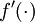

线性解码器
=====

<!-- Jump to: [navigation](#column-one), [search](#searchInput) -->

|  |
| --- |
| Contents* [1 稀疏自编码重述](#.E7.A8.80.E7.96.8F.E8.87.AA.E7.BC.96.E7.A0.81.E9.87.8D.E8.BF.B0)
* [2 线性解码器](#.E7.BA.BF.E6.80.A7.E8.A7.A3.E7.A0.81.E5.99.A8)
* [3 中英文对照](#.E4.B8.AD.E8.8B.B1.E6.96.87.E5.AF.B9.E7.85.A7)
* [4 中文译者](#.E4.B8.AD.E6.96.87.E8.AF.91.E8.80.85)
 |

  稀疏自编码重述
---------

稀疏自编码器包含3层神经元，分别是输入层，隐含层以及输出层。
从前面（神经网络）自编码器描述可知，位于神经网络中的神经元都采用相同的激励函数。
在注解中，我们修改了自编码器定义，使得某些神经元采用不同的激励函数。这样得到的模型更容易应用，而且模型对参数的变化也更为鲁棒。

回想一下，输出层神经元计算公式如下：

其中 *a*(3) 是输出. 在自编码器中, *a*(3) 近似重构了输入 *x* = *a*(1)。

S 型激励函数输出范围是 [0,1]，当 *f*(*z*(3)) 采用该激励函数时，就要对输入限制或缩放，使其位于 [0,1] 范围中。一些数据集，比如 MNIST，能方便将输出缩放到 [0,1] 中，但是很难满足对输入值的要求。比如， PCA 白化处理的输入并不满足 [0,1] 范围要求，也不清楚是否有最好的办法可以将数据缩放到特定范围中。

  线性解码器
-------

设定 *a*(3) = *z*(3) 可以很简单的解决上述问题。从形式上来看，就是输出端使用恒等函数 *f*(*z*) = *z* 作为激励函数，于是有 *a*(3) = *f*(*z*(3)) = *z*(3)。我们称该特殊的激励函数为 **线性激励函数** （称为恒等激励函数可能更好些）。

需要注意，神经网络中隐含层的神经元依然使用S型（或者tanh）激励函数。这样隐含单元的激励公式为  ,其中  是 S 型函数, *x* 是输入, *W*(1) 和 *b*(1) 分别是隐单元的权重和偏差项。我们仅在输出层中使用线性激励函数。

一个 S 型或 tanh 隐含层以及线性输出层构成的自编码器，我们称为**线性解码器**。

在这个线性解码器模型中，。因为输出  是隐单元激励输出的线性函数，改变 *W*(2) ，可以使输出值 *a*(3) 大于 1 或者小于 0。这使得我们可以用实值输入来训练稀疏自编码器，避免预先缩放样本到给定范围。

随着输出单元的激励函数的改变，这个输出单元梯度也相应变化。回顾之前每一个输出单元误差项定义为：

其中 *y* = *x* 是所期望的输出,  是自编码器的输出,   是激励函数.因为在输出层激励函数为 *f*(*z*) = *z*, 这样 *f*'(*z*) = 1，所以上述公式可以简化为

当然，若使用反向传播算法来计算隐含层的误差项时:

因为隐含层采用一个 S 型（或 tanh）的激励函数 *f*,在上述公式中， 依然是 S 型（或 tanh）函数的导数。

 中英文对照
------

线性解码器 Linear Decoders

稀疏自编码 Sparse Autoencoder

输入层 input layer

隐含层 hidden layer

输出层 output layer

神经元 neuron

神经网络 neural network

自编码器 autoencoder

激励函数 activation function

鲁棒 robust

S型激励函数 sigmoid activation function

tanh激励函数 tanh function

线性激励函数 linear activation function

恒等激励函数 identity activation function

隐单元 hidden unit

权重 weight

偏差项 error term

反向传播算法 backpropagation

 中文译者
-----

严晓东（yan.endless@gmail.com），姚涛（yaothinker@gmail.com），晓风（xiaofeng.zhb@alibaba-inc.com）

**线性解码器** | [Exercise:Learning color features with Sparse Autoencoders](Exercise_Learning_color_features_with_Sparse_Autoencoders.md "Exercise:Learning color features with Sparse Autoencoders")

---

> * Language: [English](Linear_Decoders.md "Linear Decoders")
> * This page was last modified on 8 April 2013, at 05:18.

