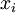
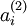

自编码算法与稀疏性
=========

<!-- Jump to: [navigation](#column-one), [search](#searchInput) -->
目前为止，我们已经讨论了神经网络在有监督学习中的应用。在有监督学习中，训练样本是有类别标签的。现在假设我们只有一个没有带类别标签的训练样本集合  ，其中  。自编码神经网络是一种无监督学习算法，它使用了反向传播算法，并让目标值等于输入值，比如  。下图是一个自编码神经网络的示例。

自编码神经网络尝试学习一个  的函数。换句话说，它尝试逼近一个恒等函数，从而使得输出  接近于输入  。恒等函数虽然看上去不太有学习的意义，但是当我们为自编码神经网络加入某些限制，比如限定隐藏神经元的数量，我们就可以从输入数据中发现一些有趣的结构。举例来说，假设某个自编码神经网络的输入  是一张  图像（共100个像素）的像素灰度值，于是  ，其隐藏层  中有50个隐藏神经元。注意，输出也是100维的  。由于只有50个隐藏神经元，我们迫使自编码神经网络去学习输入数据的**压缩**表示，也就是说，它必须从50维的隐藏神经元激活度向量  中**重构**出100维的像素灰度值输入  。如果网络的输入数据是完全随机的，比如每一个输入  都是一个跟其它特征完全无关的独立同分布高斯随机变量，那么这一压缩表示将会非常难学习。但是如果输入数据中隐含着一些特定的结构，比如某些输入特征是彼此相关的，那么这一算法就可以发现输入数据中的这些相关性。事实上，这一简单的自编码神经网络通常可以学习出一个跟主元分析（PCA）结果非常相似的输入数据的低维表示。

我们刚才的论述是基于隐藏神经元数量较小的假设。但是即使隐藏神经元的数量较大（可能比输入像素的个数还要多），我们仍然通过给自编码神经网络施加一些其他的限制条件来发现输入数据中的结构。具体来说，如果我们给隐藏神经元加入稀疏性限制，那么自编码神经网络即使在隐藏神经元数量较多的情况下仍然可以发现输入数据中一些有趣的结构。

稀疏性可以被简单地解释如下。如果当神经元的输出接近于1的时候我们认为它被激活，而输出接近于0的时候认为它被抑制，那么使得神经元大部分的时间都是被抑制的限制则被称作稀疏性限制。这里我们假设的神经元的激活函数是sigmoid函数。如果你使用tanh作为激活函数的话，当神经元输出为-1的时候，我们认为神经元是被抑制的。

注意到  表示隐藏神经元  的激活度，但是这一表示方法中并未明确指出哪一个输入  带来了这一激活度。所以我们将使用  来表示在给定输入为  情况下，自编码神经网络隐藏神经元  的激活度。
进一步，让

![\begin{align}
\hat\rho_j = \frac{1}{m} \sum_{i=1}^m \left[ a^{(2)}_j(x^{(i)}) \right]
\end{align}](images/math/8/7/2/8728009d101b17918c7ef40a6b1d34bb.png)

表示隐藏神经元  的平均活跃度（在训练集上取平均）。我们可以近似的加入一条限制

其中，  是**稀疏性参数**，通常是一个接近于0的较小的值（比如  ）。换句话说，我们想要让隐藏神经元  的平均活跃度接近0.05。为了满足这一条件，隐藏神经元的活跃度必须接近于0。

为了实现这一限制，我们将会在我们的优化目标函数中加入一个额外的惩罚因子，而这一惩罚因子将惩罚那些  和  有显著不同的情况从而使得隐藏神经元的平均活跃度保持在较小范围内。惩罚因子的具体形式有很多种合理的选择，我们将会选择以下这一种：

这里，  是隐藏层中隐藏神经元的数量，而索引  依次代表隐藏层中的每一个神经元。如果你对相对熵（KL divergence）比较熟悉，这一惩罚因子实际上是基于它的。于是惩罚因子也可以被表示为

其中  是一个以  为均值和一个以  为均值的两个伯努利随机变量之间的相对熵。相对熵是一种标准的用来测量两个分布之间差异的方法。（如果你没有见过相对熵，不用担心，所有你需要知道的内容都会被包含在这份笔记之中。）

这一惩罚因子有如下性质，当  时  ，并且随着  与  之间的差异增大而单调递增。举例来说，在下图中，我们设定  并且画出了相对熵值  随着  变化的变化。

我们可以看出，相对熵在  时达到它的最小值0，而当  靠近0或者1的时候，相对熵则变得非常大（其实是趋向于）。所以，最小化这一惩罚因子具有使得  靠近  的效果。
现在，我们的总体代价函数可以表示为

其中  如之前所定义，而  控制稀疏性惩罚因子的权重。  项则也（间接地）取决于  ，因为它是隐藏神经元  的平均激活度，而隐藏层神经元的激活度取决于  。

为了对相对熵进行导数计算，我们可以使用一个易于实现的技巧，这只需要在你的程序中稍作改动即可。具体来说，前面在后向传播算法中计算第二层（  ）更新的时候我们已经计算了

现在我们将其换成

就可以了。

有一个需要注意的地方就是我们需要知道  来计算这一项更新。所以在计算任何神经元的后向传播之前，你需要对所有的训练样本计算一遍前向传播，从而获取平均激活度。如果你的训练样本可以小到被整个存到内存之中（对于编程作业来说，通常如此），你可以方便地在你所有的样本上计算前向传播并将得到的激活度存入内存并且计算平均激活度 。然后你就可以使用事先计算好的激活度来对所有的训练样本进行后向传播的计算。如果你的数据量太大，无法全部存入内存，你就可以扫过你的训练样本并计算一次前向传播，然后将获得的结果累积起来并计算平均激活度  （当某一个前向传播的结果中的激活度  被用于计算平均激活度  之后就可以将此结果删除）。然后当你完成平均激活度  的计算之后，你需要重新对每一个训练样本做一次前向传播从而可以对其进行后向传播的计算。对于后一种情况，你对每一个训练样本需要计算两次前向传播，所以在计算上的效率会稍低一些。

证明上面算法能达到梯度下降效果的完整推导过程不再本教程的范围之内。不过如果你想要使用经过以上修改的后向传播来实现自编码神经网络，那么你就会对目标函数  做梯度下降。使用梯度验证方法，你可以自己来验证梯度下降算法是否正确。。

 中英文对照
------

自编码算法 Autoencoders
稀疏性 Sparsity
神经网络 neural networks
监督学习 supervised learning
无监督学习 unsupervised learning
反向传播算法 backpropagation
隐藏神经元 hidden units
像素灰度值 the pixel intensity value
独立同分布 IID
主元分析 PCA
激活 active
抑制 inactive
激活函数 activation function
激活度 activation
平均活跃度 the average activation
稀疏性参数 sparsity parameter
惩罚因子 penalty term
相对熵 KL divergence
伯努利随机变量 Bernoulli random variable
总体代价函数 overall cost function
后向传播 backpropagation
前向传播 forward pass
梯度下降 gradient descent
目标函数 the objective
梯度验证方法 the derivative checking method

 中文译者
-----

周韬（ztsailing@gmail.com），葛燕儒（yrgehi@gmail.com），林锋（xlfg@yeah.net），余凯（kai.yu.cool@gmail.com）

[神经网络](%E7%A5%9E%E7%BB%8F%E7%BD%91%E7%BB%9C.md "神经网络") | [反向传导算法](%E5%8F%8D%E5%90%91%E4%BC%A0%E5%AF%BC%E7%AE%97%E6%B3%95.md "反向传导算法") | [梯度检验与高级优化](%E6%A2%AF%E5%BA%A6%E6%A3%80%E9%AA%8C%E4%B8%8E%E9%AB%98%E7%BA%A7%E4%BC%98%E5%8C%96.md "梯度检验与高级优化") | **自编码算法与稀疏性** | [可视化自编码器训练结果](%E5%8F%AF%E8%A7%86%E5%8C%96%E8%87%AA%E7%BC%96%E7%A0%81%E5%99%A8%E8%AE%AD%E7%BB%83%E7%BB%93%E6%9E%9C.md "可视化自编码器训练结果") | [稀疏自编码器符号一览表](%E7%A8%80%E7%96%8F%E8%87%AA%E7%BC%96%E7%A0%81%E5%99%A8%E7%AC%A6%E5%8F%B7%E4%B8%80%E8%A7%88%E8%A1%A8.md "稀疏自编码器符号一览表") | [Exercise:Sparse\_Autoencoder](Exercise_Sparse_Autoencoder.md "Exercise:Sparse Autoencoder")

---

> * Language: [English](Autoencoders_and_Sparsity.md "Autoencoders and Sparsity")
> * This page was last modified on 8 April 2013, at 07:46.

