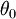

逻辑回归的向量化实现样例
============

<!-- Jump to: [navigation](#column-one), [search](#searchInput) -->
我们想用批量梯度上升法对logistic回归分析模型进行训练，其模型如下：


让我们遵从公开课程视频与CS229教学讲义的符号规范，设 ，于是 ，，  为截距。假设我们有m个训练样本{(, ) ,...,( , )}，而批量梯度上升法的更新法则是： ,这里的  是对数似然函数， 是其导函数。

[注：下文的符号规范与<公开课程视频>或<教学讲义CS229：机器学习>中的相同，详细内容可以参见公开课程视频或教学讲义#1 <http://cs229.stanford.edu/>]

于是，我们需要如下计算梯度：


我们用Matlab/Octave风格变量x表示输入数据构成的样本矩阵，x(:,i)代表第 i个训练样本，x(j,i)就代表（译者注：第i个训练样本向量的第j个元素）。同样，用Matlab/Octave风格变量y表示由训练样本集合的全体类别标号所构成的行向量，则该向量的第i个元素y(i)就代表上式中的。（注意这里跟公开课程视频及CS229的符号规范不同，矩阵x按列而不是按行存放输入训练样本，同样，是行向量而不是列向量。）

以下是梯度运算代码的一种实现，非常恐怖，速度极慢：

```
% 代码1
grad = zeros(n+1,1);
for i=1:m,
  h = sigmoid(theta'*x(:,i));
  temp = y(i) - h; 
  for j=1:n+1,
    grad(j) = grad(j) + temp * x(j,i); 
  end;
end;
```

嵌套的for循环语句使这段代码的运行非常缓慢。以下是更典型的实现方式，它对算法进行部分向量化，带来更优的执行效率：

```
% 代码2
grad = zeros(n+1,1);
for i=1:m,
  grad = grad + (y(i) - sigmoid(theta'*x(:,i)))* x(:,i);
end;
```

但是，或许可以向量化得更彻底些。如果去除for循环，我们就可以显著地改善代码执行效率。特别的，假定b是一个列向量，A是一个矩阵，我们用以下两种方式来计算A\*b：

```
% 矩阵-向量乘法运算的低效代码
grad = zeros(n+1,1);
for i=1:m,
  grad = grad + b(i) * A(:,i);  % 通常写法为A(:,i)*b(i)
end;

% 矩阵-向量乘法运算的高效代码
grad = A*b;
```

我们看到，代码2是用了低效的for循环语句执行梯度上升（译者注：原文是下降）运算，将b(i)看成(y(i) - sigmoid(theta'\*x(:,i)))，A看成x，我们就可以使用以下高效率的代码：

```
% 代码3
grad = x * (y- sigmoid(theta'*x));
```

这里我们假定Matlab/Octave的sigmoid(z)函数接受一个向量形式的输入z，依次对输入向量的每个元素施行sigmoid函数，最后返回运算结果，因此sigmoid(z)的输出结果是一个与z有相同维度的向量。

当训练数据集很大时，最终的实现（译者注：代码3）充分发挥了Matlab/Octave高度优化的数值线性代数库的优势来进行矩阵-向量操作，因此，比起之前代码要高效得多。

想采用向量化实现并非易事，通常需要周密的思考。但当你熟练掌握向量化操作后，你会发现，这里面有固定的设计模式（对应少量的向量化技巧），可以灵活运用到很多不同的代码片段中。

 中英文对照
------

逻辑回归 Logistic Regression
批量梯度上升法 batch gradient ascent
截距 intercept term
对数似然函数 the log likelihood
导函数 derivative
梯度 gradient

 中文译者
-----

林锋（xlfg@yeah.net），谭晓阳（x.tan@nuaa.edu.cn），邓亚峰（dengyafeng@gmail.com）

[矢量化编程](%E7%9F%A2%E9%87%8F%E5%8C%96%E7%BC%96%E7%A8%8B.md "矢量化编程") | **逻辑回归的向量化实现样例** | [神经网络向量化](%E7%A5%9E%E7%BB%8F%E7%BD%91%E7%BB%9C%E5%90%91%E9%87%8F%E5%8C%96.md "神经网络向量化") | [Exercise:Vectorization](Exercise_Vectorization.md "Exercise:Vectorization")

---

> * Language: [English](Logistic_Regression_Vectorization_Example.md "Logistic Regression Vectorization Example")
> * This page was last modified on 8 April 2013, at 08:31.

